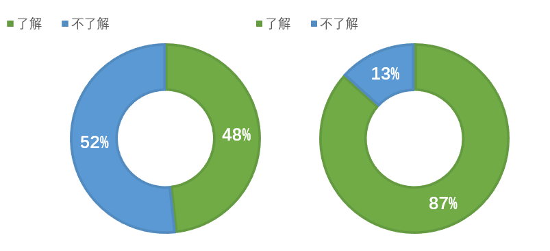

# 常见Markdown语法归纳 笔记

## 前言
这篇笔记是根据b站up主**请叫我AXin**的视频整理的，原视频链接：https://www.bilibili.com/video/BV1JA411h7Gw
markdown语法对于**空格**的使用很是苛刻，有很多错误都是因为空格加错导致的
希望这篇笔记对你有所帮助！

up推荐的markdown编辑器：
- typora（⭐⭐⭐⭐⭐，免费，附加功能齐全，win，mac，linux）
- StackEdit（⭐⭐⭐⭐，免费，附加功能齐全，chrome应用，可以使用Google drive同步）
- dillinger（⭐⭐⭐⭐，免费，附加功能齐全，chrome应用，可以使用Google drive、Dropbox、OneDrive等同步）
- QOwnNotes（⭐⭐⭐⭐，附加功能齐全，甚至可以设置同步服务器，win，mac，linux）
- VSCode（⭐⭐⭐免费，需安装插件，附加功能较少，win,mac,linux）
- Haroopad（⭐⭐免费，win，mac，linux）
- MacDown（⭐⭐⭐mac）
- Mou（⭐⭐⭐mac，以前免费好像要开始收费了）
- markdownpad（⭐⭐有收费版和免费版，Windows）
- 有道云笔记、为知笔记、印象笔记（⭐，这三个有些常用功能可能收费）

支持markdown的写作平台：GitHub、码云、简书、segmentfalut、CSDN等等

Markdown 语法参考 : https://www.runoob.com/markdown/md-tutorial.html
表情全部名称：https://unicode.org/emoji/charts/full-emoji-list.html

## 标题
标题用`#`标记，`# `代表一级标题，`## `代表二级标题，`###### `代表六级标题，更多的`#`是没有意义的。

示例：
```markdown
# 一级标题
## 二级标题
### 三级标题
#### 四级标题
##### 五级标题
###### 六级标题
####### 没有意义
```
输出：
# 一级标题
## 二级标题
### 三级标题
#### 四级标题
##### 五级标题
###### 六级标题
####### 没有意义
## 引用
引用用`> `标记。

示例：
```markdown
> 这是一段引用
```
输出：
> 这是一段引用
## 有序列表
用`数字` + `.`标记列表。注意`.`后面要加空格。

示例：
```markdown
1. 元素 1
2. 元素 2
3. 元素 3
```
输出：
1. 元素 1
2. 元素 2
3. 元素 3

## 无序列表
用`-`或`*`表示无序列表，使用`*`会使这一行的行间距更宽。

示例：
```markdown
- 元素 1
- 元素 2
* 元素 3星号会使这一行的间距更宽
- 元素 4
```
输出：
- 元素 1
- 元素 2
* 元素 3星号会使这一行的间距更宽
- 元素 4

## 任务列表
用`- [ ]`标记任务列表，`- [x]`标记打勾的任务列表。注意短横线后和中括号后都要加空格。在预览区可以单击改变勾选的状态

示例：
```markdown
- [ ] 未完成的任务
- [x] 已完成的任务
```
输出：
- [ ] 未完成的任务
- [x] 已完成的任务

## 代码块
用三个反引号加语言名标记。
小技巧：若代码块中要使用反引号，该代码块可以使用四个反引号标注，这样内层的反引号不会被解析。

示例：
````markdown
```python
def foo(x):
    print(x)
    return x * x
```
````
输出：
```python 
def foo(x):
    print(x)
    return x * x
```

## 数学公式
用两组`$$`包含Latex公式。

示例：
```markdown
$$ 
E=mc^2
$$
```
输出：
$$ 
E=mc^2
$$

## 表格
分为表头，对齐方式和表格信息三部分，表i头和对齐方式在前两行。表头‘对齐方式和表格信息都用`|`分割不同列。分割方式中`:---`代表左对齐， `---:`表示右对齐，`:---:`表示居中。

示例：
```markdown
表头（左对齐）|第二列（右对其）|第三列（居中）
:---|---:|:---:
信息|信息|信息
其他信息|更多的|信息

```
输出：
表头（左对齐）|第二列（右对其）|第三列（居中）
:---|---:|:---:
信息|信息|信息
其他信息|更多的|信息

## 脚注
用`[^内容]`和`[^内容]:`标记，两种标记成对出现，单击`[^内容]`标记会自动跳转到`[^内容]:`标记处。在正文和脚注之间会自动生成一条分割线。

示例：
```markdown
冰心[^冰心]所著的《繁星·春水》是一部在中国文学史上十分重要的诗歌作品集。
[^冰心]:冰心，原名谢婉莹。

```
输出：
冰心[^冰心]所著的《繁星·春水》是一部在中国文学史上十分重要的诗歌作品集。
[^冰心]:冰心，原名谢婉莹。

## 分割线
分割线可以手动添加，用独占三行的`---`标记。分割线上面一行一定要空出，否则会将文字标记为标题。

示例：
```markdown
李白，字太白，号青莲居士。

---

杜甫，字子美，号少陵野老。
```
输出：
李白，字太白，号青莲居士。

---

杜甫，字子美，号少陵野老。

## 链接
用`[内容](链接地址 "介绍")`标记链接，点击链接可以直接跳转，介绍是鼠标悬停时显示的文本。注意链接地址和介绍之间有空格。

示例：
```markdown
欢迎访问[Pies的主页](https://github.com/PiesAvalon "点击这个链接会跳转到pies的主页")！
```
欢迎访问[Pies的主页](https://github.com/PiesAvalon "点击这个链接会跳转到pies的主页")！
### 引用链接
若要在多处插入同一链接可以用引用链接，引用链接的标记是`[内容][标识符]`并在文档某处写`[标识符]:链接地址"介绍"`
注意：
1. `[标识符]:链接地址"介绍"`这句要独占三行，否则会出现奇怪的错误
2. 链接地址和介绍之间要空格

示例：
```markdown
[Pies的主页][p]是PiesAvalon的主页，
点击[这个链接][p]可以跳转到pies的主页。

[p]:https://github.com/PiesAvalon "点击这个链接会跳转到pies的主页"

```
输出：
[Pies的主页][p]是PiesAvalon的主页，
点击[这个链接][p]可以跳转到pies的主页。

[p]:https://github.com/PiesAvalon "点击这个链接会跳转到pies的主页"

### 标题链接
用`[内容](#标题)`来标记，可以直接跳转到文档的某个标题，注意到去掉`#`和标题之间的空格，且不管链接指向的是几级标题，用只写一个`#`。

示例：
```markdown
点击[这个链接](#一级标题)可以跳转到前面的一级标题处。
```

输出：
点击[这个链接](#一级标题)可以跳转到前面的一级标题处。

### URL
直接写https开头的url链接会自动识别为一个超链接。

示例：
```markdown
https://www.bilibili.com/
```
输出：
https://www.bilibili.com/

### 图片链接
用``可以创建图片链接，这里的链接可以是一个网络连接，也可以是本地文件的地址（相对地址或绝对地址）。

示例：
```markdown


```
输出：


## 行内格式
用一对`*`标记斜体字，
用一对`**`标记加粗，
用`<u>`和`</u>`标记下划线，
用一对`==`标记高亮，
用一对`$`标记行内数学公式，
用一对`~`标记下标，
用一对`^`标记上标，
用一些特殊标记创建特殊符号，如`:smile:`:smile:，更多表情见：https://unicode.org/emoji/charts/full-emoji-list.html 。

示例：
```markdown
*斜体*
**加粗**
<u>下划线</u>
==高亮==
$\theta=x^2$
H~2~O
x^4^
```
输出：
*斜体*
**加粗**
<u>下划线</u>
==高亮==
$\theta=x^2$
H~2~O
x^4^

## HTML代码
markdown支持直接插入html代码，如插入一段视频。
这个功能我的markdown编辑器（vscode的markdown插件）不支持。

示例：
```html
<iframe src="//player.bilibili.com/player.html?isOutside=true&aid=327623069&bvid=BV1JA411h7Gw&cid=171385214&p=1" scrolling="no" border="0" frameborder="no" framespacing="0" allowfullscreen="true"></iframe>
```
输出：
<iframe src="//player.bilibili.com/player.html?isOutside=true&aid=327623069&bvid=BV1JA411h7Gw&cid=171385214&p=1" scrolling="no" border="0" frameborder="no" framespacing="0" allowfullscreen="true"></iframe>