# 实验报告
## 思考题
1. 根据 2 选 1 多路选择器的与-或电路，替换成与非-与非电路，并分析两种电路的特性。
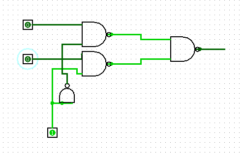
实现如图
2. 实现 4 位二进制数转换成格雷码的转换电路。
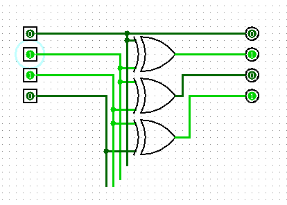
实现如图
3. 实现 4 位二进制数的奇偶校验位生成电路。
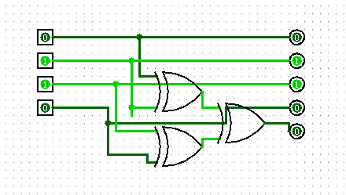
偶校验位生成电路实现
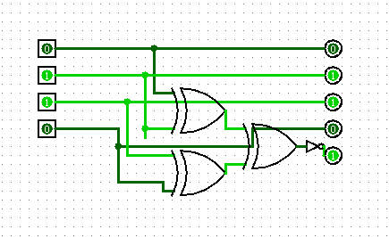
奇校验位生成电路实现

## 基本信息
**实验名称**：基本逻辑部件设计
**实验人**：241220071葛家韬

## 实验目的
1. 掌握 Logisim 软件的使用方法。
2. 掌握门电路的实现方法。
3. 掌握数字系统设计的基本设计方法。
4. 掌握子电路的设计和应用。
5. 熟练运用分线器、隧道、探针等 Logisim 组件的。
## 实验环境
Logisim 2.16
## 实验内容
### 1.利用基本逻辑门设计一个 3 输入多数表决器

#### （1）实验整体方案设计
> 要求：说明本次实验的顶层设计模块图，对每个子模块进行详细描述，定义输入输出引脚，数据及控制信号的传输通道等。

通过比较三个输入信号，输出与多数输入相同的值。若两个或三个输入为1，则输出1；否则输出0。  
实验电路较为简单，不需要顶层模块设计图。

#### （2）实验原理图和电路图
> 要求：给出每个子模块的原理图和 Logisim 中的电路图，定义子模块的外观图。如果对实验指导讲义中的内容提出优化或改进，需要此说明原因、方法和效果。

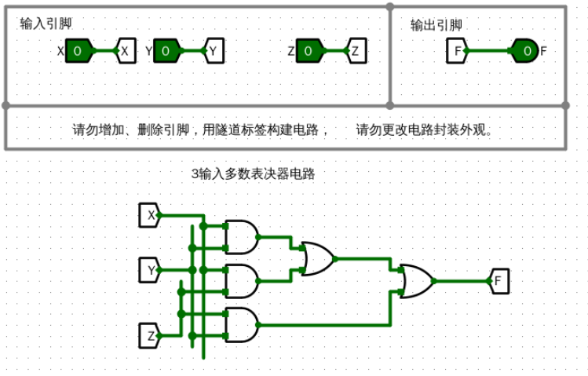
多数表决器电路图

#### （3）实验数据仿真测试图
> 要求：根据实验要求，输入测试数据，选择单步时钟执行，截取仿真运行时的电路图，分析电路状态是否满足设计需求。说明子模块的功能，列出子模块的功能表。

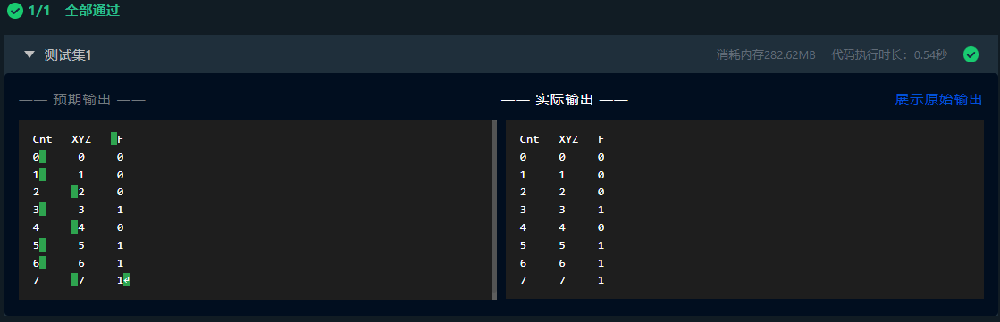
仿真测试截图

##### 真值表
| X | Y | Z | F |
|---|---|---|---|
| 0 | 0 | 0 | 0 |
| 0 | 0 | 1 | 0 |
| 0 | 1 | 0 | 0 |
| 0 | 1 | 1 | 1 |
| 1 | 0 | 0 | 0 |
| 1 | 0 | 1 | 1 |
| 1 | 1 | 0 | 1 |
| 1 | 1 | 1 | 1 |

#### （4）错误现象及分析
> 要求：在电路设计、连接和仿真运行时，遇到的任何错误，都需要截屏放置到实验报告中，并分析错误原因和解决办法。

要注意：PMOS和NMOS是MOSFET的两种类型，它们的结构和工作原理决定了源极的接法。PMOS的源极通常接电源，因为其沟道由空穴导电，当栅极电压低于源极时，PMOS导通。而NMOS的源极通常接地，因为其沟道由电子导电，当栅极电压高于源极时，NMOS导通。这种接法确保了两种晶体管在电路中能够正常工作，实现逻辑功能。

### 2.利用 CMOS 晶体管构建两输入或门，并验证其功能

#### （1）实验整体方案设计
> 要求：说明本次实验的顶层设计模块图，对每个子模块进行详细描述，定义输入输出引脚，数据及控制信号的传输通道等。

先构建或非门再连接非门来形成两输入或门。或非门由并联的NMOS管和串联的PMOS管组成，输出为两输入或操作的反相结果。随后，或非门的输出接入一个由PMOS和NMOS管构成的反相器（非门）。  
实验电路较为简单，不需要顶层模块设计图。

#### （2）实验原理图和电路图
> 要求：给出每个子模块的原理图和 Logisim 中的电路图，定义子模块的外观图。如果对实验指导讲义中的内容提出优化或改进，需要此说明原因、方法和效果。

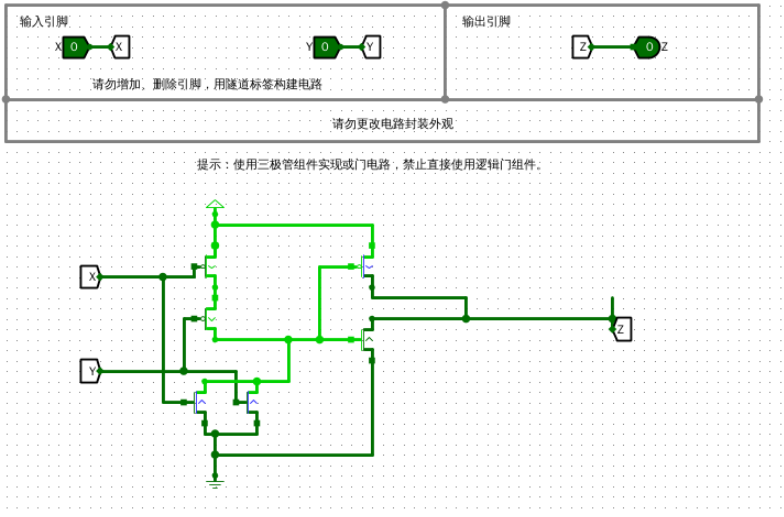
多数表决器电路图

#### （3）实验数据仿真测试图
> 要求：根据实验要求，输入测试数据，选择单步时钟执行，截取仿真运行时的电路图，分析电路状态是否满足设计需求。说明子模块的功能，列出子模块的功能表。

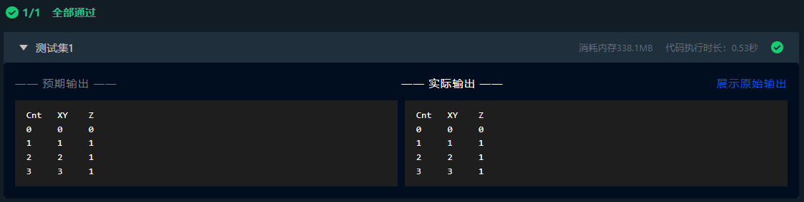
仿真测试截图

##### 真值表
| X | Y | Z |
|---|---|---|
| 0 | 0 | 0 |
| 0 | 1 | 1 |
| 1 | 0 | 1 |
| 1 | 1 | 1 |

#### （4）错误现象及分析
> 要求：在电路设计、连接和仿真运行时，遇到的任何错误，都需要截屏放置到实验报告中，并分析错误原因和解决办法。

传输门由PMOS和NMOS并联组成，利用互补控制信号实现双向导通。当控制信号为高时，PMOS和NMOS同时导通，信号从输入到输出传输；控制信号为低时，两者截止，阻断信号传输。

### 3.2选1多路选择器（1）

#### （1）实验整体方案设计
> 要求：说明本次实验的顶层设计模块图，对每个子模块进行详细描述，定义输入输出引脚，数据及控制信号的传输通道等。

将输入A与选择信号S的非相与，输入B与S相与，再将两结果相或。S为0时输出A，S为1时输出B。    
实验电路较为简单，不需要顶层模块设计图。

#### （2）实验原理图和电路图
> 要求：给出每个子模块的原理图和 Logisim 中的电路图，定义子模块的外观图。如果对实验指导讲义中的内容提出优化或改进，需要此说明原因、方法和效果。

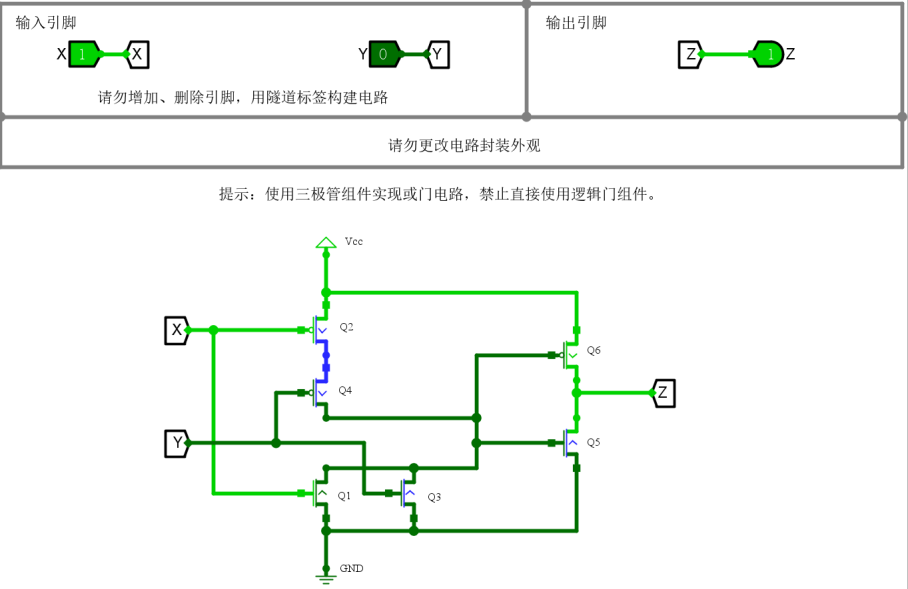
多数表决器电路图

#### （3）实验数据仿真测试图
> 要求：根据实验要求，输入测试数据，选择单步时钟执行，截取仿真运行时的电路图，分析电路状态是否满足设计需求。说明子模块的功能，列出子模块的功能表。

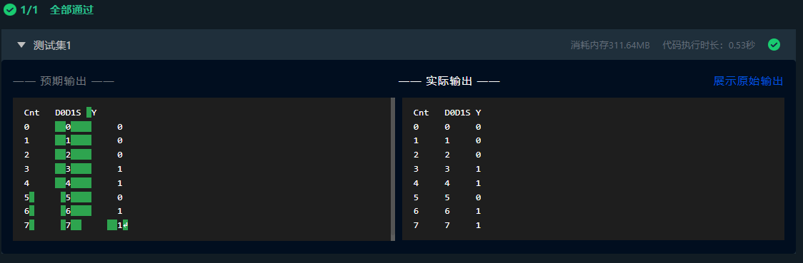
仿真测试截图

##### 真值表
| D0 | D1 | S | Y |
|----|----|---|---|
| 0  | 0  | 0 | 0 |
| 0  | 0  | 1 | 0 |
| 0  | 1  | 0 | 0 |
| 0  | 1  | 1 | 1 |
| 1  | 0  | 0 | 1 |
| 1  | 0  | 1 | 0 |
| 1  | 1  | 0 | 1 |
| 1  | 1  | 1 | 1 |

#### （4）错误现象及分析
> 要求：在电路设计、连接和仿真运行时，遇到的任何错误，都需要截屏放置到实验报告中，并分析错误原因和解决办法。

实验过程中没有遇到任何错误。

### 4.2选1多路选择器（2）

#### （1）实验整体方案设计
> 要求：说明本次实验的顶层设计模块图，对每个子模块进行详细描述，定义输入输出引脚，数据及控制信号的传输通道等。

传输门控制输入A和B的通断，选择信号S决定传输门状态，S为0时输出A，S为1时输出B，实现信号选择功能。   
实验电路较为简单，不需要顶层模块设计图。

#### （2）实验原理图和电路图
> 要求：给出每个子模块的原理图和 Logisim 中的电路图，定义子模块的外观图。如果对实验指导讲义中的内容提出优化或改进，需要此说明原因、方法和效果。

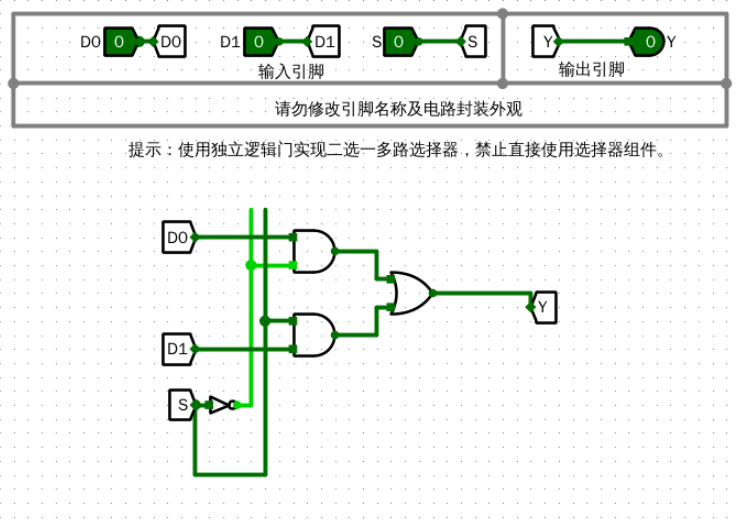
多数表决器电路图

#### （3）实验数据仿真测试图
> 要求：根据实验要求，输入测试数据，选择单步时钟执行，截取仿真运行时的电路图，分析电路状态是否满足设计需求。说明子模块的功能，列出子模块的功能表。

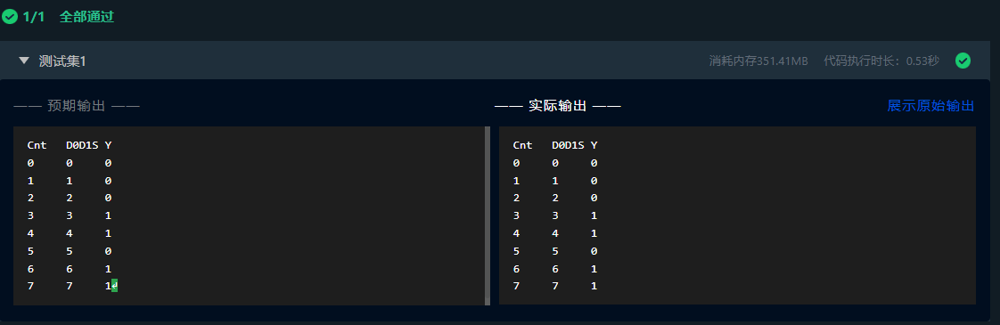
仿真测试截图

##### 真值表
| D0 | D1 | S | Y |
|----|----|---|---|
| 0  | 0  | 0 | 0 |
| 0  | 0  | 1 | 0 |
| 0  | 1  | 0 | 0 |
| 0  | 1  | 1 | 1 |
| 1  | 0  | 0 | 1 |
| 1  | 0  | 1 | 0 |
| 1  | 1  | 0 | 1 |
| 1  | 1  | 1 | 1 |

#### （4）错误现象及分析
> 要求：在电路设计、连接和仿真运行时，遇到的任何错误，都需要截屏放置到实验报告中，并分析错误原因和解决办法。

这个实验中的错误也很容易由传输门造成。传输门由PMOS和NMOS并联组成，利用互补控制信号实现双向导通。当控制信号为高时，PMOS和NMOS同时导通，信号从输入到输出传输；控制信号为低时，两者截止，阻断信号传输。

### 5.4选择1多路选择器

#### （1）实验整体方案设计
> 要求：说明本次实验的顶层设计模块图，对每个子模块进行详细描述，定义输入输出引脚，数据及控制信号的传输通道等。

通过封装三个2选1多路选择器，利用两级选择信号（S1、S0）逐级筛选，将四个输入信号（D0-D3）依次传递，最终实现4选1多路选择功能。  
实验电路较为简单，不需要顶层模块设计图。

#### （2）实验原理图和电路图
> 要求：给出每个子模块的原理图和 Logisim 中的电路图，定义子模块的外观图。如果对实验指导讲义中的内容提出优化或改进，需要此说明原因、方法和效果。

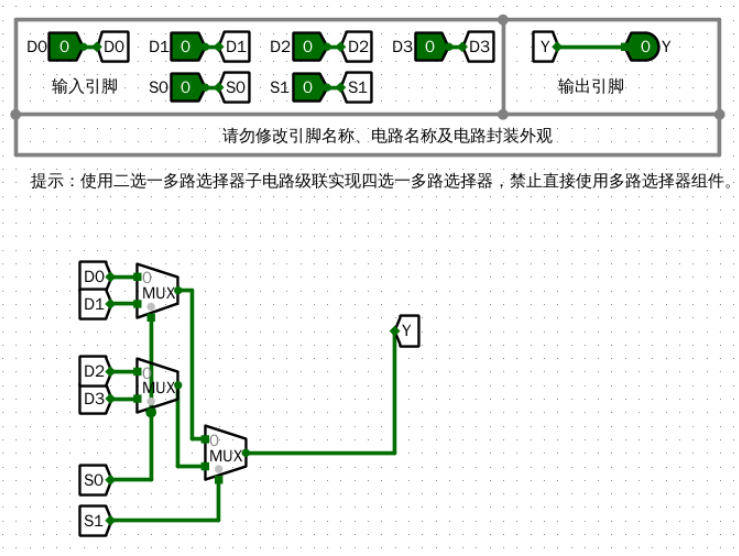
多数表决器电路图

#### （3）实验数据仿真测试图
> 要求：根据实验要求，输入测试数据，选择单步时钟执行，截取仿真运行时的电路图，分析电路状态是否满足设计需求。说明子模块的功能，列出子模块的功能表。

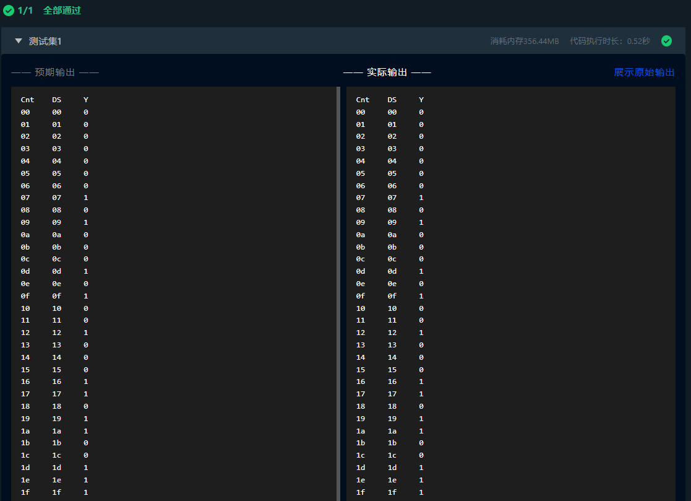
仿真测试截图

##### 真值表
| D0 | D1 | S | Y |
|----|----|---|---|
| 0  | 0  | 0 | 0 |
| 0  | 0  | 1 | 0 |
| 0  | 1  | 0 | 0 |
| 0  | 1  | 1 | 1 |
| 1  | 0  | 0 | 1 |
| 1  | 0  | 1 | 0 |
| 1  | 1  | 0 | 1 |
| 1  | 1  | 1 | 1 |

#### （4）错误现象及分析
> 要求：在电路设计、连接和仿真运行时，遇到的任何错误，都需要截屏放置到实验报告中，并分析错误原因和解决办法。

将二路选择器的引脚顺序弄反，导致逻辑功能完全错误。这种错误还很难察出来

> 思考题在报告开头处