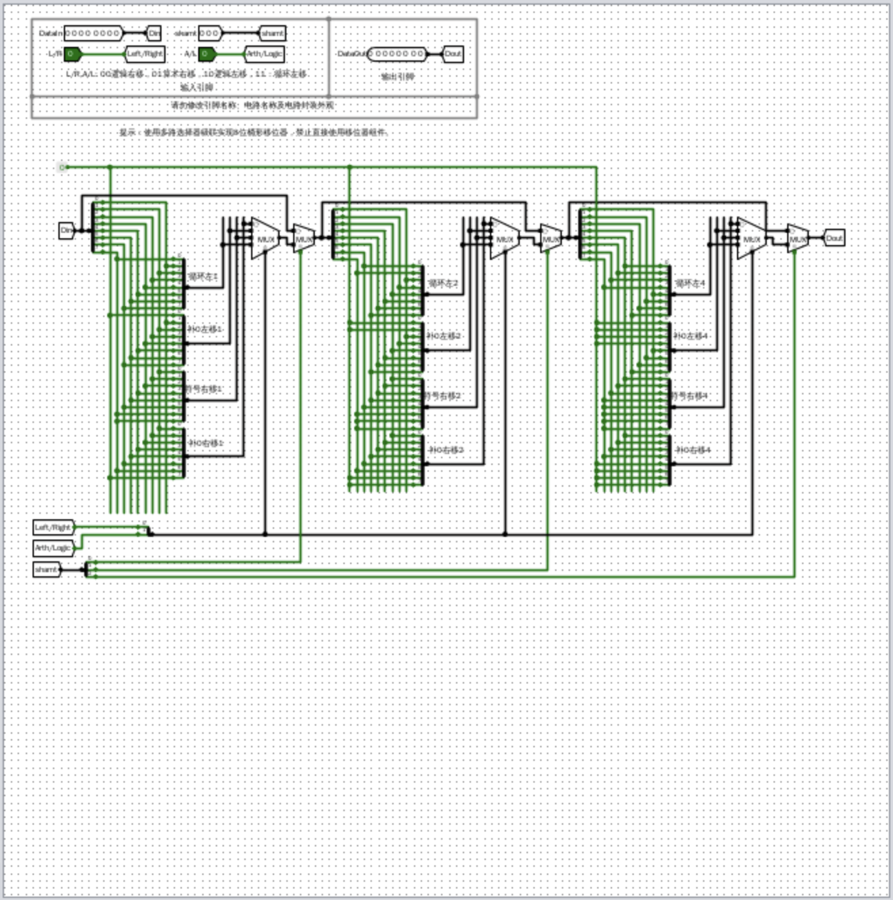
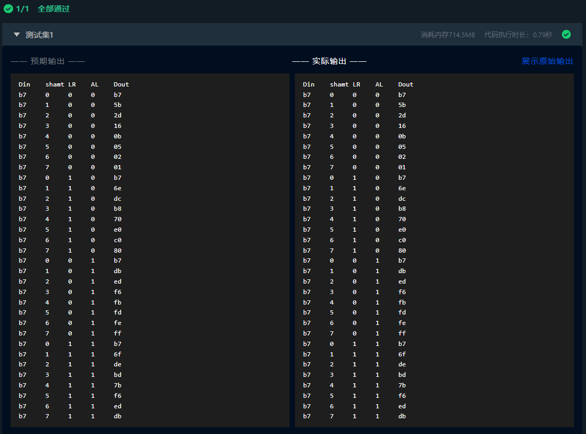

# 实验报告
## 思考题
1. 修改实验中的加法器电路，生成进位标志 CF、溢出标志 OF、符号标志 SF 和结果为零标志位 ZF。

如此实现
2. 在执行比较指令时，通常使用减法运算后，判断标志位的方式来实现，试通过上述加法器实验举例说明判别的方法

如此实现两个无符号二进制数的比较
3. 如何使用 8 位桶形移位器扩展到 32 位桶形移位器。
8位桶形位移器由三个模块组成，即移动1位置、移动2位、移动4位。要实现32位桶形位移器，还需要实现移动8位、移动16位的模块，原理一致。

## 基本信息
**实验名称**：基本逻辑部件设计
**实验人**：241220071葛家韬

## 实验目的
1. 学习组合逻辑电路的设计方法和步骤，掌握译码器、编码器等组合部件的设计方法。
2. 掌握串行加法器设计方法，理解减法和比较运算的实现方法。
3. 掌握汉明码校验电路的设计方法。
4. 掌握桶形移位器的设计方法。
## 实验环境
Logisim 2.16
## 实验内容
### 1.译码器实验

#### （1）实验整体方案设计
> 要求：说明本次实验的顶层设计模块图，对每个子模块进行详细描述，定义输入输出引脚，数据及控制信号的传输通道等。

实验电路较为简单，不需要顶层模块设计图。

#### （2）实验原理图和电路图
> 要求：给出每个子模块的原理图和 Logisim 中的电路图，定义子模块的外观图。如果对实验指导讲义中的内容提出优化或改进，需要此说明原因、方法和效果。

3-8译码器原理图

3-8译码器电路图

#### （3）实验数据仿真测试图
> 要求：根据实验要求，输入测试数据，选择单步时钟执行，截取仿真运行时的电路图，分析电路状态是否满足设计需求。说明子模块的功能，列出子模块的功能表。

仿真测试截图

##### 真值表
附在实验报告末尾

#### （4）错误现象及分析
> 要求：在电路设计、连接和仿真运行时，遇到的任何错误，都需要截屏放置到实验报告中，并分析错误原因和解决办法。

在完成实验的过程中，没有遇到任何错误。

### 2.编码器实验

#### （1）实验整体方案设计
> 要求：说明本次实验的顶层设计模块图，对每个子模块进行详细描述，定义输入输出引脚，数据及控制信号的传输通道等。

实验电路较为简单，不需要顶层模块设计图。

#### （2）实验原理图和电路图
> 要求：给出每个子模块的原理图和 Logisim 中的电路图，定义子模块的外观图。如果对实验指导讲义中的内容提出优化或改进，需要此说明原因、方法和效果。

编码器原理图

编码器电路图

#### （3）实验数据仿真测试图
> 要求：根据实验要求，输入测试数据，选择单步时钟执行，截取仿真运行时的电路图，分析电路状态是否满足设计需求。说明子模块的功能，列出子模块的功能表。

仿真测试截图

##### 真值表
附在实验报告末尾

#### （4）错误现象及分析
> 要求：在电路设计、连接和仿真运行时，遇到的任何错误，都需要截屏放置到实验报告中，并分析错误原因和解决办法。

在完成实验的过程中，没有遇到任何错误。

### 3.加减法器实验

#### （1）实验整体方案设计
> 要求：说明本次实验的顶层设计模块图，对每个子模块进行详细描述，定义输入输出引脚，数据及控制信号的传输通道等。

实验电路较为简单，不需要顶层模块设计图。

#### （2）实验原理图和电路图
> 要求：给出每个子模块的原理图和 Logisim 中的电路图，定义子模块的外观图。如果对实验指导讲义中的内容提出优化或改进，需要此说明原因、方法和效果。

加减法器原理图

加减法器电路图

#### （3）实验数据仿真测试图
> 要求：根据实验要求，输入测试数据，选择单步时钟执行，截取仿真运行时的电路图，分析电路状态是否满足设计需求。说明子模块的功能，列出子模块的功能表。

仿真测试截图

##### 真值表
附在实验报告末尾

### 4.汉明码校验电路

#### （1）实验整体方案设计
> 要求：说明本次实验的顶层设计模块图，对每个子模块进行详细描述，定义输入输出引脚，数据及控制信号的传输通道等。

实验电路较为简单，不需要顶层模块设计图。

#### （2）实验原理图和电路图
> 要求：给出每个子模块的原理图和 Logisim 中的电路图，定义子模块的外观图。如果对实验指导讲义中的内容提出优化或改进，需要此说明原因、方法和效果。

汉明码校验电路原理图

汉明码校验电路电路图

#### （3）实验数据仿真测试图
> 要求：根据实验要求，输入测试数据，选择单步时钟执行，截取仿真运行时的电路图，分析电路状态是否满足设计需求。说明子模块的功能，列出子模块的功能表。

仿真测试截图

##### 真值表
附在实验报告末尾

#### （4）错误现象及分析
> 要求：在电路设计、连接和仿真运行时，遇到的任何错误，都需要截屏放置到实验报告中，并分析错误原因和解决办法。

在完成实验的过程中，没有遇到任何错误。
## 附件 真值表

### 5.桶形移位器

#### （1）实验整体方案设计
> 要求：说明本次实验的顶层设计模块图，对每个子模块进行详细描述，定义输入输出引脚，数据及控制信号的传输通道等。

实验电路较为简单，不需要顶层模块设计图。

#### （2）实验原理图和电路图
> 要求：给出每个子模块的原理图和 Logisim 中的电路图，定义子模块的外观图。如果对实验指导讲义中的内容提出优化或改进，需要此说明原因、方法和效果。

桶形移位器原理图

桶形移位器电路图

#### （3）实验数据仿真测试图
> 要求：根据实验要求，输入测试数据，选择单步时钟执行，截取仿真运行时的电路图，分析电路状态是否满足设计需求。说明子模块的功能，列出子模块的功能表。

仿真测试截图

##### 真值表
附在实验报告末尾

#### （4）错误现象及分析
> 要求：在电路设计、连接和仿真运行时，遇到的任何错误，都需要截屏放置到实验报告中，并分析错误原因和解决办法。

在完成实验的过程中，没有遇到任何错误。
## 附件 真值表

### 译码器实验
| G1 | G2A_L | G2B_L | A | B | C | Y0_L | Y1_L | Y2_L | Y3_L | Y4_L | Y5_L | Y6_L | Y7_L |
|----|-------|-------|---|---|---|------|------|------|------|------|------|------|------|
| 0  |   0   |   0   | 0 | 0 | 0 |  1   |  1   |  1   |  1   |  1   |  1   |  1   |  1   |
| 0  |   0   |   0   | 0 | 0 | 1 |  1   |  1   |  1   |  1   |  1   |  1   |  1   |  1   |
| 0  |   0   |   0   | 0 | 1 | 0 |  1   |  1   |  1   |  1   |  1   |  1   |  1   |  1   |
| 0  |   0   |   0   | 0 | 1 | 1 |  1   |  1   |  1   |  1   |  1   |  1   |  1   |  1   |
| 0  |   0   |   0   | 1 | 0 | 0 |  1   |  1   |  1   |  1   |  1   |  1   |  1   |  1   |
| 0  |   0   |   0   | 1 | 0 | 1 |  1   |  1   |  1   |  1   |  1   |  1   |  1   |  1   |
| 0  |   0   |   0   | 1 | 1 | 0 |  1   |  1   |  1   |  1   |  1   |  1   |  1   |  1   |
| 0  |   0   |   0   | 1 | 1 | 1 |  1   |  1   |  1   |  1   |  1   |  1   |  1   |  1   |
| 0  |   0   |   1   | 0 | 0 | 0 |  1   |  1   |  1   |  1   |  1   |  1   |  1   |  1   |
| 0  |   0   |   1   | 0 | 0 | 1 |  1   |  1   |  1   |  1   |  1   |  1   |  1   |  1   |
| 0  |   0   |   1   | 0 | 1 | 0 |  1   |  1   |  1   |  1   |  1   |  1   |  1   |  1   |
| 0  |   0   |   1   | 0 | 1 | 1 |  1   |  1   |  1   |  1   |  1   |  1   |  1   |  1   |
| 0  |   0   |   1   | 1 | 0 | 0 |  1   |  1   |  1   |  1   |  1   |  1   |  1   |  1   |
| 0  |   0   |   1   | 1 | 0 | 1 |  1   |  1   |  1   |  1   |  1   |  1   |  1   |  1   |
| 0  |   0   |   1   | 1 | 1 | 0 |  1   |  1   |  1   |  1   |  1   |  1   |  1   |  1   |
| 0  |   0   |   1   | 1 | 1 | 1 |  1   |  1   |  1   |  1   |  1   |  1   |  1   |  1   |
| 0  |   1   |   0   | 0 | 0 | 0 |  1   |  1   |  1   |  1   |  1   |  1   |  1   |  1   |
| 0  |   1   |   0   | 0 | 0 | 1 |  1   |  1   |  1   |  1   |  1   |  1   |  1   |  1   |
| 0  |   1   |   0   | 0 | 1 | 0 |  1   |  1   |  1   |  1   |  1   |  1   |  1   |  1   |
| 0  |   1   |   0   | 0 | 1 | 1 |  1   |  1   |  1   |  1   |  1   |  1   |  1   |  1   |
| 0  |   1   |   0   | 1 | 0 | 0 |  1   |  1   |  1   |  1   |  1   |  1   |  1   |  1   |
| 0  |   1   |   0   | 1 | 0 | 1 |  1   |  1   |  1   |  1   |  1   |  1   |  1   |  1   |
| 0  |   1   |   0   | 1 | 1 | 0 |  1   |  1   |  1   |  1   |  1   |  1   |  1   |  1   |
| 0  |   1   |   0   | 1 | 1 | 1 |  1   |  1   |  1   |  1   |  1   |  1   |  1   |  1   |
| 0  |   1   |   1   | 0 | 0 | 0 |  1   |  1   |  1   |  1   |  1   |  1   |  1   |  1   |
| 0  |   1   |   1   | 0 | 0 | 1 |  1   |  1   |  1   |  1   |  1   |  1   |  1   |  1   |
| 0  |   1   |   1   | 0 | 1 | 0 |  1   |  1   |  1   |  1   |  1   |  1   |  1   |  1   |
| 0  |   1   |   1   | 0 | 1 | 1 |  1   |  1   |  1   |  1   |  1   |  1   |  1   |  1   |
| 0  |   1   |   1   | 1 | 0 | 0 |  1   |  1   |  1   |  1   |  1   |  1   |  1   |  1   |
| 0  |   1   |   1   | 1 | 0 | 1 |  1   |  1   |  1   |  1   |  1   |  1   |  1   |  1   |
| 0  |   1   |   1   | 1 | 1 | 0 |  1   |  1   |  1   |  1   |  1   |  1   |  1   |  1   |
| 0  |   1   |   1   | 1 | 1 | 1 |  1   |  1   |  1   |  1   |  1   |  1   |  1   |  1   |
| 1  |   0   |   0   | 0 | 0 | 0 |  0   |  1   |  1   |  1   |  1   |  1   |  1   |  1   |
| 1  |   0   |   0   | 0 | 0 | 1 |  1   |  1   |  1   |  1   |  0   |  1   |  1   |  1   |
| 1  |   0   |   0   | 0 | 1 | 0 |  1   |  1   |  0   |  1   |  1   |  1   |  1   |  1   |
| 1  |   0   |   0   | 0 | 1 | 1 |  1   |  1   |  1   |  1   |  1   |  1   |  0   |  1   |
| 1  |   0   |   0   | 1 | 0 | 0 |  1   |  0   |  1   |  1   |  1   |  1   |  1   |  1   |
| 1  |   0   |   0   | 1 | 0 | 1 |  1   |  1   |  1   |  1   |  1   |  0   |  1   |  1   |
| 1  |   0   |   0   | 1 | 1 | 0 |  1   |  1   |  1   |  0   |  1   |  1   |  1   |  1   |
| 1  |   0   |   0   | 1 | 1 | 1 |  1   |  1   |  1   |  1   |  1   |  1   |  1   |  0   |
| 1  |   0   |   1   | 0 | 0 | 0 |  1   |  1   |  1   |  1   |  1   |  1   |  1   |  1   |
| 1  |   0   |   1   | 0 | 0 | 1 |  1   |  1   |  1   |  1   |  1   |  1   |  1   |  1   |
| 1  |   0   |   1   | 0 | 1 | 0 |  1   |  1   |  1   |  1   |  1   |  1   |  1   |  1   |
| 1  |   0   |   1   | 0 | 1 | 1 |  1   |  1   |  1   |  1   |  1   |  1   |  1   |  1   |
| 1  |   0   |   1   | 1 | 0 | 0 |  1   |  1   |  1   |  1   |  1   |  1   |  1   |  1   |
| 1  |   0   |   1   | 1 | 0 | 1 |  1   |  1   |  1   |  1   |  1   |  1   |  1   |  1   |
| 1  |   0   |   1   | 1 | 1 | 0 |  1   |  1   |  1   |  1   |  1   |  1   |  1   |  1   |
| 1  |   0   |   1   | 1 | 1 | 1 |  1   |  1   |  1   |  1   |  1   |  1   |  1   |  1   |
| 1  |   1   |   0   | 0 | 0 | 0 |  1   |  1   |  1   |  1   |  1   |  1   |  1   |  1   |
| 1  |   1   |   0   | 0 | 0 | 1 |  1   |  1   |  1   |  1   |  1   |  1   |  1   |  1   |
| 1  |   1   |   0   | 0 | 1 | 0 |  1   |  1   |  1   |  1   |  1   |  1   |  1   |  1   |
| 1  |   1   |   0   | 0 | 1 | 1 |  1   |  1   |  1   |  1   |  1   |  1   |  1   |  1   |
| 1  |   1   |   0   | 1 | 0 | 0 |  1   |  1   |  1   |  1   |  1   |  1   |  1   |  1   |
| 1  |   1   |   0   | 1 | 0 | 1 |  1   |  1   |  1   |  1   |  1   |  1   |  1   |  1   |
| 1  |   1   |   0   | 1 | 1 | 0 |  1   |  1   |  1   |  1   |  1   |  1   |  1   |  1   |
| 1  |   1   |   0   | 1 | 1 | 1 |  1   |  1   |  1   |  1   |  1   |  1   |  1   |  1   |
| 1  |   1   |   1   | 0 | 0 | 0 |  1   |  1   |  1   |  1   |  1   |  1   |  1   |  1   |
| 1  |   1   |   1   | 0 | 0 | 1 |  1   |  1   |  1   |  1   |  1   |  1   |  1   |  1   |
| 1  |   1   |   1   | 0 | 1 | 0 |  1   |  1   |  1   |  1   |  1   |  1   |  1   |  1   |
| 1  |   1   |   1   | 0 | 1 | 1 |  1   |  1   |  1   |  1   |  1   |  1   |  1   |  1   |
| 1  |   1   |   1   | 1 | 0 | 0 |  1   |  1   |  1   |  1   |  1   |  1   |  1   |  1   |
| 1  |   1   |   1   | 1 | 0 | 1 |  1   |  1   |  1   |  1   |  1   |  1   |  1   |  1   |
| 1  |   1   |   1   | 1 | 1 | 0 |  1   |  1   |  1   |  1   |  1   |  1   |  1   |  1   |
| 1  |   1   |   1   | 1 | 1 | 1 |  1   |  1   |  1   |  1   |  1   |  1   |  1   |  1   |

### 编码器实验
| I0 | I1 | I2 | I4 | I5 | I3 | I6 | I7 | O0 | O1 | O2 |
|----|----|----|----|----|----|----|----|----|----|----|
| 0  | 0  | 0  | 0  | 0  | 0  | 0  | 0  | 0  | 0  | 0  |
| 0  | 0  | 0  | 0  | 0  | 0  | 0  | 1  | 1  | 1  | 1  |
| 0  | 0  | 0  | 0  | 0  | 0  | 1  | 0  | 1  | 1  | 0  |
| 0  | 0  | 0  | 0  | 0  | 0  | 1  | 1  | 1  | 1  | 0  |
| 0  | 0  | 0  | 0  | 0  | 1  | 0  | 0  | 0  | 1  | 1  |
| 0  | 0  | 0  | 0  | 0  | 1  | 0  | 1  | 0  | 1  | 1  |
| 0  | 0  | 0  | 0  | 0  | 1  | 1  | 0  | 0  | 1  | 1  |
| 0  | 0  | 0  | 0  | 0  | 1  | 1  | 1  | 0  | 1  | 1  |
| 0  | 0  | 0  | 0  | 1  | 0  | 0  | 0  | 1  | 0  | 1  |
| 0  | 0  | 0  | 0  | 1  | 0  | 0  | 1  | 1  | 0  | 1  |
| 0  | 0  | 0  | 0  | 1  | 0  | 1  | 0  | 1  | 0  | 1  |
| 0  | 0  | 0  | 0  | 1  | 0  | 1  | 1  | 1  | 0  | 1  |
| 0  | 0  | 0  | 0  | 1  | 1  | 0  | 0  | 0  | 1  | 1  |
| 0  | 0  | 0  | 0  | 1  | 1  | 0  | 1  | 0  | 1  | 1  |
| 0  | 0  | 0  | 0  | 1  | 1  | 1  | 0  | 0  | 1  | 1  |
| 0  | 0  | 0  | 0  | 1  | 1  | 1  | 1  | 0  | 1  | 1  |
| 0  | 0  | 0  | 1  | 0  | 0  | 0  | 0  | 1  | 0  | 0  |
| 0  | 0  | 0  | 1  | 0  | 0  | 0  | 1  | 1  | 0  | 0  |
| 0  | 0  | 0  | 1  | 0  | 0  | 1  | 0  | 1  | 0  | 0  |
| 0  | 0  | 0  | 1  | 0  | 0  | 1  | 1  | 1  | 0  | 0  |
| 0  | 0  | 0  | 1  | 0  | 1  | 0  | 0  | 0  | 1  | 1  |
| 0  | 0  | 0  | 1  | 0  | 1  | 0  | 1  | 0  | 1  | 1  |
| 0  | 0  | 0  | 1  | 0  | 1  | 1  | 0  | 0  | 1  | 1  |
| 0  | 0  | 0  | 1  | 0  | 1  | 1  | 1  | 0  | 1  | 1  |
| 0  | 0  | 0  | 1  | 1  | 0  | 0  | 0  | 1  | 0  | 0  |
| 0  | 0  | 0  | 1  | 1  | 0  | 0  | 1  | 1  | 0  | 0  |
| 0  | 0  | 0  | 1  | 1  | 0  | 1  | 0  | 1  | 0  | 0  |
| 0  | 0  | 0  | 1  | 1  | 0  | 1  | 1  | 1  | 0  | 0  |
| 0  | 0  | 0  | 1  | 1  | 1  | 0  | 0  | 0  | 1  | 1  |
| 0  | 0  | 0  | 1  | 1  | 1  | 0  | 1  | 0  | 1  | 1  |
| 0  | 0  | 0  | 1  | 1  | 1  | 1  | 0  | 0  | 1  | 1  |
| 0  | 0  | 0  | 1  | 1  | 1  | 1  | 1  | 0  | 1  | 1  |
| 0  | 0  | 1  | 0  | 0  | 0  | 0  | 0  | 0  | 1  | 0  |
| 0  | 0  | 1  | 0  | 0  | 0  | 0  | 1  | 0  | 1  | 0  |
| 0  | 0  | 1  | 0  | 0  | 0  | 1  | 0  | 0  | 1  | 0  |
| 0  | 0  | 1  | 0  | 0  | 0  | 1  | 1  | 0  | 1  | 0  |
| 0  | 0  | 1  | 0  | 0  | 1  | 0  | 0  | 0  | 1  | 0  |
| 0  | 0  | 1  | 0  | 0  | 1  | 0  | 1  | 0  | 1  | 0  |
| 0  | 0  | 1  | 0  | 0  | 1  | 1  | 0  | 0  | 1  | 0  |
| 0  | 0  | 1  | 0  | 0  | 1  | 1  | 1  | 0  | 1  | 0  |
| 0  | 0  | 1  | 0  | 1  | 0  | 0  | 0  | 0  | 1  | 0  |
| 0  | 0  | 1  | 0  | 1  | 0  | 0  | 1  | 0  | 1  | 0  |
| 0  | 0  | 1  | 0  | 1  | 0  | 1  | 0  | 0  | 1  | 0  |
| 0  | 0  | 1  | 0  | 1  | 0  | 1  | 1  | 0  | 1  | 0  |
| 0  | 0  | 1  | 0  | 1  | 1  | 0  | 0  | 0  | 1  | 0  |
| 0  | 0  | 1  | 0  | 1  | 1  | 0  | 1  | 0  | 1  | 0  |
| 0  | 0  | 1  | 0  | 1  | 1  | 1  | 0  | 0  | 1  | 0  |
| 0  | 0  | 1  | 0  | 1  | 1  | 1  | 1  | 0  | 1  | 0  |
| 0  | 0  | 1  | 1  | 0  | 0  | 0  | 0  | 0  | 1  | 0  |
| 0  | 0  | 1  | 1  | 0  | 0  | 0  | 1  | 0  | 1  | 0  |
| 0  | 0  | 1  | 1  | 0  | 0  | 1  | 0  | 0  | 1  | 0  |
| 0  | 0  | 1  | 1  | 0  | 0  | 1  | 1  | 0  | 1  | 0  |
| 0  | 0  | 1  | 1  | 0  | 1  | 0  | 0  | 0  | 1  | 0  |
| 0  | 0  | 1  | 1  | 0  | 1  | 0  | 1  | 0  | 1  | 0  |
| 0  | 0  | 1  | 1  | 0  | 1  | 1  | 0  | 0  | 1  | 0  |
| 0  | 0  | 1  | 1  | 0  | 1  | 1  | 1  | 0  | 1  | 0  |
| 0  | 0  | 1  | 1  | 1  | 0  | 0  | 0  | 0  | 1  | 0  |
| 0  | 0  | 1  | 1  | 1  | 0  | 0  | 1  | 0  | 1  | 0  |
| 0  | 0  | 1  | 1  | 1  | 0  | 1  | 0  | 0  | 1  | 0  |
| 0  | 0  | 1  | 1  | 1  | 0  | 1  | 1  | 0  | 1  | 0  |
| 0  | 0  | 1  | 1  | 1  | 1  | 0  | 0  | 0  | 1  | 0  |
| 0  | 0  | 1  | 1  | 1  | 1  | 0  | 1  | 0  | 1  | 0  |
| 0  | 0  | 1  | 1  | 1  | 1  | 1  | 0  | 0  | 1  | 0  |
| 0  | 0  | 1  | 1  | 1  | 1  | 1  | 1  | 0  | 1  | 0  |
| 0  | 1  | 0  | 0  | 0  | 0  | 0  | 0  | 0  | 0  | 1  |
| 0  | 1  | 0  | 0  | 0  | 0  | 0  | 1  | 0  | 0  | 1  |
| 0  | 1  | 0  | 0  | 0  | 0  | 1  | 0  | 0  | 0  | 1  |
| 0  | 1  | 0  | 0  | 0  | 0  | 1  | 1  | 0  | 0  | 1  |
| 0  | 1  | 0  | 0  | 0  | 1  | 0  | 0  | 0  | 0  | 1  |
| 0  | 1  | 0  | 0  | 0  | 1  | 0  | 1  | 0  | 0  | 1  |
| 0  | 1  | 0  | 0  | 0  | 1  | 1  | 0  | 0  | 0  | 1  |
| 0  | 1  | 0  | 0  | 0  | 1  | 1  | 1  | 0  | 0  | 1  |
| 0  | 1  | 0  | 0  | 1  | 0  | 0  | 0  | 0  | 0  | 1  |
| 0  | 1  | 0  | 0  | 1  | 0  | 0  | 1  | 0  | 0  | 1  |
| 0  | 1  | 0  | 0  | 1  | 0  | 1  | 0  | 0  | 0  | 1  |
| 0  | 1  | 0  | 0  | 1  | 0  | 1  | 1  | 0  | 0  | 1  |
| 0  | 1  | 0  | 0  | 1  | 1  | 0  | 0  | 0  | 0  | 1  |
| 0  | 1  | 0  | 0  | 1  | 1  | 0  | 1  | 0  | 0  | 1  |
| 0  | 1  | 0  | 0  | 1  | 1  | 1  | 0  | 0  | 0  | 1  |
| 0  | 1  | 0  | 0  | 1  | 1  | 1  | 1  | 0  | 0  | 1  |
| 0  | 1  | 0  | 1  | 0  | 0  | 0  | 0  | 0  | 0  | 1  |
| 0  | 1  | 0  | 1  | 0  | 0  | 0  | 1  | 0  | 0  | 1  |
| 0  | 1  | 0  | 1  | 0  | 0  | 1  | 0  | 0  | 0  | 1  |
| 0  | 1  | 0  | 1  | 0  | 0  | 1  | 1  | 0  | 0  | 1  |
| 0  | 1  | 0  | 1  | 0  | 1  | 0  | 0  | 0  | 0  | 1  |
| 0  | 1  | 0  | 1  | 0  | 1  | 0  | 1  | 0  | 0  | 1  |
| 0  | 1  | 0  | 1  | 0  | 1  | 1  | 0  | 0  | 0  | 1  |
| 0  | 1  | 0  | 1  | 0  | 1  | 1  | 1  | 0  | 0  | 1  |
| 0  | 1  | 0  | 1  | 1  | 0  | 0  | 0  | 0  | 0  | 1  |
| 0  | 1  | 0  | 1  | 1  | 0  | 0  | 1  | 0  | 0  | 1  |
| 0  | 1  | 0  | 1  | 1  | 0  | 1  | 0  | 0  | 0  | 1  |
| 0  | 1  | 0  | 1  | 1  | 0  | 1  | 1  | 0  | 0  | 1  |
| 0  | 1  | 0  | 1  | 1  | 1  | 0  | 0  | 0  | 0  | 1  |
| 0  | 1  | 0  | 1  | 1  | 1  | 0  | 1  | 0  | 0  | 1  |
| 0  | 1  | 0  | 1  | 1  | 1  | 1  | 0  | 0  | 0  | 1  |
| 0  | 1  | 0  | 1  | 1  | 1  | 1  | 1  | 0  | 0  | 1  |
| 0  | 1  | 1  | 0  | 0  | 0  | 0  | 0  | 0  | 0  | 1  |
| 0  | 1  | 1  | 0  | 0  | 0  | 0  | 1  | 0  | 0  | 1  |
| 0  | 1  | 1  | 0  | 0  | 0  | 1  | 0  | 0  | 0  | 1  |
| 0  | 1  | 1  | 0  | 0  | 0  | 1  | 1  | 0  | 0  | 1  |
| 0  | 1  | 1  | 0  | 0  | 1  | 0  | 0  | 0  | 0  | 1  |
| 0  | 1  | 1  | 0  | 0  | 1  | 0  | 1  | 0  | 0  | 1  |
| 0  | 1  | 1  | 0  | 0  | 1  | 1  | 0  | 0  | 0  | 1  |
| 0  | 1  | 1  | 0  | 0  | 1  | 1  | 1  | 0  | 0  | 1  |
| 0  | 1  | 1  | 0  | 1  | 0  | 0  | 0  | 0  | 0  | 1  |
| 0  | 1  | 1  | 0  | 1  | 0  | 0  | 1  | 0  | 0  | 1  |
| 0  | 1  | 1  | 0  | 1  | 0  | 1  | 0  | 0  | 0  | 1  |
| 0  | 1  | 1  | 0  | 1  | 0  | 1  | 1  | 0  | 0  | 1  |
| 0  | 1  | 1  | 0  | 1  | 1  | 0  | 0  | 0  | 0  | 1  |
| 0  | 1  | 1  | 0  | 1  | 1  | 0  | 1  | 0  | 0  | 1  |
| 0  | 1  | 1  | 0  | 1  | 1  | 1  | 0  | 0  | 0  | 1  |
| 0  | 1  | 1  | 0  | 1  | 1  | 1  | 1  | 0  | 0  | 1  |
| 0  | 1  | 1  | 1  | 0  | 0  | 0  | 0  | 0  | 0  | 1  |
| 0  | 1  | 1  | 1  | 0  | 0  | 0  | 1  | 0  | 0  | 1  |
| 0  | 1  | 1  | 1  | 0  | 0  | 1  | 0  | 0  | 0  | 1  |
| 0  | 1  | 1  | 1  | 0  | 0  | 1  | 1  | 0  | 0  | 1  |
| 0  | 1  | 1  | 1  | 0  | 1  | 0  | 0  | 0  | 0  | 1  |
| 0  | 1  | 1  | 1  | 0  | 1  | 0  | 1  | 0  | 0  | 1  |
| 0  | 1  | 1  | 1  | 0  | 1  | 1  | 0  | 0  | 0  | 1  |
| 0  | 1  | 1  | 1  | 0  | 1  | 1  | 1  | 0  | 0  | 1  |
| 0  | 1  | 1  | 1  | 1  | 0  | 0  | 0  | 0  | 0  | 1  |
| 0  | 1  | 1  | 1  | 1  | 0  | 0  | 1  | 0  | 0  | 1  |
| 0  | 1  | 1  | 1  | 1  | 0  | 1  | 0  | 0  | 0  | 1  |
| 0  | 1  | 1  | 1  | 1  | 0  | 1  | 1  | 0  | 0  | 1  |
| 0  | 1  | 1  | 1  | 1  | 1  | 0  | 0  | 0  | 0  | 1  |
| 0  | 1  | 1  | 1  | 1  | 1  | 0  | 1  | 0  | 0  | 1  |
| 0  | 1  | 1  | 1  | 1  | 1  | 1  | 0  | 0  | 0  | 1  |
| 0  | 1  | 1  | 1  | 1  | 1  | 1  | 1  | 0  | 0  | 1  |
| 1  | 0  | 0  | 0  | 0  | 0  | 0  | 0  | 0  | 0  | 0  |
| 1  | 0  | 0  | 0  | 0  | 0  | 0  | 1  | 0  | 0  | 0  |
| 1  | 0  | 0  | 0  | 0  | 0  | 1  | 0  | 0  | 0  | 0  |
| 1  | 0  | 0  | 0  | 0  | 0  | 1  | 1  | 0  | 0  | 0  |
| 1  | 0  | 0  | 0  | 0  | 1  | 0  | 0  | 0  | 0  | 0  |
| 1  | 0  | 0  | 0  | 0  | 1  | 0  | 1  | 0  | 0  | 0  |
| 1  | 0  | 0  | 0  | 0  | 1  | 1  | 0  | 0  | 0  | 0  |
| 1  | 0  | 0  | 0  | 0  | 1  | 1  | 1  | 0  | 0  | 0  |
| 1  | 0  | 0  | 0  | 1  | 0  | 0  | 0  | 0  | 0  | 0  |
| 1  | 0  | 0  | 0  | 1  | 0  | 0  | 1  | 0  | 0  | 0  |
| 1  | 0  | 0  | 0  | 1  | 0  | 1  | 0  | 0  | 0  | 0  |
| 1  | 0  | 0  | 0  | 1  | 0  | 1  | 1  | 0  | 0  | 0  |
| 1  | 0  | 0  | 0  | 1  | 1  | 0  | 0  | 0  | 0  | 0  |
| 1  | 0  | 0  | 0  | 1  | 1  | 0  | 1  | 0  | 0  | 0  |
| 1  | 0  | 0  | 0  | 1  | 1  | 1  | 0  | 0  | 0  | 0  |
| 1  | 0  | 0  | 0  | 1  | 1  | 1  | 1  | 0  | 0  | 0  |
| 1  | 0  | 0  | 1  | 0  | 0  | 0  | 0  | 0  | 0  | 0  |
| 1  | 0  | 0  | 1  | 0  | 0  | 0  | 1  | 0  | 0  | 0  |
| 1  | 0  | 0  | 1  | 0  | 0  | 1  | 0  | 0  | 0  | 0  |
| 1  | 0  | 0  | 1  | 0  | 0  | 1  | 1  | 0  | 0  | 0  |
| 1  | 0  | 0  | 1  | 0  | 1  | 0  | 0  | 0  | 0  | 0  |
| 1  | 0  | 0  | 1  | 0  | 1  | 0  | 1  | 0  | 0  | 0  |
| 1  | 0  | 0  | 1  | 0  | 1  | 1  | 0  | 0  | 0  | 0  |
| 1  | 0  | 0  | 1  | 0  | 1  | 1  | 1  | 0  | 0  | 0  |
| 1  | 0  | 0  | 1  | 1  | 0  | 0  | 0  | 0  | 0  | 0  |
| 1  | 0  | 0  | 1  | 1  | 0  | 0  | 1  | 0  | 0  | 0  |
| 1  | 0  | 0  | 1  | 1  | 0  | 1  | 0  | 0  | 0  | 0  |
| 1  | 0  | 0  | 1  | 1  | 0  | 1  | 1  | 0  | 0  | 0  |
| 1  | 0  | 0  | 1  | 1  | 1  | 0  | 0  | 0  | 0  | 0  |
| 1  | 0  | 0  | 1  | 1  | 1  | 0  | 1  | 0  | 0  | 0  |
| 1  | 0  | 0  | 1  | 1  | 1  | 1  | 0  | 0  | 0  | 0  |
| 1  | 0  | 0  | 1  | 1  | 1  | 1  | 1  | 0  | 0  | 0  |
| 1  | 0  | 1  | 0  | 0  | 0  | 0  | 0  | 0  | 0  | 0  |
| 1  | 0  | 1  | 0  | 0  | 0  | 0  | 1  | 0  | 0  | 0  |
| 1  | 0  | 1  | 0  | 0  | 0  | 1  | 0  | 0  | 0  | 0  |
| 1  | 0  | 1  | 0  | 0  | 0  | 1  | 1  | 0  | 0  | 0  |
| 1  | 0  | 1  | 0  | 0  | 1  | 0  | 0  | 0  | 0  | 0  |
| 1  | 0  | 1  | 0  | 0  | 1  | 0  | 1  | 0  | 0  | 0  |
| 1  | 0  | 1  | 0  | 0  | 1  | 1  | 0  | 0  | 0  | 0  |
| 1  | 0  | 1  | 0  | 0  | 1  | 1  | 1  | 0  | 0  | 0  |
| 1  | 0  | 1  | 0  | 1  | 0  | 0  | 0  | 0  | 0  | 0  |
| 1  | 0  | 1  | 0  | 1  | 0  | 0  | 1  | 0  | 0  | 0  |
| 1  | 0  | 1  | 0  | 1  | 0  | 1  | 0  | 0  | 0  | 0  |
| 1  | 0  | 1  | 0  | 1  | 0  | 1  | 1  | 0  | 0  | 0  |
| 1  | 0  | 1  | 0  | 1  | 1  | 0  | 0  | 0  | 0  | 0  |
| 1  | 0  | 1  | 0  | 1  | 1  | 0  | 1  | 0  | 0  | 0  |
| 1  | 0  | 1  | 0  | 1  | 1  | 1  | 0  | 0  | 0  | 0  |
| 1  | 0  | 1  | 0  | 1  | 1  | 1  | 1  | 0  | 0  | 0  |
| 1  | 0  | 1  | 1  | 0  | 0  | 0  | 0  | 0  | 0  | 0  |
| 1  | 0  | 1  | 1  | 0  | 0  | 0  | 1  | 0  | 0  | 0  |
| 1  | 0  | 1  | 1  | 0  | 0  | 1  | 0  | 0  | 0  | 0  |
| 1  | 0  | 1  | 1  | 0  | 0  | 1  | 1  | 0  | 0  | 0  |
| 1  | 0  | 1  | 1  | 0  | 1  | 0  | 0  | 0  | 0  | 0  |
| 1  | 0  | 1  | 1  | 0  | 1  | 0  | 1  | 0  | 0  | 0  |
| 1  | 0  | 1  | 1  | 0  | 1  | 1  | 0  | 0  | 0  | 0  |
| 1  | 0  | 1  | 1  | 0  | 1  | 1  | 1  | 0  | 0  | 0  |
| 1  | 0  | 1  | 1  | 1  | 0  | 0  | 0  | 0  | 0  | 0  |
| 1  | 0  | 1  | 1  | 1  | 0  | 0  | 1  | 0  | 0  | 0  |
| 1  | 0  | 1  | 1  | 1  | 0  | 1  | 0  | 0  | 0  | 0  |
| 1  | 0  | 1  | 1  | 1  | 0  | 1  | 1  | 0  | 0  | 0  |
| 1  | 0  | 1  | 1  | 1  | 1  | 0  | 0  | 0  | 0  | 0  |
| 1  | 0  | 1  | 1  | 1  | 1  | 0  | 1  | 0  | 0  | 0  |
| 1  | 0  | 1  | 1  | 1  | 1  | 1  | 0  | 0  | 0  | 0  |
| 1  | 0  | 1  | 1  | 1  | 1  | 1  | 1  | 0  | 0  | 0  |
| 1  | 1  | 0  | 0  | 0  | 0  | 0  | 0  | 0  | 0  | 0  |
| 1  | 1  | 0  | 0  | 0  | 0  | 0  | 1  | 0  | 0  | 0  |
| 1  | 1  | 0  | 0  | 0  | 0  | 1  | 0  | 0  | 0  | 0  |
| 1  | 1  | 0  | 0  | 0  | 0  | 1  | 1  | 0  | 0  | 0  |
| 1  | 1  | 0  | 0  | 0  | 1  | 0  | 0  | 0  | 0  | 0  |
| 1  | 1  | 0  | 0  | 0  | 1  | 0  | 1  | 0  | 0  | 0  |
| 1  | 1  | 0  | 0  | 0  | 1  | 1  | 0  | 0  | 0  | 0  |
| 1  | 1  | 0  | 0  | 0  | 1  | 1  | 1  | 0  | 0  | 0  |
| 1  | 1  | 0  | 0  | 1  | 0  | 0  | 0  | 0  | 0  | 0  |
| 1  | 1  | 0  | 0  | 1  | 0  | 0  | 1  | 0  | 0  | 0  |
| 1  | 1  | 0  | 0  | 1  | 0  | 1  | 0  | 0  | 0  | 0  |
| 1  | 1  | 0  | 0  | 1  | 0  | 1  | 1  | 0  | 0  | 0  |
| 1  | 1  | 0  | 0  | 1  | 1  | 0  | 0  | 0  | 0  | 0  |
| 1  | 1  | 0  | 0  | 1  | 1  | 0  | 1  | 0  | 0  | 0  |
| 1  | 1  | 0  | 0  | 1  | 1  | 1  | 0  | 0  | 0  | 0  |
| 1  | 1  | 0  | 0  | 1  | 1  | 1  | 1  | 0  | 0  | 0  |
| 1  | 1  | 0  | 1  | 0  | 0  | 0  | 0  | 0  | 0  | 0  |
| 1  | 1  | 0  | 1  | 0  | 0  | 0  | 1  | 0  | 0  | 0  |
| 1  | 1  | 0  | 1  | 0  | 0  | 1  | 0  | 0  | 0  | 0  |
| 1  | 1  | 0  | 1  | 0  | 0  | 1  | 1  | 0  | 0  | 0  |
| 1  | 1  | 0  | 1  | 0  | 1  | 0  | 0  | 0  | 0  | 0  |
| 1  | 1  | 0  | 1  | 0  | 1  | 0  | 1  | 0  | 0  | 0  |
| 1  | 1  | 0  | 1  | 0  | 1  | 1  | 0  | 0  | 0  | 0  |
| 1  | 1  | 0  | 1  | 0  | 1  | 1  | 1  | 0  | 0  | 0  |
| 1  | 1  | 0  | 1  | 1  | 0  | 0  | 0  | 0  | 0  | 0  |
| 1  | 1  | 0  | 1  | 1  | 0  | 0  | 1  | 0  | 0  | 0  |
| 1  | 1  | 0  | 1  | 1  | 0  | 1  | 0  | 0  | 0  | 0  |
| 1  | 1  | 0  | 1  | 1  | 0  | 1  | 1  | 0  | 0  | 0  |
| 1  | 1  | 0  | 1  | 1  | 1  | 0  | 0  | 0  | 0  | 0  |
| 1  | 1  | 0  | 1  | 1  | 1  | 0  | 1  | 0  | 0  | 0  |
| 1  | 1  | 0  | 1  | 1  | 1  | 1  | 0  | 0  | 0  | 0  |
| 1  | 1  | 0  | 1  | 1  | 1  | 1  | 1  | 0  | 0  | 0  |
| 1  | 1  | 1  | 0  | 0  | 0  | 0  | 0  | 0  | 0  | 0  |
| 1  | 1  | 1  | 0  | 0  | 0  | 0  | 1  | 0  | 0  | 0  |
| 1  | 1  | 1  | 0  | 0  | 0  | 1  | 0  | 0  | 0  | 0  |
| 1  | 1  | 1  | 0  | 0  | 0  | 1  | 1  | 0  | 0  | 0  |
| 1  | 1  | 1  | 0  | 0  | 1  | 0  | 0  | 0  | 0  | 0  |
| 1  | 1  | 1  | 0  | 0  | 1  | 0  | 1  | 0  | 0  | 0  |
| 1  | 1  | 1  | 0  | 0  | 1  | 1  | 0  | 0  | 0  | 0  |
| 1  | 1  | 1  | 0  | 0  | 1  | 1  | 1  | 0  | 0  | 0  |
| 1  | 1  | 1  | 0  | 1  | 0  | 0  | 0  | 0  | 0  | 0  |
| 1  | 1  | 1  | 0  | 1  | 0  | 0  | 1  | 0  | 0  | 0  |
| 1  | 1  | 1  | 0  | 1  | 0  | 1  | 0  | 0  | 0  | 0  |
| 1  | 1  | 1  | 0  | 1  | 0  | 1  | 1  | 0  | 0  | 0  |
| 1  | 1  | 1  | 0  | 1  | 1  | 0  | 0  | 0  | 0  | 0  |
| 1  | 1  | 1  | 0  | 1  | 1  | 0  | 1  | 0  | 0  | 0  |
| 1  | 1  | 1  | 0  | 1  | 1  | 1  | 0  | 0  | 0  | 0  |
| 1  | 1  | 1  | 0  | 1  | 1  | 1  | 1  | 0  | 0  | 0  |
| 1  | 1  | 1  | 1  | 0  | 0  | 0  | 0  | 0  | 0  | 0  |
| 1  | 1  | 1  | 1  | 0  | 0  | 0  | 1  | 0  | 0  | 0  |
| 1  | 1  | 1  | 1  | 0  | 0  | 1  | 0  | 0  | 0  | 0  |
| 1  | 1  | 1  | 1  | 0  | 0  | 1  | 1  | 0  | 0  | 0  |
| 1  | 1  | 1  | 1  | 0  | 1  | 0  | 0  | 0  | 0  | 0  |
| 1  | 1  | 1  | 1  | 0  | 1  | 0  | 1  | 0  | 0  | 0  |
| 1  | 1  | 1  | 1  | 0  | 1  | 1  | 0  | 0  | 0  | 0  |
| 1  | 1  | 1  | 1  | 0  | 1  | 1  | 1  | 0  | 0  | 0  |
| 1  | 1  | 1  | 1  | 1  | 0  | 0  | 0  | 0  | 0  | 0  |
| 1  | 1  | 1  | 1  | 1  | 0  | 0  | 1  | 0  | 0  | 0  |
| 1  | 1  | 1  | 1  | 1  | 0  | 1  | 0  | 0  | 0  | 0  |
| 1  | 1  | 1  | 1  | 1  | 0  | 1  | 1  | 0  | 0  | 0  |
| 1  | 1  | 1  | 1  | 1  | 1  | 0  | 0  | 0  | 0  | 0  |
| 1  | 1  | 1  | 1  | 1  | 1  | 0  | 1  | 0  | 0  | 0  |
| 1  | 1  | 1  | 1  | 1  | 1  | 1  | 0  | 0  | 0  | 0  |
| 1  | 1  | 1  | 1  | 1  | 1  | 1  | 1  | 0  | 0  | 0  |

### 加减法器实验
| in | X1 | X2 | X3 | X4 | Y1 | Y2 | Y3 | Y4 | Cout | O1 | O2 | O3 | O4 |
|----|----|----|----|----|----|----|----|----|------|----|----|----|----|
| 0  | 0  | 0  | 0  | 0  | 0  | 0  | 0  | 0  |  0   | 0  | 0  | 0  | 0  |
| 0  | 0  | 0  | 0  | 0  | 0  | 0  | 0  | 1  |  0   | 0  | 0  | 0  | 1  |
| 0  | 0  | 0  | 0  | 0  | 0  | 0  | 1  | 0  |  0   | 0  | 0  | 1  | 0  |
| 0  | 0  | 0  | 0  | 0  | 0  | 0  | 1  | 1  |  0   | 0  | 0  | 1  | 1  |
| 0  | 0  | 0  | 0  | 0  | 0  | 1  | 0  | 0  |  0   | 0  | 1  | 0  | 0  |
| 0  | 0  | 0  | 0  | 0  | 0  | 1  | 0  | 1  |  0   | 0  | 1  | 0  | 1  |
| 0  | 0  | 0  | 0  | 0  | 0  | 1  | 1  | 0  |  0   | 0  | 1  | 1  | 0  |
| 0  | 0  | 0  | 0  | 0  | 0  | 1  | 1  | 1  |  0   | 0  | 1  | 1  | 1  |
| 0  | 0  | 0  | 0  | 0  | 1  | 0  | 0  | 0  |  0   | 1  | 0  | 0  | 0  |
| 0  | 0  | 0  | 0  | 0  | 1  | 0  | 0  | 1  |  0   | 1  | 0  | 0  | 1  |
| 0  | 0  | 0  | 0  | 0  | 1  | 0  | 1  | 0  |  0   | 1  | 0  | 1  | 0  |
| 0  | 0  | 0  | 0  | 0  | 1  | 0  | 1  | 1  |  0   | 1  | 0  | 1  | 1  |
| 0  | 0  | 0  | 0  | 0  | 1  | 1  | 0  | 0  |  0   | 1  | 1  | 0  | 0  |
| 0  | 0  | 0  | 0  | 0  | 1  | 1  | 0  | 1  |  0   | 1  | 1  | 0  | 1  |
| 0  | 0  | 0  | 0  | 0  | 1  | 1  | 1  | 0  |  0   | 1  | 1  | 1  | 0  |
| 0  | 0  | 0  | 0  | 0  | 1  | 1  | 1  | 1  |  0   | 1  | 1  | 1  | 1  |
| 0  | 0  | 0  | 0  | 1  | 0  | 0  | 0  | 0  |  0   | 0  | 0  | 0  | 1  |
| 0  | 0  | 0  | 0  | 1  | 0  | 0  | 0  | 1  |  1   | 0  | 0  | 0  | 0  |
| 0  | 0  | 0  | 0  | 1  | 0  | 0  | 1  | 0  |  0   | 0  | 0  | 1  | 1  |
| 0  | 0  | 0  | 0  | 1  | 0  | 0  | 1  | 1  |  1   | 0  | 0  | 1  | 0  |
| 0  | 0  | 0  | 0  | 1  | 0  | 1  | 0  | 0  |  0   | 0  | 1  | 0  | 1  |
| 0  | 0  | 0  | 0  | 1  | 0  | 1  | 0  | 1  |  1   | 0  | 1  | 0  | 0  |
| 0  | 0  | 0  | 0  | 1  | 0  | 1  | 1  | 0  |  0   | 0  | 1  | 1  | 1  |
| 0  | 0  | 0  | 0  | 1  | 0  | 1  | 1  | 1  |  1   | 0  | 1  | 1  | 0  |
| 0  | 0  | 0  | 0  | 1  | 1  | 0  | 0  | 0  |  0   | 1  | 0  | 0  | 1  |
| 0  | 0  | 0  | 0  | 1  | 1  | 0  | 0  | 1  |  1   | 1  | 0  | 0  | 0  |
| 0  | 0  | 0  | 0  | 1  | 1  | 0  | 1  | 0  |  0   | 1  | 0  | 1  | 1  |
| 0  | 0  | 0  | 0  | 1  | 1  | 0  | 1  | 1  |  1   | 1  | 0  | 1  | 0  |
| 0  | 0  | 0  | 0  | 1  | 1  | 1  | 0  | 0  |  0   | 1  | 1  | 0  | 1  |
| 0  | 0  | 0  | 0  | 1  | 1  | 1  | 0  | 1  |  1   | 1  | 1  | 0  | 0  |
| 0  | 0  | 0  | 0  | 1  | 1  | 1  | 1  | 0  |  0   | 1  | 1  | 1  | 1  |
| 0  | 0  | 0  | 0  | 1  | 1  | 1  | 1  | 1  |  1   | 1  | 1  | 1  | 0  |
| 0  | 0  | 0  | 1  | 0  | 0  | 0  | 0  | 0  |  0   | 0  | 0  | 1  | 0  |
| 0  | 0  | 0  | 1  | 0  | 0  | 0  | 0  | 1  |  0   | 0  | 0  | 1  | 1  |
| 0  | 0  | 0  | 1  | 0  | 0  | 0  | 1  | 0  |  0   | 0  | 0  | 0  | 1  |
| 0  | 0  | 0  | 1  | 0  | 0  | 0  | 1  | 1  |  1   | 0  | 0  | 0  | 0  |
| 0  | 0  | 0  | 1  | 0  | 0  | 1  | 0  | 0  |  0   | 0  | 1  | 1  | 0  |
| 0  | 0  | 0  | 1  | 0  | 0  | 1  | 0  | 1  |  0   | 0  | 1  | 1  | 1  |
| 0  | 0  | 0  | 1  | 0  | 0  | 1  | 1  | 0  |  0   | 0  | 1  | 0  | 1  |
| 0  | 0  | 0  | 1  | 0  | 0  | 1  | 1  | 1  |  1   | 0  | 1  | 0  | 0  |
| 0  | 0  | 0  | 1  | 0  | 1  | 0  | 0  | 0  |  0   | 1  | 0  | 1  | 0  |
| 0  | 0  | 0  | 1  | 0  | 1  | 0  | 0  | 1  |  0   | 1  | 0  | 1  | 1  |
| 0  | 0  | 0  | 1  | 0  | 1  | 0  | 1  | 0  |  0   | 1  | 0  | 0  | 1  |
| 0  | 0  | 0  | 1  | 0  | 1  | 0  | 1  | 1  |  1   | 1  | 0  | 0  | 0  |
| 0  | 0  | 0  | 1  | 0  | 1  | 1  | 0  | 0  |  0   | 1  | 1  | 1  | 0  |
| 0  | 0  | 0  | 1  | 0  | 1  | 1  | 0  | 1  |  0   | 1  | 1  | 1  | 1  |
| 0  | 0  | 0  | 1  | 0  | 1  | 1  | 1  | 0  |  0   | 1  | 1  | 0  | 1  |
| 0  | 0  | 0  | 1  | 0  | 1  | 1  | 1  | 1  |  1   | 1  | 1  | 0  | 0  |
| 0  | 0  | 0  | 1  | 1  | 0  | 0  | 0  | 0  |  0   | 0  | 0  | 1  | 1  |
| 0  | 0  | 0  | 1  | 1  | 0  | 0  | 0  | 1  |  1   | 0  | 0  | 1  | 0  |
| 0  | 0  | 0  | 1  | 1  | 0  | 0  | 1  | 0  |  1   | 0  | 0  | 0  | 0  |
| 0  | 0  | 0  | 1  | 1  | 0  | 0  | 1  | 1  |  1   | 0  | 0  | 0  | 1  |
| 0  | 0  | 0  | 1  | 1  | 0  | 1  | 0  | 0  |  0   | 0  | 1  | 1  | 1  |
| 0  | 0  | 0  | 1  | 1  | 0  | 1  | 0  | 1  |  1   | 0  | 1  | 1  | 0  |
| 0  | 0  | 0  | 1  | 1  | 0  | 1  | 1  | 0  |  1   | 0  | 1  | 0  | 0  |
| 0  | 0  | 0  | 1  | 1  | 0  | 1  | 1  | 1  |  1   | 0  | 1  | 0  | 1  |
| 0  | 0  | 0  | 1  | 1  | 1  | 0  | 0  | 0  |  0   | 1  | 0  | 1  | 1  |
| 0  | 0  | 0  | 1  | 1  | 1  | 0  | 0  | 1  |  1   | 1  | 0  | 1  | 0  |
| 0  | 0  | 0  | 1  | 1  | 1  | 0  | 1  | 0  |  1   | 1  | 0  | 0  | 0  |
| 0  | 0  | 0  | 1  | 1  | 1  | 0  | 1  | 1  |  1   | 1  | 0  | 0  | 1  |
| 0  | 0  | 0  | 1  | 1  | 1  | 1  | 0  | 0  |  0   | 1  | 1  | 1  | 1  |
| 0  | 0  | 0  | 1  | 1  | 1  | 1  | 0  | 1  |  1   | 1  | 1  | 1  | 0  |
| 0  | 0  | 0  | 1  | 1  | 1  | 1  | 1  | 0  |  1   | 1  | 1  | 0  | 0  |
| 0  | 0  | 0  | 1  | 1  | 1  | 1  | 1  | 1  |  1   | 1  | 1  | 0  | 1  |
| 0  | 0  | 1  | 0  | 0  | 0  | 0  | 0  | 0  |  0   | 0  | 1  | 0  | 0  |
| 0  | 0  | 1  | 0  | 0  | 0  | 0  | 0  | 1  |  0   | 0  | 1  | 0  | 1  |
| 0  | 0  | 1  | 0  | 0  | 0  | 0  | 1  | 0  |  0   | 0  | 1  | 1  | 0  |
| 0  | 0  | 1  | 0  | 0  | 0  | 0  | 1  | 1  |  0   | 0  | 1  | 1  | 1  |
| 0  | 0  | 1  | 0  | 0  | 0  | 1  | 0  | 0  |  0   | 0  | 0  | 1  | 0  |
| 0  | 0  | 1  | 0  | 0  | 0  | 1  | 0  | 1  |  0   | 0  | 0  | 1  | 1  |
| 0  | 0  | 1  | 0  | 0  | 0  | 1  | 1  | 0  |  0   | 0  | 0  | 0  | 1  |
| 0  | 0  | 1  | 0  | 0  | 0  | 1  | 1  | 1  |  1   | 0  | 0  | 0  | 0  |
| 0  | 0  | 1  | 0  | 0  | 1  | 0  | 0  | 0  |  0   | 1  | 1  | 0  | 0  |
| 0  | 0  | 1  | 0  | 0  | 1  | 0  | 0  | 1  |  0   | 1  | 1  | 0  | 1  |
| 0  | 0  | 1  | 0  | 0  | 1  | 0  | 1  | 0  |  0   | 1  | 1  | 1  | 0  |
| 0  | 0  | 1  | 0  | 0  | 1  | 0  | 1  | 1  |  0   | 1  | 1  | 1  | 1  |
| 0  | 0  | 1  | 0  | 0  | 1  | 1  | 0  | 0  |  0   | 1  | 0  | 1  | 0  |
| 0  | 0  | 1  | 0  | 0  | 1  | 1  | 0  | 1  |  0   | 1  | 0  | 1  | 1  |
| 0  | 0  | 1  | 0  | 0  | 1  | 1  | 1  | 0  |  0   | 1  | 0  | 0  | 1  |
| 0  | 0  | 1  | 0  | 0  | 1  | 1  | 1  | 1  |  1   | 1  | 0  | 0  | 0  |
| 0  | 0  | 1  | 0  | 1  | 0  | 0  | 0  | 0  |  0   | 0  | 1  | 0  | 1  |
| 0  | 0  | 1  | 0  | 1  | 0  | 0  | 0  | 1  |  1   | 0  | 1  | 0  | 0  |
| 0  | 0  | 1  | 0  | 1  | 0  | 0  | 1  | 0  |  0   | 0  | 1  | 1  | 1  |
| 0  | 0  | 1  | 0  | 1  | 0  | 0  | 1  | 1  |  1   | 0  | 1  | 1  | 0  |
| 0  | 0  | 1  | 0  | 1  | 0  | 1  | 0  | 0  |  0   | 0  | 0  | 1  | 1  |
| 0  | 0  | 1  | 0  | 1  | 0  | 1  | 0  | 1  |  1   | 0  | 0  | 1  | 0  |
| 0  | 0  | 1  | 0  | 1  | 0  | 1  | 1  | 0  |  1   | 0  | 0  | 0  | 0  |
| 0  | 0  | 1  | 0  | 1  | 0  | 1  | 1  | 1  |  1   | 0  | 0  | 0  | 1  |
| 0  | 0  | 1  | 0  | 1  | 1  | 0  | 0  | 0  |  0   | 1  | 1  | 0  | 1  |
| 0  | 0  | 1  | 0  | 1  | 1  | 0  | 0  | 1  |  1   | 1  | 1  | 0  | 0  |
| 0  | 0  | 1  | 0  | 1  | 1  | 0  | 1  | 0  |  0   | 1  | 1  | 1  | 1  |
| 0  | 0  | 1  | 0  | 1  | 1  | 0  | 1  | 1  |  1   | 1  | 1  | 1  | 0  |
| 0  | 0  | 1  | 0  | 1  | 1  | 1  | 0  | 0  |  0   | 1  | 0  | 1  | 1  |
| 0  | 0  | 1  | 0  | 1  | 1  | 1  | 0  | 1  |  1   | 1  | 0  | 1  | 0  |
| 0  | 0  | 1  | 0  | 1  | 1  | 1  | 1  | 0  |  1   | 1  | 0  | 0  | 0  |
| 0  | 0  | 1  | 0  | 1  | 1  | 1  | 1  | 1  |  1   | 1  | 0  | 0  | 1  |
| 0  | 0  | 1  | 1  | 0  | 0  | 0  | 0  | 0  |  0   | 0  | 1  | 1  | 0  |
| 0  | 0  | 1  | 1  | 0  | 0  | 0  | 0  | 1  |  0   | 0  | 1  | 1  | 1  |
| 0  | 0  | 1  | 1  | 0  | 0  | 0  | 1  | 0  |  0   | 0  | 1  | 0  | 1  |
| 0  | 0  | 1  | 1  | 0  | 0  | 0  | 1  | 1  |  1   | 0  | 1  | 0  | 0  |
| 0  | 0  | 1  | 1  | 0  | 0  | 1  | 0  | 0  |  0   | 0  | 0  | 0  | 1  |
| 0  | 0  | 1  | 1  | 0  | 0  | 1  | 0  | 1  |  1   | 0  | 0  | 0  | 0  |
| 0  | 0  | 1  | 1  | 0  | 0  | 1  | 1  | 0  |  0   | 0  | 0  | 1  | 1  |
| 0  | 0  | 1  | 1  | 0  | 0  | 1  | 1  | 1  |  1   | 0  | 0  | 1  | 0  |
| 0  | 0  | 1  | 1  | 0  | 1  | 0  | 0  | 0  |  0   | 1  | 1  | 1  | 0  |
| 0  | 0  | 1  | 1  | 0  | 1  | 0  | 0  | 1  |  0   | 1  | 1  | 1  | 1  |
| 0  | 0  | 1  | 1  | 0  | 1  | 0  | 1  | 0  |  0   | 1  | 1  | 0  | 1  |
| 0  | 0  | 1  | 1  | 0  | 1  | 0  | 1  | 1  |  1   | 1  | 1  | 0  | 0  |
| 0  | 0  | 1  | 1  | 0  | 1  | 1  | 0  | 0  |  0   | 1  | 0  | 0  | 1  |
| 0  | 0  | 1  | 1  | 0  | 1  | 1  | 0  | 1  |  1   | 1  | 0  | 0  | 0  |
| 0  | 0  | 1  | 1  | 0  | 1  | 1  | 1  | 0  |  0   | 1  | 0  | 1  | 1  |
| 0  | 0  | 1  | 1  | 0  | 1  | 1  | 1  | 1  |  1   | 1  | 0  | 1  | 0  |
| 0  | 0  | 1  | 1  | 1  | 0  | 0  | 0  | 0  |  0   | 0  | 1  | 1  | 1  |
| 0  | 0  | 1  | 1  | 1  | 0  | 0  | 0  | 1  |  1   | 0  | 1  | 1  | 0  |
| 0  | 0  | 1  | 1  | 1  | 0  | 0  | 1  | 0  |  1   | 0  | 1  | 0  | 0  |
| 0  | 0  | 1  | 1  | 1  | 0  | 0  | 1  | 1  |  1   | 0  | 1  | 0  | 1  |
| 0  | 0  | 1  | 1  | 1  | 0  | 1  | 0  | 0  |  1   | 0  | 0  | 0  | 0  |
| 0  | 0  | 1  | 1  | 1  | 0  | 1  | 0  | 1  |  1   | 0  | 0  | 0  | 1  |
| 0  | 0  | 1  | 1  | 1  | 0  | 1  | 1  | 0  |  1   | 0  | 0  | 1  | 0  |
| 0  | 0  | 1  | 1  | 1  | 0  | 1  | 1  | 1  |  1   | 0  | 0  | 1  | 1  |
| 0  | 0  | 1  | 1  | 1  | 1  | 0  | 0  | 0  |  0   | 1  | 1  | 1  | 1  |
| 0  | 0  | 1  | 1  | 1  | 1  | 0  | 0  | 1  |  1   | 1  | 1  | 1  | 0  |
| 0  | 0  | 1  | 1  | 1  | 1  | 0  | 1  | 0  |  1   | 1  | 1  | 0  | 0  |
| 0  | 0  | 1  | 1  | 1  | 1  | 0  | 1  | 1  |  1   | 1  | 1  | 0  | 1  |
| 0  | 0  | 1  | 1  | 1  | 1  | 1  | 0  | 0  |  1   | 1  | 0  | 0  | 0  |
| 0  | 0  | 1  | 1  | 1  | 1  | 1  | 0  | 1  |  1   | 1  | 0  | 0  | 1  |
| 0  | 0  | 1  | 1  | 1  | 1  | 1  | 1  | 0  |  1   | 1  | 0  | 1  | 0  |
| 0  | 0  | 1  | 1  | 1  | 1  | 1  | 1  | 1  |  1   | 1  | 0  | 1  | 1  |
| 0  | 1  | 0  | 0  | 0  | 0  | 0  | 0  | 0  |  0   | 1  | 0  | 0  | 0  |
| 0  | 1  | 0  | 0  | 0  | 0  | 0  | 0  | 1  |  0   | 1  | 0  | 0  | 1  |
| 0  | 1  | 0  | 0  | 0  | 0  | 0  | 1  | 0  |  0   | 1  | 0  | 1  | 0  |
| 0  | 1  | 0  | 0  | 0  | 0  | 0  | 1  | 1  |  0   | 1  | 0  | 1  | 1  |
| 0  | 1  | 0  | 0  | 0  | 0  | 1  | 0  | 0  |  0   | 1  | 1  | 0  | 0  |
| 0  | 1  | 0  | 0  | 0  | 0  | 1  | 0  | 1  |  0   | 1  | 1  | 0  | 1  |
| 0  | 1  | 0  | 0  | 0  | 0  | 1  | 1  | 0  |  0   | 1  | 1  | 1  | 0  |
| 0  | 1  | 0  | 0  | 0  | 0  | 1  | 1  | 1  |  0   | 1  | 1  | 1  | 1  |
| 0  | 1  | 0  | 0  | 0  | 1  | 0  | 0  | 0  |  0   | 0  | 1  | 0  | 0  |
| 0  | 1  | 0  | 0  | 0  | 1  | 0  | 0  | 1  |  0   | 0  | 1  | 0  | 1  |
| 0  | 1  | 0  | 0  | 0  | 1  | 0  | 1  | 0  |  0   | 0  | 1  | 1  | 0  |
| 0  | 1  | 0  | 0  | 0  | 1  | 0  | 1  | 1  |  0   | 0  | 1  | 1  | 1  |
| 0  | 1  | 0  | 0  | 0  | 1  | 1  | 0  | 0  |  0   | 0  | 0  | 1  | 0  |
| 0  | 1  | 0  | 0  | 0  | 1  | 1  | 0  | 1  |  0   | 0  | 0  | 1  | 1  |
| 0  | 1  | 0  | 0  | 0  | 1  | 1  | 1  | 0  |  0   | 0  | 0  | 0  | 1  |
| 0  | 1  | 0  | 0  | 0  | 1  | 1  | 1  | 1  |  1   | 0  | 0  | 0  | 0  |
| 0  | 1  | 0  | 0  | 1  | 0  | 0  | 0  | 0  |  0   | 1  | 0  | 0  | 1  |
| 0  | 1  | 0  | 0  | 1  | 0  | 0  | 0  | 1  |  1   | 1  | 0  | 0  | 0  |
| 0  | 1  | 0  | 0  | 1  | 0  | 0  | 1  | 0  |  0   | 1  | 0  | 1  | 1  |
| 0  | 1  | 0  | 0  | 1  | 0  | 0  | 1  | 1  |  1   | 1  | 0  | 1  | 0  |
| 0  | 1  | 0  | 0  | 1  | 0  | 1  | 0  | 0  |  0   | 1  | 1  | 0  | 1  |
| 0  | 1  | 0  | 0  | 1  | 0  | 1  | 0  | 1  |  1   | 1  | 1  | 0  | 0  |
| 0  | 1  | 0  | 0  | 1  | 0  | 1  | 1  | 0  |  0   | 1  | 1  | 1  | 1  |
| 0  | 1  | 0  | 0  | 1  | 0  | 1  | 1  | 1  |  1   | 1  | 1  | 1  | 0  |
| 0  | 1  | 0  | 0  | 1  | 1  | 0  | 0  | 0  |  0   | 0  | 1  | 0  | 1  |
| 0  | 1  | 0  | 0  | 1  | 1  | 0  | 0  | 1  |  1   | 0  | 1  | 0  | 0  |
| 0  | 1  | 0  | 0  | 1  | 1  | 0  | 1  | 0  |  0   | 0  | 1  | 1  | 1  |
| 0  | 1  | 0  | 0  | 1  | 1  | 0  | 1  | 1  |  1   | 0  | 1  | 1  | 0  |
| 0  | 1  | 0  | 0  | 1  | 1  | 1  | 0  | 0  |  0   | 0  | 0  | 1  | 1  |
| 0  | 1  | 0  | 0  | 1  | 1  | 1  | 0  | 1  |  1   | 0  | 0  | 1  | 0  |
| 0  | 1  | 0  | 0  | 1  | 1  | 1  | 1  | 0  |  1   | 0  | 0  | 0  | 0  |
| 0  | 1  | 0  | 0  | 1  | 1  | 1  | 1  | 1  |  1   | 0  | 0  | 0  | 1  |
| 0  | 1  | 0  | 1  | 0  | 0  | 0  | 0  | 0  |  0   | 1  | 0  | 1  | 0  |
| 0  | 1  | 0  | 1  | 0  | 0  | 0  | 0  | 1  |  0   | 1  | 0  | 1  | 1  |
| 0  | 1  | 0  | 1  | 0  | 0  | 0  | 1  | 0  |  0   | 1  | 0  | 0  | 1  |
| 0  | 1  | 0  | 1  | 0  | 0  | 0  | 1  | 1  |  1   | 1  | 0  | 0  | 0  |
| 0  | 1  | 0  | 1  | 0  | 0  | 1  | 0  | 0  |  0   | 1  | 1  | 1  | 0  |
| 0  | 1  | 0  | 1  | 0  | 0  | 1  | 0  | 1  |  0   | 1  | 1  | 1  | 1  |
| 0  | 1  | 0  | 1  | 0  | 0  | 1  | 1  | 0  |  0   | 1  | 1  | 0  | 1  |
| 0  | 1  | 0  | 1  | 0  | 0  | 1  | 1  | 1  |  1   | 1  | 1  | 0  | 0  |
| 0  | 1  | 0  | 1  | 0  | 1  | 0  | 0  | 0  |  0   | 0  | 1  | 1  | 0  |
| 0  | 1  | 0  | 1  | 0  | 1  | 0  | 0  | 1  |  0   | 0  | 1  | 1  | 1  |
| 0  | 1  | 0  | 1  | 0  | 1  | 0  | 1  | 0  |  0   | 0  | 1  | 0  | 1  |
| 0  | 1  | 0  | 1  | 0  | 1  | 0  | 1  | 1  |  1   | 0  | 1  | 0  | 0  |
| 0  | 1  | 0  | 1  | 0  | 1  | 1  | 0  | 0  |  0   | 0  | 0  | 0  | 1  |
| 0  | 1  | 0  | 1  | 0  | 1  | 1  | 0  | 1  |  1   | 0  | 0  | 0  | 0  |
| 0  | 1  | 0  | 1  | 0  | 1  | 1  | 1  | 0  |  0   | 0  | 0  | 1  | 1  |
| 0  | 1  | 0  | 1  | 0  | 1  | 1  | 1  | 1  |  1   | 0  | 0  | 1  | 0  |
| 0  | 1  | 0  | 1  | 1  | 0  | 0  | 0  | 0  |  0   | 1  | 0  | 1  | 1  |
| 0  | 1  | 0  | 1  | 1  | 0  | 0  | 0  | 1  |  1   | 1  | 0  | 1  | 0  |
| 0  | 1  | 0  | 1  | 1  | 0  | 0  | 1  | 0  |  1   | 1  | 0  | 0  | 0  |
| 0  | 1  | 0  | 1  | 1  | 0  | 0  | 1  | 1  |  1   | 1  | 0  | 0  | 1  |
| 0  | 1  | 0  | 1  | 1  | 0  | 1  | 0  | 0  |  0   | 1  | 1  | 1  | 1  |
| 0  | 1  | 0  | 1  | 1  | 0  | 1  | 0  | 1  |  1   | 1  | 1  | 1  | 0  |
| 0  | 1  | 0  | 1  | 1  | 0  | 1  | 1  | 0  |  1   | 1  | 1  | 0  | 0  |
| 0  | 1  | 0  | 1  | 1  | 0  | 1  | 1  | 1  |  1   | 1  | 1  | 0  | 1  |
| 0  | 1  | 0  | 1  | 1  | 1  | 0  | 0  | 0  |  0   | 0  | 1  | 1  | 1  |
| 0  | 1  | 0  | 1  | 1  | 1  | 0  | 0  | 1  |  1   | 0  | 1  | 1  | 0  |
| 0  | 1  | 0  | 1  | 1  | 1  | 0  | 1  | 0  |  1   | 0  | 1  | 0  | 0  |
| 0  | 1  | 0  | 1  | 1  | 1  | 0  | 1  | 1  |  1   | 0  | 1  | 0  | 1  |
| 0  | 1  | 0  | 1  | 1  | 1  | 1  | 0  | 0  |  1   | 0  | 0  | 0  | 0  |
| 0  | 1  | 0  | 1  | 1  | 1  | 1  | 0  | 1  |  1   | 0  | 0  | 0  | 1  |
| 0  | 1  | 0  | 1  | 1  | 1  | 1  | 1  | 0  |  1   | 0  | 0  | 1  | 0  |
| 0  | 1  | 0  | 1  | 1  | 1  | 1  | 1  | 1  |  1   | 0  | 0  | 1  | 1  |
| 0  | 1  | 1  | 0  | 0  | 0  | 0  | 0  | 0  |  0   | 1  | 1  | 0  | 0  |
| 0  | 1  | 1  | 0  | 0  | 0  | 0  | 0  | 1  |  0   | 1  | 1  | 0  | 1  |
| 0  | 1  | 1  | 0  | 0  | 0  | 0  | 1  | 0  |  0   | 1  | 1  | 1  | 0  |
| 0  | 1  | 1  | 0  | 0  | 0  | 0  | 1  | 1  |  0   | 1  | 1  | 1  | 1  |
| 0  | 1  | 1  | 0  | 0  | 0  | 1  | 0  | 0  |  0   | 1  | 0  | 1  | 0  |
| 0  | 1  | 1  | 0  | 0  | 0  | 1  | 0  | 1  |  0   | 1  | 0  | 1  | 1  |
| 0  | 1  | 1  | 0  | 0  | 0  | 1  | 1  | 0  |  0   | 1  | 0  | 0  | 1  |
| 0  | 1  | 1  | 0  | 0  | 0  | 1  | 1  | 1  |  1   | 1  | 0  | 0  | 0  |
| 0  | 1  | 1  | 0  | 0  | 1  | 0  | 0  | 0  |  0   | 0  | 0  | 1  | 0  |
| 0  | 1  | 1  | 0  | 0  | 1  | 0  | 0  | 1  |  0   | 0  | 0  | 1  | 1  |
| 0  | 1  | 1  | 0  | 0  | 1  | 0  | 1  | 0  |  0   | 0  | 0  | 0  | 1  |
| 0  | 1  | 1  | 0  | 0  | 1  | 0  | 1  | 1  |  1   | 0  | 0  | 0  | 0  |
| 0  | 1  | 1  | 0  | 0  | 1  | 1  | 0  | 0  |  0   | 0  | 1  | 1  | 0  |
| 0  | 1  | 1  | 0  | 0  | 1  | 1  | 0  | 1  |  0   | 0  | 1  | 1  | 1  |
| 0  | 1  | 1  | 0  | 0  | 1  | 1  | 1  | 0  |  0   | 0  | 1  | 0  | 1  |
| 0  | 1  | 1  | 0  | 0  | 1  | 1  | 1  | 1  |  1   | 0  | 1  | 0  | 0  |
| 0  | 1  | 1  | 0  | 1  | 0  | 0  | 0  | 0  |  0   | 1  | 1  | 0  | 1  |
| 0  | 1  | 1  | 0  | 1  | 0  | 0  | 0  | 1  |  1   | 1  | 1  | 0  | 0  |
| 0  | 1  | 1  | 0  | 1  | 0  | 0  | 1  | 0  |  0   | 1  | 1  | 1  | 1  |
| 0  | 1  | 1  | 0  | 1  | 0  | 0  | 1  | 1  |  1   | 1  | 1  | 1  | 0  |
| 0  | 1  | 1  | 0  | 1  | 0  | 1  | 0  | 0  |  0   | 1  | 0  | 1  | 1  |
| 0  | 1  | 1  | 0  | 1  | 0  | 1  | 0  | 1  |  1   | 1  | 0  | 1  | 0  |
| 0  | 1  | 1  | 0  | 1  | 0  | 1  | 1  | 0  |  1   | 1  | 0  | 0  | 0  |
| 0  | 1  | 1  | 0  | 1  | 0  | 1  | 1  | 1  |  1   | 1  | 0  | 0  | 1  |
| 0  | 1  | 1  | 0  | 1  | 1  | 0  | 0  | 0  |  0   | 0  | 0  | 1  | 1  |
| 0  | 1  | 1  | 0  | 1  | 1  | 0  | 0  | 1  |  1   | 0  | 0  | 1  | 0  |
| 0  | 1  | 1  | 0  | 1  | 1  | 0  | 1  | 0  |  1   | 0  | 0  | 0  | 0  |
| 0  | 1  | 1  | 0  | 1  | 1  | 0  | 1  | 1  |  1   | 0  | 0  | 0  | 1  |
| 0  | 1  | 1  | 0  | 1  | 1  | 1  | 0  | 0  |  0   | 0  | 1  | 1  | 1  |
| 0  | 1  | 1  | 0  | 1  | 1  | 1  | 0  | 1  |  1   | 0  | 1  | 1  | 0  |
| 0  | 1  | 1  | 0  | 1  | 1  | 1  | 1  | 0  |  1   | 0  | 1  | 0  | 0  |
| 0  | 1  | 1  | 0  | 1  | 1  | 1  | 1  | 1  |  1   | 0  | 1  | 0  | 1  |
| 0  | 1  | 1  | 1  | 0  | 0  | 0  | 0  | 0  |  0   | 1  | 1  | 1  | 0  |
| 0  | 1  | 1  | 1  | 0  | 0  | 0  | 0  | 1  |  0   | 1  | 1  | 1  | 1  |
| 0  | 1  | 1  | 1  | 0  | 0  | 0  | 1  | 0  |  0   | 1  | 1  | 0  | 1  |
| 0  | 1  | 1  | 1  | 0  | 0  | 0  | 1  | 1  |  1   | 1  | 1  | 0  | 0  |
| 0  | 1  | 1  | 1  | 0  | 0  | 1  | 0  | 0  |  0   | 1  | 0  | 0  | 1  |
| 0  | 1  | 1  | 1  | 0  | 0  | 1  | 0  | 1  |  1   | 1  | 0  | 0  | 0  |
| 0  | 1  | 1  | 1  | 0  | 0  | 1  | 1  | 0  |  0   | 1  | 0  | 1  | 1  |
| 0  | 1  | 1  | 1  | 0  | 0  | 1  | 1  | 1  |  1   | 1  | 0  | 1  | 0  |
| 0  | 1  | 1  | 1  | 0  | 1  | 0  | 0  | 0  |  0   | 0  | 0  | 0  | 1  |
| 0  | 1  | 1  | 1  | 0  | 1  | 0  | 0  | 1  |  1   | 0  | 0  | 0  | 0  |
| 0  | 1  | 1  | 1  | 0  | 1  | 0  | 1  | 0  |  0   | 0  | 0  | 1  | 1  |
| 0  | 1  | 1  | 1  | 0  | 1  | 0  | 1  | 1  |  1   | 0  | 0  | 1  | 0  |
| 0  | 1  | 1  | 1  | 0  | 1  | 1  | 0  | 0  |  0   | 0  | 1  | 0  | 1  |
| 0  | 1  | 1  | 1  | 0  | 1  | 1  | 0  | 1  |  1   | 0  | 1  | 0  | 0  |
| 0  | 1  | 1  | 1  | 0  | 1  | 1  | 1  | 0  |  0   | 0  | 1  | 1  | 1  |
| 0  | 1  | 1  | 1  | 0  | 1  | 1  | 1  | 1  |  1   | 0  | 1  | 1  | 0  |
| 0  | 1  | 1  | 1  | 1  | 0  | 0  | 0  | 0  |  0   | 1  | 1  | 1  | 1  |
| 0  | 1  | 1  | 1  | 1  | 0  | 0  | 0  | 1  |  1   | 1  | 1  | 1  | 0  |
| 0  | 1  | 1  | 1  | 1  | 0  | 0  | 1  | 0  |  1   | 1  | 1  | 0  | 0  |
| 0  | 1  | 1  | 1  | 1  | 0  | 0  | 1  | 1  |  1   | 1  | 1  | 0  | 1  |
| 0  | 1  | 1  | 1  | 1  | 0  | 1  | 0  | 0  |  1   | 1  | 0  | 0  | 0  |
| 0  | 1  | 1  | 1  | 1  | 0  | 1  | 0  | 1  |  1   | 1  | 0  | 0  | 1  |
| 0  | 1  | 1  | 1  | 1  | 0  | 1  | 1  | 0  |  1   | 1  | 0  | 1  | 0  |
| 0  | 1  | 1  | 1  | 1  | 0  | 1  | 1  | 1  |  1   | 1  | 0  | 1  | 1  |
| 0  | 1  | 1  | 1  | 1  | 1  | 0  | 0  | 0  |  1   | 0  | 0  | 0  | 0  |
| 0  | 1  | 1  | 1  | 1  | 1  | 0  | 0  | 1  |  1   | 0  | 0  | 0  | 1  |
| 0  | 1  | 1  | 1  | 1  | 1  | 0  | 1  | 0  |  1   | 0  | 0  | 1  | 0  |
| 0  | 1  | 1  | 1  | 1  | 1  | 0  | 1  | 1  |  1   | 0  | 0  | 1  | 1  |
| 0  | 1  | 1  | 1  | 1  | 1  | 1  | 0  | 0  |  1   | 0  | 1  | 0  | 0  |
| 0  | 1  | 1  | 1  | 1  | 1  | 1  | 0  | 1  |  1   | 0  | 1  | 0  | 1  |
| 0  | 1  | 1  | 1  | 1  | 1  | 1  | 1  | 0  |  1   | 0  | 1  | 1  | 0  |
| 0  | 1  | 1  | 1  | 1  | 1  | 1  | 1  | 1  |  1   | 0  | 1  | 1  | 1  |
| 1  | 0  | 0  | 0  | 0  | 0  | 0  | 0  | 0  |  1   | 0  | 0  | 0  | 0  |
| 1  | 0  | 0  | 0  | 0  | 0  | 0  | 0  | 1  |  0   | 0  | 0  | 0  | 1  |
| 1  | 0  | 0  | 0  | 0  | 0  | 0  | 1  | 0  |  0   | 0  | 0  | 1  | 1  |
| 1  | 0  | 0  | 0  | 0  | 0  | 0  | 1  | 1  |  0   | 0  | 0  | 1  | 0  |
| 1  | 0  | 0  | 0  | 0  | 0  | 1  | 0  | 0  |  0   | 0  | 1  | 1  | 1  |
| 1  | 0  | 0  | 0  | 0  | 0  | 1  | 0  | 1  |  0   | 0  | 1  | 1  | 0  |
| 1  | 0  | 0  | 0  | 0  | 0  | 1  | 1  | 0  |  0   | 0  | 1  | 0  | 1  |
| 1  | 0  | 0  | 0  | 0  | 0  | 1  | 1  | 1  |  0   | 0  | 1  | 0  | 0  |
| 1  | 0  | 0  | 0  | 0  | 1  | 0  | 0  | 0  |  0   | 1  | 1  | 1  | 1  |
| 1  | 0  | 0  | 0  | 0  | 1  | 0  | 0  | 1  |  0   | 1  | 1  | 1  | 0  |
| 1  | 0  | 0  | 0  | 0  | 1  | 0  | 1  | 0  |  0   | 1  | 1  | 0  | 1  |
| 1  | 0  | 0  | 0  | 0  | 1  | 0  | 1  | 1  |  0   | 1  | 1  | 0  | 0  |
| 1  | 0  | 0  | 0  | 0  | 1  | 1  | 0  | 0  |  0   | 1  | 0  | 1  | 1  |
| 1  | 0  | 0  | 0  | 0  | 1  | 1  | 0  | 1  |  0   | 1  | 0  | 1  | 0  |
| 1  | 0  | 0  | 0  | 0  | 1  | 1  | 1  | 0  |  0   | 1  | 0  | 0  | 1  |
| 1  | 0  | 0  | 0  | 0  | 1  | 1  | 1  | 1  |  0   | 1  | 0  | 0  | 0  |
| 1  | 0  | 0  | 0  | 1  | 0  | 0  | 0  | 0  |  1   | 0  | 0  | 0  | 1  |
| 1  | 0  | 0  | 0  | 1  | 0  | 0  | 0  | 1  |  1   | 0  | 0  | 0  | 0  |
| 1  | 0  | 0  | 0  | 1  | 0  | 0  | 1  | 0  |  1   | 0  | 0  | 1  | 0  |
| 1  | 0  | 0  | 0  | 1  | 0  | 0  | 1  | 1  |  0   | 0  | 0  | 1  | 1  |
| 1  | 0  | 0  | 0  | 1  | 0  | 1  | 0  | 0  |  1   | 0  | 1  | 1  | 0  |
| 1  | 0  | 0  | 0  | 1  | 0  | 1  | 0  | 1  |  0   | 0  | 1  | 1  | 1  |
| 1  | 0  | 0  | 0  | 1  | 0  | 1  | 1  | 0  |  1   | 0  | 1  | 0  | 0  |
| 1  | 0  | 0  | 0  | 1  | 0  | 1  | 1  | 1  |  0   | 0  | 1  | 0  | 1  |
| 1  | 0  | 0  | 0  | 1  | 1  | 0  | 0  | 0  |  1   | 1  | 1  | 1  | 0  |
| 1  | 0  | 0  | 0  | 1  | 1  | 0  | 0  | 1  |  0   | 1  | 1  | 1  | 1  |
| 1  | 0  | 0  | 0  | 1  | 1  | 0  | 1  | 0  |  1   | 1  | 1  | 0  | 0  |
| 1  | 0  | 0  | 0  | 1  | 1  | 0  | 1  | 1  |  0   | 1  | 1  | 0  | 1  |
| 1  | 0  | 0  | 0  | 1  | 1  | 1  | 0  | 0  |  1   | 1  | 0  | 1  | 0  |
| 1  | 0  | 0  | 0  | 1  | 1  | 1  | 0  | 1  |  0   | 1  | 0  | 1  | 1  |
| 1  | 0  | 0  | 0  | 1  | 1  | 1  | 1  | 0  |  1   | 1  | 0  | 0  | 0  |
| 1  | 0  | 0  | 0  | 1  | 1  | 1  | 1  | 1  |  0   | 1  | 0  | 0  | 1  |
| 1  | 0  | 0  | 1  | 0  | 0  | 0  | 0  | 0  |  1   | 0  | 0  | 1  | 0  |
| 1  | 0  | 0  | 1  | 0  | 0  | 0  | 0  | 1  |  0   | 0  | 0  | 1  | 1  |
| 1  | 0  | 0  | 1  | 0  | 0  | 0  | 1  | 0  |  1   | 0  | 0  | 0  | 0  |
| 1  | 0  | 0  | 1  | 0  | 0  | 0  | 1  | 1  |  0   | 0  | 0  | 0  | 1  |
| 1  | 0  | 0  | 1  | 0  | 0  | 1  | 0  | 0  |  1   | 0  | 1  | 0  | 0  |
| 1  | 0  | 0  | 1  | 0  | 0  | 1  | 0  | 1  |  0   | 0  | 1  | 0  | 1  |
| 1  | 0  | 0  | 1  | 0  | 0  | 1  | 1  | 0  |  0   | 0  | 1  | 1  | 1  |
| 1  | 0  | 0  | 1  | 0  | 0  | 1  | 1  | 1  |  0   | 0  | 1  | 1  | 0  |
| 1  | 0  | 0  | 1  | 0  | 1  | 0  | 0  | 0  |  1   | 1  | 1  | 0  | 0  |
| 1  | 0  | 0  | 1  | 0  | 1  | 0  | 0  | 1  |  0   | 1  | 1  | 0  | 1  |
| 1  | 0  | 0  | 1  | 0  | 1  | 0  | 1  | 0  |  0   | 1  | 1  | 1  | 1  |
| 1  | 0  | 0  | 1  | 0  | 1  | 0  | 1  | 1  |  0   | 1  | 1  | 1  | 0  |
| 1  | 0  | 0  | 1  | 0  | 1  | 1  | 0  | 0  |  1   | 1  | 0  | 0  | 0  |
| 1  | 0  | 0  | 1  | 0  | 1  | 1  | 0  | 1  |  0   | 1  | 0  | 0  | 1  |
| 1  | 0  | 0  | 1  | 0  | 1  | 1  | 1  | 0  |  0   | 1  | 0  | 1  | 1  |
| 1  | 0  | 0  | 1  | 0  | 1  | 1  | 1  | 1  |  0   | 1  | 0  | 1  | 0  |
| 1  | 0  | 0  | 1  | 1  | 0  | 0  | 0  | 0  |  1   | 0  | 0  | 1  | 1  |
| 1  | 0  | 0  | 1  | 1  | 0  | 0  | 0  | 1  |  1   | 0  | 0  | 1  | 0  |
| 1  | 0  | 0  | 1  | 1  | 0  | 0  | 1  | 0  |  1   | 0  | 0  | 0  | 1  |
| 1  | 0  | 0  | 1  | 1  | 0  | 0  | 1  | 1  |  1   | 0  | 0  | 0  | 0  |
| 1  | 0  | 0  | 1  | 1  | 0  | 1  | 0  | 0  |  1   | 0  | 1  | 0  | 1  |
| 1  | 0  | 0  | 1  | 1  | 0  | 1  | 0  | 1  |  1   | 0  | 1  | 0  | 0  |
| 1  | 0  | 0  | 1  | 1  | 0  | 1  | 1  | 0  |  1   | 0  | 1  | 1  | 0  |
| 1  | 0  | 0  | 1  | 1  | 0  | 1  | 1  | 1  |  0   | 0  | 1  | 1  | 1  |
| 1  | 0  | 0  | 1  | 1  | 1  | 0  | 0  | 0  |  1   | 1  | 1  | 0  | 1  |
| 1  | 0  | 0  | 1  | 1  | 1  | 0  | 0  | 1  |  1   | 1  | 1  | 0  | 0  |
| 1  | 0  | 0  | 1  | 1  | 1  | 0  | 1  | 0  |  1   | 1  | 1  | 1  | 0  |
| 1  | 0  | 0  | 1  | 1  | 1  | 0  | 1  | 1  |  0   | 1  | 1  | 1  | 1  |
| 1  | 0  | 0  | 1  | 1  | 1  | 1  | 0  | 0  |  1   | 1  | 0  | 0  | 1  |
| 1  | 0  | 0  | 1  | 1  | 1  | 1  | 0  | 1  |  1   | 1  | 0  | 0  | 0  |
| 1  | 0  | 0  | 1  | 1  | 1  | 1  | 1  | 0  |  1   | 1  | 0  | 1  | 0  |
| 1  | 0  | 0  | 1  | 1  | 1  | 1  | 1  | 1  |  0   | 1  | 0  | 1  | 1  |
| 1  | 0  | 1  | 0  | 0  | 0  | 0  | 0  | 0  |  1   | 0  | 1  | 0  | 0  |
| 1  | 0  | 1  | 0  | 0  | 0  | 0  | 0  | 1  |  0   | 0  | 1  | 0  | 1  |
| 1  | 0  | 1  | 0  | 0  | 0  | 0  | 1  | 0  |  0   | 0  | 1  | 1  | 1  |
| 1  | 0  | 1  | 0  | 0  | 0  | 0  | 1  | 1  |  0   | 0  | 1  | 1  | 0  |
| 1  | 0  | 1  | 0  | 0  | 0  | 1  | 0  | 0  |  1   | 0  | 0  | 0  | 0  |
| 1  | 0  | 1  | 0  | 0  | 0  | 1  | 0  | 1  |  0   | 0  | 0  | 0  | 1  |
| 1  | 0  | 1  | 0  | 0  | 0  | 1  | 1  | 0  |  0   | 0  | 0  | 1  | 1  |
| 1  | 0  | 1  | 0  | 0  | 0  | 1  | 1  | 1  |  0   | 0  | 0  | 1  | 0  |
| 1  | 0  | 1  | 0  | 0  | 1  | 0  | 0  | 0  |  1   | 1  | 0  | 0  | 0  |
| 1  | 0  | 1  | 0  | 0  | 1  | 0  | 0  | 1  |  0   | 1  | 0  | 0  | 1  |
| 1  | 0  | 1  | 0  | 0  | 1  | 0  | 1  | 0  |  0   | 1  | 0  | 1  | 1  |
| 1  | 0  | 1  | 0  | 0  | 1  | 0  | 1  | 1  |  0   | 1  | 0  | 1  | 0  |
| 1  | 0  | 1  | 0  | 0  | 1  | 1  | 0  | 0  |  0   | 1  | 1  | 1  | 1  |
| 1  | 0  | 1  | 0  | 0  | 1  | 1  | 0  | 1  |  0   | 1  | 1  | 1  | 0  |
| 1  | 0  | 1  | 0  | 0  | 1  | 1  | 1  | 0  |  0   | 1  | 1  | 0  | 1  |
| 1  | 0  | 1  | 0  | 0  | 1  | 1  | 1  | 1  |  0   | 1  | 1  | 0  | 0  |
| 1  | 0  | 1  | 0  | 1  | 0  | 0  | 0  | 0  |  1   | 0  | 1  | 0  | 1  |
| 1  | 0  | 1  | 0  | 1  | 0  | 0  | 0  | 1  |  1   | 0  | 1  | 0  | 0  |
| 1  | 0  | 1  | 0  | 1  | 0  | 0  | 1  | 0  |  1   | 0  | 1  | 1  | 0  |
| 1  | 0  | 1  | 0  | 1  | 0  | 0  | 1  | 1  |  0   | 0  | 1  | 1  | 1  |
| 1  | 0  | 1  | 0  | 1  | 0  | 1  | 0  | 0  |  1   | 0  | 0  | 0  | 1  |
| 1  | 0  | 1  | 0  | 1  | 0  | 1  | 0  | 1  |  1   | 0  | 0  | 0  | 0  |
| 1  | 0  | 1  | 0  | 1  | 0  | 1  | 1  | 0  |  1   | 0  | 0  | 1  | 0  |
| 1  | 0  | 1  | 0  | 1  | 0  | 1  | 1  | 1  |  0   | 0  | 0  | 1  | 1  |
| 1  | 0  | 1  | 0  | 1  | 1  | 0  | 0  | 0  |  1   | 1  | 0  | 0  | 1  |
| 1  | 0  | 1  | 0  | 1  | 1  | 0  | 0  | 1  |  1   | 1  | 0  | 0  | 0  |
| 1  | 0  | 1  | 0  | 1  | 1  | 0  | 1  | 0  |  1   | 1  | 0  | 1  | 0  |
| 1  | 0  | 1  | 0  | 1  | 1  | 0  | 1  | 1  |  0   | 1  | 0  | 1  | 1  |
| 1  | 0  | 1  | 0  | 1  | 1  | 1  | 0  | 0  |  1   | 1  | 1  | 1  | 0  |
| 1  | 0  | 1  | 0  | 1  | 1  | 1  | 0  | 1  |  0   | 1  | 1  | 1  | 1  |
| 1  | 0  | 1  | 0  | 1  | 1  | 1  | 1  | 0  |  1   | 1  | 1  | 0  | 0  |
| 1  | 0  | 1  | 0  | 1  | 1  | 1  | 1  | 1  |  0   | 1  | 1  | 0  | 1  |
| 1  | 0  | 1  | 1  | 0  | 0  | 0  | 0  | 0  |  1   | 0  | 1  | 1  | 0  |
| 1  | 0  | 1  | 1  | 0  | 0  | 0  | 0  | 1  |  0   | 0  | 1  | 1  | 1  |
| 1  | 0  | 1  | 1  | 0  | 0  | 0  | 1  | 0  |  1   | 0  | 1  | 0  | 0  |
| 1  | 0  | 1  | 1  | 0  | 0  | 0  | 1  | 1  |  0   | 0  | 1  | 0  | 1  |
| 1  | 0  | 1  | 1  | 0  | 0  | 1  | 0  | 0  |  1   | 0  | 0  | 1  | 0  |
| 1  | 0  | 1  | 1  | 0  | 0  | 1  | 0  | 1  |  0   | 0  | 0  | 1  | 1  |
| 1  | 0  | 1  | 1  | 0  | 0  | 1  | 1  | 0  |  1   | 0  | 0  | 0  | 0  |
| 1  | 0  | 1  | 1  | 0  | 0  | 1  | 1  | 1  |  0   | 0  | 0  | 0  | 1  |
| 1  | 0  | 1  | 1  | 0  | 1  | 0  | 0  | 0  |  1   | 1  | 0  | 1  | 0  |
| 1  | 0  | 1  | 1  | 0  | 1  | 0  | 0  | 1  |  0   | 1  | 0  | 1  | 1  |
| 1  | 0  | 1  | 1  | 0  | 1  | 0  | 1  | 0  |  1   | 1  | 0  | 0  | 0  |
| 1  | 0  | 1  | 1  | 0  | 1  | 0  | 1  | 1  |  0   | 1  | 0  | 0  | 1  |
| 1  | 0  | 1  | 1  | 0  | 1  | 1  | 0  | 0  |  1   | 1  | 1  | 0  | 0  |
| 1  | 0  | 1  | 1  | 0  | 1  | 1  | 0  | 1  |  0   | 1  | 1  | 0  | 1  |
| 1  | 0  | 1  | 1  | 0  | 1  | 1  | 1  | 0  |  0   | 1  | 1  | 1  | 1  |
| 1  | 0  | 1  | 1  | 0  | 1  | 1  | 1  | 1  |  0   | 1  | 1  | 1  | 0  |
| 1  | 0  | 1  | 1  | 1  | 0  | 0  | 0  | 0  |  1   | 0  | 1  | 1  | 1  |
| 1  | 0  | 1  | 1  | 1  | 0  | 0  | 0  | 1  |  1   | 0  | 1  | 1  | 0  |
| 1  | 0  | 1  | 1  | 1  | 0  | 0  | 1  | 0  |  1   | 0  | 1  | 0  | 1  |
| 1  | 0  | 1  | 1  | 1  | 0  | 0  | 1  | 1  |  1   | 0  | 1  | 0  | 0  |
| 1  | 0  | 1  | 1  | 1  | 0  | 1  | 0  | 0  |  1   | 0  | 0  | 1  | 1  |
| 1  | 0  | 1  | 1  | 1  | 0  | 1  | 0  | 1  |  1   | 0  | 0  | 1  | 0  |
| 1  | 0  | 1  | 1  | 1  | 0  | 1  | 1  | 0  |  1   | 0  | 0  | 0  | 1  |
| 1  | 0  | 1  | 1  | 1  | 0  | 1  | 1  | 1  |  1   | 0  | 0  | 0  | 0  |
| 1  | 0  | 1  | 1  | 1  | 1  | 0  | 0  | 0  |  1   | 1  | 0  | 1  | 1  |
| 1  | 0  | 1  | 1  | 1  | 1  | 0  | 0  | 1  |  1   | 1  | 0  | 1  | 0  |
| 1  | 0  | 1  | 1  | 1  | 1  | 0  | 1  | 0  |  1   | 1  | 0  | 0  | 1  |
| 1  | 0  | 1  | 1  | 1  | 1  | 0  | 1  | 1  |  1   | 1  | 0  | 0  | 0  |
| 1  | 0  | 1  | 1  | 1  | 1  | 1  | 0  | 0  |  1   | 1  | 1  | 0  | 1  |
| 1  | 0  | 1  | 1  | 1  | 1  | 1  | 0  | 1  |  1   | 1  | 1  | 0  | 0  |
| 1  | 0  | 1  | 1  | 1  | 1  | 1  | 1  | 0  |  1   | 1  | 1  | 1  | 0  |
| 1  | 0  | 1  | 1  | 1  | 1  | 1  | 1  | 1  |  0   | 1  | 1  | 1  | 1  |
| 1  | 1  | 0  | 0  | 0  | 0  | 0  | 0  | 0  |  1   | 1  | 0  | 0  | 0  |
| 1  | 1  | 0  | 0  | 0  | 0  | 0  | 0  | 1  |  0   | 1  | 0  | 0  | 1  |
| 1  | 1  | 0  | 0  | 0  | 0  | 0  | 1  | 0  |  0   | 1  | 0  | 1  | 1  |
| 1  | 1  | 0  | 0  | 0  | 0  | 0  | 1  | 1  |  0   | 1  | 0  | 1  | 0  |
| 1  | 1  | 0  | 0  | 0  | 0  | 1  | 0  | 0  |  0   | 1  | 1  | 1  | 1  |
| 1  | 1  | 0  | 0  | 0  | 0  | 1  | 0  | 1  |  0   | 1  | 1  | 1  | 0  |
| 1  | 1  | 0  | 0  | 0  | 0  | 1  | 1  | 0  |  0   | 1  | 1  | 0  | 1  |
| 1  | 1  | 0  | 0  | 0  | 0  | 1  | 1  | 1  |  0   | 1  | 1  | 0  | 0  |
| 1  | 1  | 0  | 0  | 0  | 1  | 0  | 0  | 0  |  1   | 0  | 0  | 0  | 0  |
| 1  | 1  | 0  | 0  | 0  | 1  | 0  | 0  | 1  |  0   | 0  | 0  | 0  | 1  |
| 1  | 1  | 0  | 0  | 0  | 1  | 0  | 1  | 0  |  0   | 0  | 0  | 1  | 1  |
| 1  | 1  | 0  | 0  | 0  | 1  | 0  | 1  | 1  |  0   | 0  | 0  | 1  | 0  |
| 1  | 1  | 0  | 0  | 0  | 1  | 1  | 0  | 0  |  0   | 0  | 1  | 1  | 1  |
| 1  | 1  | 0  | 0  | 0  | 1  | 1  | 0  | 1  |  0   | 0  | 1  | 1  | 0  |
| 1  | 1  | 0  | 0  | 0  | 1  | 1  | 1  | 0  |  0   | 0  | 1  | 0  | 1  |
| 1  | 1  | 0  | 0  | 0  | 1  | 1  | 1  | 1  |  0   | 0  | 1  | 0  | 0  |
| 1  | 1  | 0  | 0  | 1  | 0  | 0  | 0  | 0  |  1   | 1  | 0  | 0  | 1  |
| 1  | 1  | 0  | 0  | 1  | 0  | 0  | 0  | 1  |  1   | 1  | 0  | 0  | 0  |
| 1  | 1  | 0  | 0  | 1  | 0  | 0  | 1  | 0  |  1   | 1  | 0  | 1  | 0  |
| 1  | 1  | 0  | 0  | 1  | 0  | 0  | 1  | 1  |  0   | 1  | 0  | 1  | 1  |
| 1  | 1  | 0  | 0  | 1  | 0  | 1  | 0  | 0  |  1   | 1  | 1  | 1  | 0  |
| 1  | 1  | 0  | 0  | 1  | 0  | 1  | 0  | 1  |  0   | 1  | 1  | 1  | 1  |
| 1  | 1  | 0  | 0  | 1  | 0  | 1  | 1  | 0  |  1   | 1  | 1  | 0  | 0  |
| 1  | 1  | 0  | 0  | 1  | 0  | 1  | 1  | 1  |  0   | 1  | 1  | 0  | 1  |
| 1  | 1  | 0  | 0  | 1  | 1  | 0  | 0  | 0  |  1   | 0  | 0  | 0  | 1  |
| 1  | 1  | 0  | 0  | 1  | 1  | 0  | 0  | 1  |  1   | 0  | 0  | 0  | 0  |
| 1  | 1  | 0  | 0  | 1  | 1  | 0  | 1  | 0  |  1   | 0  | 0  | 1  | 0  |
| 1  | 1  | 0  | 0  | 1  | 1  | 0  | 1  | 1  |  0   | 0  | 0  | 1  | 1  |
| 1  | 1  | 0  | 0  | 1  | 1  | 1  | 0  | 0  |  1   | 0  | 1  | 1  | 0  |
| 1  | 1  | 0  | 0  | 1  | 1  | 1  | 0  | 1  |  0   | 0  | 1  | 1  | 1  |
| 1  | 1  | 0  | 0  | 1  | 1  | 1  | 1  | 0  |  1   | 0  | 1  | 0  | 0  |
| 1  | 1  | 0  | 0  | 1  | 1  | 1  | 1  | 1  |  0   | 0  | 1  | 0  | 1  |
| 1  | 1  | 0  | 1  | 0  | 0  | 0  | 0  | 0  |  1   | 1  | 0  | 1  | 0  |
| 1  | 1  | 0  | 1  | 0  | 0  | 0  | 0  | 1  |  0   | 1  | 0  | 1  | 1  |
| 1  | 1  | 0  | 1  | 0  | 0  | 0  | 1  | 0  |  1   | 1  | 0  | 0  | 0  |
| 1  | 1  | 0  | 1  | 0  | 0  | 0  | 1  | 1  |  0   | 1  | 0  | 0  | 1  |
| 1  | 1  | 0  | 1  | 0  | 0  | 1  | 0  | 0  |  1   | 1  | 1  | 0  | 0  |
| 1  | 1  | 0  | 1  | 0  | 0  | 1  | 0  | 1  |  0   | 1  | 1  | 0  | 1  |
| 1  | 1  | 0  | 1  | 0  | 0  | 1  | 1  | 0  |  0   | 1  | 1  | 1  | 1  |
| 1  | 1  | 0  | 1  | 0  | 0  | 1  | 1  | 1  |  0   | 1  | 1  | 1  | 0  |
| 1  | 1  | 0  | 1  | 0  | 1  | 0  | 0  | 0  |  1   | 0  | 0  | 1  | 0  |
| 1  | 1  | 0  | 1  | 0  | 1  | 0  | 0  | 1  |  0   | 0  | 0  | 1  | 1  |
| 1  | 1  | 0  | 1  | 0  | 1  | 0  | 1  | 0  |  1   | 0  | 0  | 0  | 0  |
| 1  | 1  | 0  | 1  | 0  | 1  | 0  | 1  | 1  |  0   | 0  | 0  | 0  | 1  |
| 1  | 1  | 0  | 1  | 0  | 1  | 1  | 0  | 0  |  1   | 0  | 1  | 0  | 0  |
| 1  | 1  | 0  | 1  | 0  | 1  | 1  | 0  | 1  |  0   | 0  | 1  | 0  | 1  |
| 1  | 1  | 0  | 1  | 0  | 1  | 1  | 1  | 0  |  0   | 0  | 1  | 1  | 1  |
| 1  | 1  | 0  | 1  | 0  | 1  | 1  | 1  | 1  |  0   | 0  | 1  | 1  | 0  |
| 1  | 1  | 0  | 1  | 1  | 0  | 0  | 0  | 0  |  1   | 1  | 0  | 1  | 1  |
| 1  | 1  | 0  | 1  | 1  | 0  | 0  | 0  | 1  |  1   | 1  | 0  | 1  | 0  |
| 1  | 1  | 0  | 1  | 1  | 0  | 0  | 1  | 0  |  1   | 1  | 0  | 0  | 1  |
| 1  | 1  | 0  | 1  | 1  | 0  | 0  | 1  | 1  |  1   | 1  | 0  | 0  | 0  |
| 1  | 1  | 0  | 1  | 1  | 0  | 1  | 0  | 0  |  1   | 1  | 1  | 0  | 1  |
| 1  | 1  | 0  | 1  | 1  | 0  | 1  | 0  | 1  |  1   | 1  | 1  | 0  | 0  |
| 1  | 1  | 0  | 1  | 1  | 0  | 1  | 1  | 0  |  1   | 1  | 1  | 1  | 0  |
| 1  | 1  | 0  | 1  | 1  | 0  | 1  | 1  | 1  |  0   | 1  | 1  | 1  | 1  |
| 1  | 1  | 0  | 1  | 1  | 1  | 0  | 0  | 0  |  1   | 0  | 0  | 1  | 1  |
| 1  | 1  | 0  | 1  | 1  | 1  | 0  | 0  | 1  |  1   | 0  | 0  | 1  | 0  |
| 1  | 1  | 0  | 1  | 1  | 1  | 0  | 1  | 0  |  1   | 0  | 0  | 0  | 1  |
| 1  | 1  | 0  | 1  | 1  | 1  | 0  | 1  | 1  |  1   | 0  | 0  | 0  | 0  |
| 1  | 1  | 0  | 1  | 1  | 1  | 1  | 0  | 0  |  1   | 0  | 1  | 0  | 1  |
| 1  | 1  | 0  | 1  | 1  | 1  | 1  | 0  | 1  |  1   | 0  | 1  | 0  | 0  |
| 1  | 1  | 0  | 1  | 1  | 1  | 1  | 1  | 0  |  1   | 0  | 1  | 1  | 0  |
| 1  | 1  | 0  | 1  | 1  | 1  | 1  | 1  | 1  |  0   | 0  | 1  | 1  | 1  |
| 1  | 1  | 1  | 0  | 0  | 0  | 0  | 0  | 0  |  1   | 1  | 1  | 0  | 0  |
| 1  | 1  | 1  | 0  | 0  | 0  | 0  | 0  | 1  |  0   | 1  | 1  | 0  | 1  |
| 1  | 1  | 1  | 0  | 0  | 0  | 0  | 1  | 0  |  0   | 1  | 1  | 1  | 1  |
| 1  | 1  | 1  | 0  | 0  | 0  | 0  | 1  | 1  |  0   | 1  | 1  | 1  | 0  |
| 1  | 1  | 1  | 0  | 0  | 0  | 1  | 0  | 0  |  1   | 1  | 0  | 0  | 0  |
| 1  | 1  | 1  | 0  | 0  | 0  | 1  | 0  | 1  |  0   | 1  | 0  | 0  | 1  |
| 1  | 1  | 1  | 0  | 0  | 0  | 1  | 1  | 0  |  0   | 1  | 0  | 1  | 1  |
| 1  | 1  | 1  | 0  | 0  | 0  | 1  | 1  | 1  |  0   | 1  | 0  | 1  | 0  |
| 1  | 1  | 1  | 0  | 0  | 1  | 0  | 0  | 0  |  1   | 0  | 1  | 0  | 0  |
| 1  | 1  | 1  | 0  | 0  | 1  | 0  | 0  | 1  |  0   | 0  | 1  | 0  | 1  |
| 1  | 1  | 1  | 0  | 0  | 1  | 0  | 1  | 0  |  0   | 0  | 1  | 1  | 1  |
| 1  | 1  | 1  | 0  | 0  | 1  | 0  | 1  | 1  |  0   | 0  | 1  | 1  | 0  |
| 1  | 1  | 1  | 0  | 0  | 1  | 1  | 0  | 0  |  1   | 0  | 0  | 0  | 0  |
| 1  | 1  | 1  | 0  | 0  | 1  | 1  | 0  | 1  |  0   | 0  | 0  | 0  | 1  |
| 1  | 1  | 1  | 0  | 0  | 1  | 1  | 1  | 0  |  0   | 0  | 0  | 1  | 1  |
| 1  | 1  | 1  | 0  | 0  | 1  | 1  | 1  | 1  |  0   | 0  | 0  | 1  | 0  |
| 1  | 1  | 1  | 0  | 1  | 0  | 0  | 0  | 0  |  1   | 1  | 1  | 0  | 1  |
| 1  | 1  | 1  | 0  | 1  | 0  | 0  | 0  | 1  |  1   | 1  | 1  | 0  | 0  |
| 1  | 1  | 1  | 0  | 1  | 0  | 0  | 1  | 0  |  1   | 1  | 1  | 1  | 0  |
| 1  | 1  | 1  | 0  | 1  | 0  | 0  | 1  | 1  |  0   | 1  | 1  | 1  | 1  |
| 1  | 1  | 1  | 0  | 1  | 0  | 1  | 0  | 0  |  1   | 1  | 0  | 0  | 1  |
| 1  | 1  | 1  | 0  | 1  | 0  | 1  | 0  | 1  |  1   | 1  | 0  | 0  | 0  |
| 1  | 1  | 1  | 0  | 1  | 0  | 1  | 1  | 0  |  1   | 1  | 0  | 1  | 0  |
| 1  | 1  | 1  | 0  | 1  | 0  | 1  | 1  | 1  |  0   | 1  | 0  | 1  | 1  |
| 1  | 1  | 1  | 0  | 1  | 1  | 0  | 0  | 0  |  1   | 0  | 1  | 0  | 1  |
| 1  | 1  | 1  | 0  | 1  | 1  | 0  | 0  | 1  |  1   | 0  | 1  | 0  | 0  |
| 1  | 1  | 1  | 0  | 1  | 1  | 0  | 1  | 0  |  1   | 0  | 1  | 1  | 0  |
| 1  | 1  | 1  | 0  | 1  | 1  | 0  | 1  | 1  |  0   | 0  | 1  | 1  | 1  |
| 1  | 1  | 1  | 0  | 1  | 1  | 1  | 0  | 0  |  1   | 0  | 0  | 0  | 1  |
| 1  | 1  | 1  | 0  | 1  | 1  | 1  | 0  | 1  |  1   | 0  | 0  | 0  | 0  |
| 1  | 1  | 1  | 0  | 1  | 1  | 1  | 1  | 0  |  1   | 0  | 0  | 1  | 0  |
| 1  | 1  | 1  | 0  | 1  | 1  | 1  | 1  | 1  |  0   | 0  | 0  | 1  | 1  |
| 1  | 1  | 1  | 1  | 0  | 0  | 0  | 0  | 0  |  1   | 1  | 1  | 1  | 0  |
| 1  | 1  | 1  | 1  | 0  | 0  | 0  | 0  | 1  |  0   | 1  | 1  | 1  | 1  |
| 1  | 1  | 1  | 1  | 0  | 0  | 0  | 1  | 0  |  1   | 1  | 1  | 0  | 0  |
| 1  | 1  | 1  | 1  | 0  | 0  | 0  | 1  | 1  |  0   | 1  | 1  | 0  | 1  |
| 1  | 1  | 1  | 1  | 0  | 0  | 1  | 0  | 0  |  1   | 1  | 0  | 1  | 0  |
| 1  | 1  | 1  | 1  | 0  | 0  | 1  | 0  | 1  |  0   | 1  | 0  | 1  | 1  |
| 1  | 1  | 1  | 1  | 0  | 0  | 1  | 1  | 0  |  1   | 1  | 0  | 0  | 0  |
| 1  | 1  | 1  | 1  | 0  | 0  | 1  | 1  | 1  |  0   | 1  | 0  | 0  | 1  |
| 1  | 1  | 1  | 1  | 0  | 1  | 0  | 0  | 0  |  1   | 0  | 1  | 1  | 0  |
| 1  | 1  | 1  | 1  | 0  | 1  | 0  | 0  | 1  |  0   | 0  | 1  | 1  | 1  |
| 1  | 1  | 1  | 1  | 0  | 1  | 0  | 1  | 0  |  1   | 0  | 1  | 0  | 0  |
| 1  | 1  | 1  | 1  | 0  | 1  | 0  | 1  | 1  |  0   | 0  | 1  | 0  | 1  |
| 1  | 1  | 1  | 1  | 0  | 1  | 1  | 0  | 0  |  1   | 0  | 0  | 1  | 0  |
| 1  | 1  | 1  | 1  | 0  | 1  | 1  | 0  | 1  |  0   | 0  | 0  | 1  | 1  |
| 1  | 1  | 1  | 1  | 0  | 1  | 1  | 1  | 0  |  1   | 0  | 0  | 0  | 0  |
| 1  | 1  | 1  | 1  | 0  | 1  | 1  | 1  | 1  |  0   | 0  | 0  | 0  | 1  |
| 1  | 1  | 1  | 1  | 1  | 0  | 0  | 0  | 0  |  1   | 1  | 1  | 1  | 1  |
| 1  | 1  | 1  | 1  | 1  | 0  | 0  | 0  | 1  |  1   | 1  | 1  | 1  | 0  |
| 1  | 1  | 1  | 1  | 1  | 0  | 0  | 1  | 0  |  1   | 1  | 1  | 0  | 1  |
| 1  | 1  | 1  | 1  | 1  | 0  | 0  | 1  | 1  |  1   | 1  | 1  | 0  | 0  |
| 1  | 1  | 1  | 1  | 1  | 0  | 1  | 0  | 0  |  1   | 1  | 0  | 1  | 1  |
| 1  | 1  | 1  | 1  | 1  | 0  | 1  | 0  | 1  |  1   | 1  | 0  | 1  | 0  |
| 1  | 1  | 1  | 1  | 1  | 0  | 1  | 1  | 0  |  1   | 1  | 0  | 0  | 1  |
| 1  | 1  | 1  | 1  | 1  | 0  | 1  | 1  | 1  |  1   | 1  | 0  | 0  | 0  |
| 1  | 1  | 1  | 1  | 1  | 1  | 0  | 0  | 0  |  1   | 0  | 1  | 1  | 1  |
| 1  | 1  | 1  | 1  | 1  | 1  | 0  | 0  | 1  |  1   | 0  | 1  | 1  | 0  |
| 1  | 1  | 1  | 1  | 1  | 1  | 0  | 1  | 0  |  1   | 0  | 1  | 0  | 1  |
| 1  | 1  | 1  | 1  | 1  | 1  | 0  | 1  | 1  |  1   | 0  | 1  | 0  | 0  |
| 1  | 1  | 1  | 1  | 1  | 1  | 1  | 0  | 0  |  1   | 0  | 0  | 1  | 1  |
| 1  | 1  | 1  | 1  | 1  | 1  | 1  | 0  | 1  |  1   | 0  | 0  | 1  | 0  |
| 1  | 1  | 1  | 1  | 1  | 1  | 1  | 1  | 0  |  1   | 0  | 0  | 0  | 1  |
| 1  | 1  | 1  | 1  | 1  | 1  | 1  | 1  | 1  |  1   | 0  | 0  | 0  | 0  |

### 汉明码校验电路
| I1 | I2 | I3 | I4 | I5 | I6 | I7 | NoError | O1 | O2 | O3 | O4 | O5 | O6 | O7 |
|----|----|----|----|----|----|----|---------|----|----|----|----|----|----|----|
| 0  | 0  | 0  | 0  | 0  | 0  | 0  |    1    | 0  | 0  | 0  | 0  | 0  | 0  | 0  |
| 0  | 0  | 0  | 0  | 0  | 0  | 1  |    0    | 0  | 0  | 0  | 0  | 0  | 0  | 0  |
| 0  | 0  | 0  | 0  | 0  | 1  | 0  |    0    | 0  | 0  | 0  | 0  | 0  | 0  | 0  |
| 0  | 0  | 0  | 0  | 0  | 1  | 1  |    0    | 1  | 0  | 0  | 0  | 0  | 1  | 1  |
| 0  | 0  | 0  | 0  | 1  | 0  | 0  |    0    | 0  | 0  | 0  | 0  | 0  | 0  | 0  |
| 0  | 0  | 0  | 0  | 1  | 0  | 1  |    0    | 0  | 1  | 0  | 0  | 1  | 0  | 1  |
| 0  | 0  | 0  | 0  | 1  | 1  | 0  |    0    | 0  | 0  | 1  | 0  | 1  | 1  | 0  |
| 0  | 0  | 0  | 0  | 1  | 1  | 1  |    0    | 0  | 0  | 0  | 1  | 1  | 1  | 1  |
| 0  | 0  | 0  | 1  | 0  | 0  | 0  |    0    | 0  | 0  | 0  | 0  | 0  | 0  | 0  |
| 0  | 0  | 0  | 1  | 0  | 0  | 1  |    0    | 0  | 0  | 1  | 1  | 0  | 0  | 1  |
| 0  | 0  | 0  | 1  | 0  | 1  | 0  |    0    | 1  | 1  | 0  | 1  | 0  | 1  | 0  |
| 0  | 0  | 0  | 1  | 0  | 1  | 1  |    0    | 0  | 0  | 0  | 1  | 1  | 1  | 1  |
| 0  | 0  | 0  | 1  | 1  | 0  | 0  |    0    | 1  | 0  | 0  | 1  | 1  | 0  | 0  |
| 0  | 0  | 0  | 1  | 1  | 0  | 1  |    0    | 0  | 0  | 0  | 1  | 1  | 1  | 1  |
| 0  | 0  | 0  | 1  | 1  | 1  | 0  |    0    | 0  | 0  | 0  | 1  | 1  | 1  | 1  |
| 0  | 0  | 0  | 1  | 1  | 1  | 1  |    1    | 0  | 0  | 0  | 1  | 1  | 1  | 1  |
| 0  | 0  | 1  | 0  | 0  | 0  | 0  |    0    | 0  | 0  | 0  | 0  | 0  | 0  | 0  |
| 0  | 0  | 1  | 0  | 0  | 0  | 1  |    0    | 0  | 0  | 1  | 1  | 0  | 0  | 1  |
| 0  | 0  | 1  | 0  | 0  | 1  | 0  |    0    | 0  | 0  | 1  | 0  | 1  | 1  | 0  |
| 0  | 0  | 1  | 0  | 0  | 1  | 1  |    0    | 0  | 1  | 1  | 0  | 0  | 1  | 1  |
| 0  | 0  | 1  | 0  | 1  | 0  | 0  |    0    | 0  | 0  | 1  | 0  | 1  | 1  | 0  |
| 0  | 0  | 1  | 0  | 1  | 0  | 1  |    0    | 1  | 0  | 1  | 0  | 1  | 0  | 1  |
| 0  | 0  | 1  | 0  | 1  | 1  | 0  |    1    | 0  | 0  | 1  | 0  | 1  | 1  | 0  |
| 0  | 0  | 1  | 0  | 1  | 1  | 1  |    0    | 0  | 0  | 1  | 0  | 1  | 1  | 0  |
| 0  | 0  | 1  | 1  | 0  | 0  | 0  |    0    | 0  | 0  | 1  | 1  | 0  | 0  | 1  |
| 0  | 0  | 1  | 1  | 0  | 0  | 1  |    1    | 0  | 0  | 1  | 1  | 0  | 0  | 1  |
| 0  | 0  | 1  | 1  | 0  | 1  | 0  |    0    | 1  | 0  | 1  | 1  | 0  | 1  | 0  |
| 0  | 0  | 1  | 1  | 0  | 1  | 1  |    0    | 0  | 0  | 1  | 1  | 0  | 0  | 1  |
| 0  | 0  | 1  | 1  | 1  | 0  | 0  |    0    | 0  | 1  | 1  | 1  | 1  | 0  | 0  |
| 0  | 0  | 1  | 1  | 1  | 0  | 1  |    0    | 0  | 0  | 1  | 1  | 0  | 0  | 1  |
| 0  | 0  | 1  | 1  | 1  | 1  | 0  |    0    | 0  | 0  | 1  | 0  | 1  | 1  | 0  |
| 0  | 0  | 1  | 1  | 1  | 1  | 1  |    0    | 0  | 0  | 0  | 1  | 1  | 1  | 1  |
| 0  | 1  | 0  | 0  | 0  | 0  | 0  |    0    | 0  | 0  | 0  | 0  | 0  | 0  | 0  |
| 0  | 1  | 0  | 0  | 0  | 0  | 1  |    0    | 0  | 1  | 0  | 0  | 1  | 0  | 1  |
| 0  | 1  | 0  | 0  | 0  | 1  | 0  |    0    | 0  | 1  | 0  | 1  | 0  | 1  | 0  |
| 0  | 1  | 0  | 0  | 0  | 1  | 1  |    0    | 0  | 1  | 1  | 0  | 0  | 1  | 1  |
| 0  | 1  | 0  | 0  | 1  | 0  | 0  |    0    | 0  | 1  | 0  | 0  | 1  | 0  | 1  |
| 0  | 1  | 0  | 0  | 1  | 0  | 1  |    1    | 0  | 1  | 0  | 0  | 1  | 0  | 1  |
| 0  | 1  | 0  | 0  | 1  | 1  | 0  |    0    | 1  | 1  | 0  | 0  | 1  | 1  | 0  |
| 0  | 1  | 0  | 0  | 1  | 1  | 1  |    0    | 0  | 1  | 0  | 0  | 1  | 0  | 1  |
| 0  | 1  | 0  | 1  | 0  | 0  | 0  |    0    | 0  | 1  | 0  | 1  | 0  | 1  | 0  |
| 0  | 1  | 0  | 1  | 0  | 0  | 1  |    0    | 1  | 1  | 0  | 1  | 0  | 0  | 1  |
| 0  | 1  | 0  | 1  | 0  | 1  | 0  |    1    | 0  | 1  | 0  | 1  | 0  | 1  | 0  |
| 0  | 1  | 0  | 1  | 0  | 1  | 1  |    0    | 0  | 1  | 0  | 1  | 0  | 1  | 0  |
| 0  | 1  | 0  | 1  | 1  | 0  | 0  |    0    | 0  | 1  | 1  | 1  | 1  | 0  | 0  |
| 0  | 1  | 0  | 1  | 1  | 0  | 1  |    0    | 0  | 1  | 0  | 0  | 1  | 0  | 1  |
| 0  | 1  | 0  | 1  | 1  | 1  | 0  |    0    | 0  | 1  | 0  | 1  | 0  | 1  | 0  |
| 0  | 1  | 0  | 1  | 1  | 1  | 1  |    0    | 0  | 0  | 0  | 1  | 1  | 1  | 1  |
| 0  | 1  | 1  | 0  | 0  | 0  | 0  |    0    | 1  | 1  | 1  | 0  | 0  | 0  | 0  |
| 0  | 1  | 1  | 0  | 0  | 0  | 1  |    0    | 0  | 1  | 1  | 0  | 0  | 1  | 1  |
| 0  | 1  | 1  | 0  | 0  | 1  | 0  |    0    | 0  | 1  | 1  | 0  | 0  | 1  | 1  |
| 0  | 1  | 1  | 0  | 0  | 1  | 1  |    1    | 0  | 1  | 1  | 0  | 0  | 1  | 1  |
| 0  | 1  | 1  | 0  | 1  | 0  | 0  |    0    | 0  | 1  | 1  | 1  | 1  | 0  | 0  |
| 0  | 1  | 1  | 0  | 1  | 0  | 1  |    0    | 0  | 1  | 0  | 0  | 1  | 0  | 1  |
| 0  | 1  | 1  | 0  | 1  | 1  | 0  |    0    | 0  | 0  | 1  | 0  | 1  | 1  | 0  |
| 0  | 1  | 1  | 0  | 1  | 1  | 1  |    0    | 0  | 1  | 1  | 0  | 0  | 1  | 1  |
| 0  | 1  | 1  | 1  | 0  | 0  | 0  |    0    | 0  | 1  | 1  | 1  | 1  | 0  | 0  |
| 0  | 1  | 1  | 1  | 0  | 0  | 1  |    0    | 0  | 0  | 1  | 1  | 0  | 0  | 1  |
| 0  | 1  | 1  | 1  | 0  | 1  | 0  |    0    | 0  | 1  | 0  | 1  | 0  | 1  | 0  |
| 0  | 1  | 1  | 1  | 0  | 1  | 1  |    0    | 0  | 1  | 1  | 0  | 0  | 1  | 1  |
| 0  | 1  | 1  | 1  | 1  | 0  | 0  |    1    | 0  | 1  | 1  | 1  | 1  | 0  | 0  |
| 0  | 1  | 1  | 1  | 1  | 0  | 1  |    0    | 0  | 1  | 1  | 1  | 1  | 0  | 0  |
| 0  | 1  | 1  | 1  | 1  | 1  | 0  |    0    | 0  | 1  | 1  | 1  | 1  | 0  | 0  |
| 0  | 1  | 1  | 1  | 1  | 1  | 1  |    0    | 1  | 1  | 1  | 1  | 1  | 1  | 1  |
| 1  | 0  | 0  | 0  | 0  | 0  | 0  |    0    | 0  | 0  | 0  | 0  | 0  | 0  | 0  |
| 1  | 0  | 0  | 0  | 0  | 0  | 1  |    0    | 1  | 0  | 0  | 0  | 0  | 1  | 1  |
| 1  | 0  | 0  | 0  | 0  | 1  | 0  |    0    | 1  | 0  | 0  | 0  | 0  | 1  | 1  |
| 1  | 0  | 0  | 0  | 0  | 1  | 1  |    1    | 1  | 0  | 0  | 0  | 0  | 1  | 1  |
| 1  | 0  | 0  | 0  | 1  | 0  | 0  |    0    | 1  | 0  | 0  | 1  | 1  | 0  | 0  |
| 1  | 0  | 0  | 0  | 1  | 0  | 1  |    0    | 1  | 0  | 1  | 0  | 1  | 0  | 1  |
| 1  | 0  | 0  | 0  | 1  | 1  | 0  |    0    | 1  | 1  | 0  | 0  | 1  | 1  | 0  |
| 1  | 0  | 0  | 0  | 1  | 1  | 1  |    0    | 1  | 0  | 0  | 0  | 0  | 1  | 1  |
| 1  | 0  | 0  | 1  | 0  | 0  | 0  |    0    | 1  | 0  | 0  | 1  | 1  | 0  | 0  |
| 1  | 0  | 0  | 1  | 0  | 0  | 1  |    0    | 1  | 1  | 0  | 1  | 0  | 0  | 1  |
| 1  | 0  | 0  | 1  | 0  | 1  | 0  |    0    | 1  | 0  | 1  | 1  | 0  | 1  | 0  |
| 1  | 0  | 0  | 1  | 0  | 1  | 1  |    0    | 1  | 0  | 0  | 0  | 0  | 1  | 1  |
| 1  | 0  | 0  | 1  | 1  | 0  | 0  |    1    | 1  | 0  | 0  | 1  | 1  | 0  | 0  |
| 1  | 0  | 0  | 1  | 1  | 0  | 1  |    0    | 1  | 0  | 0  | 1  | 1  | 0  | 0  |
| 1  | 0  | 0  | 1  | 1  | 1  | 0  |    0    | 1  | 0  | 0  | 1  | 1  | 0  | 0  |
| 1  | 0  | 0  | 1  | 1  | 1  | 1  |    0    | 0  | 0  | 0  | 1  | 1  | 1  | 1  |
| 1  | 0  | 1  | 0  | 0  | 0  | 0  |    0    | 1  | 1  | 1  | 0  | 0  | 0  | 0  |
| 1  | 0  | 1  | 0  | 0  | 0  | 1  |    0    | 1  | 0  | 1  | 0  | 1  | 0  | 1  |
| 1  | 0  | 1  | 0  | 0  | 1  | 0  |    0    | 1  | 0  | 1  | 1  | 0  | 1  | 0  |
| 1  | 0  | 1  | 0  | 0  | 1  | 1  |    0    | 1  | 0  | 0  | 0  | 0  | 1  | 1  |
| 1  | 0  | 1  | 0  | 1  | 0  | 0  |    0    | 1  | 0  | 1  | 0  | 1  | 0  | 1  |
| 1  | 0  | 1  | 0  | 1  | 0  | 1  |    1    | 1  | 0  | 1  | 0  | 1  | 0  | 1  |
| 1  | 0  | 1  | 0  | 1  | 1  | 0  |    0    | 0  | 0  | 1  | 0  | 1  | 1  | 0  |
| 1  | 0  | 1  | 0  | 1  | 1  | 1  |    0    | 1  | 0  | 1  | 0  | 1  | 0  | 1  |
| 1  | 0  | 1  | 1  | 0  | 0  | 0  |    0    | 1  | 0  | 1  | 1  | 0  | 1  | 0  |
| 1  | 0  | 1  | 1  | 0  | 0  | 1  |    0    | 0  | 0  | 1  | 1  | 0  | 0  | 1  |
| 1  | 0  | 1  | 1  | 0  | 1  | 0  |    1    | 1  | 0  | 1  | 1  | 0  | 1  | 0  |
| 1  | 0  | 1  | 1  | 0  | 1  | 1  |    0    | 1  | 0  | 1  | 1  | 0  | 1  | 0  |
| 1  | 0  | 1  | 1  | 1  | 0  | 0  |    0    | 1  | 0  | 0  | 1  | 1  | 0  | 0  |
| 1  | 0  | 1  | 1  | 1  | 0  | 1  |    0    | 1  | 0  | 1  | 0  | 1  | 0  | 1  |
| 1  | 0  | 1  | 1  | 1  | 1  | 0  |    0    | 1  | 0  | 1  | 1  | 0  | 1  | 0  |
| 1  | 0  | 1  | 1  | 1  | 1  | 1  |    0    | 1  | 1  | 1  | 1  | 1  | 1  | 1  |
| 1  | 1  | 0  | 0  | 0  | 0  | 0  |    0    | 1  | 1  | 1  | 0  | 0  | 0  | 0  |
| 1  | 1  | 0  | 0  | 0  | 0  | 1  |    0    | 1  | 1  | 0  | 1  | 0  | 0  | 1  |
| 1  | 1  | 0  | 0  | 0  | 1  | 0  |    0    | 1  | 1  | 0  | 0  | 1  | 1  | 0  |
| 1  | 1  | 0  | 0  | 0  | 1  | 1  |    0    | 1  | 0  | 0  | 0  | 0  | 1  | 1  |
| 1  | 1  | 0  | 0  | 1  | 0  | 0  |    0    | 1  | 1  | 0  | 0  | 1  | 1  | 0  |
| 1  | 1  | 0  | 0  | 1  | 0  | 1  |    0    | 0  | 1  | 0  | 0  | 1  | 0  | 1  |
| 1  | 1  | 0  | 0  | 1  | 1  | 0  |    1    | 1  | 1  | 0  | 0  | 1  | 1  | 0  |
| 1  | 1  | 0  | 0  | 1  | 1  | 1  |    0    | 1  | 1  | 0  | 0  | 1  | 1  | 0  |
| 1  | 1  | 0  | 1  | 0  | 0  | 0  |    0    | 1  | 1  | 0  | 1  | 0  | 0  | 1  |
| 1  | 1  | 0  | 1  | 0  | 0  | 1  |    1    | 1  | 1  | 0  | 1  | 0  | 0  | 1  |
| 1  | 1  | 0  | 1  | 0  | 1  | 0  |    0    | 0  | 1  | 0  | 1  | 0  | 1  | 0  |
| 1  | 1  | 0  | 1  | 0  | 1  | 1  |    0    | 1  | 1  | 0  | 1  | 0  | 0  | 1  |
| 1  | 1  | 0  | 1  | 1  | 0  | 0  |    0    | 1  | 0  | 0  | 1  | 1  | 0  | 0  |
| 1  | 1  | 0  | 1  | 1  | 0  | 1  |    0    | 1  | 1  | 0  | 1  | 0  | 0  | 1  |
| 1  | 1  | 0  | 1  | 1  | 1  | 0  |    0    | 1  | 1  | 0  | 0  | 1  | 1  | 0  |
| 1  | 1  | 0  | 1  | 1  | 1  | 1  |    0    | 1  | 1  | 1  | 1  | 1  | 1  | 1  |
| 1  | 1  | 1  | 0  | 0  | 0  | 0  |    1    | 1  | 1  | 1  | 0  | 0  | 0  | 0  |
| 1  | 1  | 1  | 0  | 0  | 0  | 1  |    0    | 1  | 1  | 1  | 0  | 0  | 0  | 0  |
| 1  | 1  | 1  | 0  | 0  | 1  | 0  |    0    | 1  | 1  | 1  | 0  | 0  | 0  | 0  |
| 1  | 1  | 1  | 0  | 0  | 1  | 1  |    0    | 0  | 1  | 1  | 0  | 0  | 1  | 1  |
| 1  | 1  | 1  | 0  | 1  | 0  | 0  |    0    | 1  | 1  | 1  | 0  | 0  | 0  | 0  |
| 1  | 1  | 1  | 0  | 1  | 0  | 1  |    0    | 1  | 0  | 1  | 0  | 1  | 0  | 1  |
| 1  | 1  | 1  | 0  | 1  | 1  | 0  |    0    | 1  | 1  | 0  | 0  | 1  | 1  | 0  |
| 1  | 1  | 1  | 0  | 1  | 1  | 1  |    0    | 1  | 1  | 1  | 1  | 1  | 1  | 1  |
| 1  | 1  | 1  | 1  | 0  | 0  | 0  |    0    | 1  | 1  | 1  | 0  | 0  | 0  | 0  |
| 1  | 1  | 1  | 1  | 0  | 0  | 1  |    0    | 1  | 1  | 0  | 1  | 0  | 0  | 1  |
| 1  | 1  | 1  | 1  | 0  | 1  | 0  |    0    | 1  | 0  | 1  | 1  | 0  | 1  | 0  |
| 1  | 1  | 1  | 1  | 0  | 1  | 1  |    0    | 1  | 1  | 1  | 1  | 1  | 1  | 1  |
| 1  | 1  | 1  | 1  | 1  | 0  | 0  |    0    | 0  | 1  | 1  | 1  | 1  | 0  | 0  |
| 1  | 1  | 1  | 1  | 1  | 0  | 1  |    0    | 1  | 1  | 1  | 1  | 1  | 1  | 1  |
| 1  | 1  | 1  | 1  | 1  | 1  | 0  |    0    | 1  | 1  | 1  | 1  | 1  | 1  | 1  |
| 1  | 1  | 1  | 1  | 1  | 1  | 1  |    1    | 1  | 1  | 1  | 1  | 1  | 1  | 1  |
### 桶形移位器
该真值表有2^13行，不在这里展示，附在了压缩包中。

思考题在报告开头处