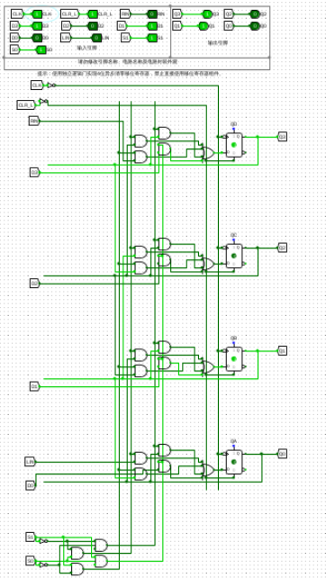
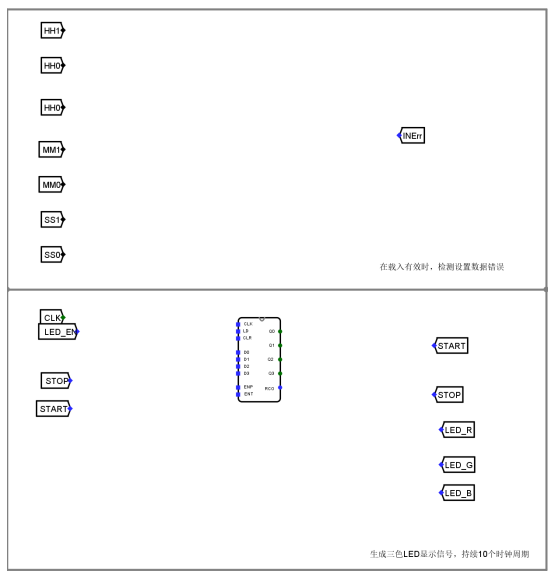

# 实验报告
## 思考题

## 基本信息
**实验名称**：同步时序部件设计
**实验人**：241220071葛家韬

## 实验目的
1. 掌握时序逻辑电路设计的基本方法。
2. 掌握计数器和移位寄存器的设计方法和应用。
3. 掌握无符号乘法器的设计方法。
4. 掌握寄存器堆的设计方法。
5. 掌握数字时钟的设计方法。
6. 掌握数字系统的设计方法
## 实验环境
Logisim 2.16
## 实验内容
### 1.计数器实验

#### （1）实验整体方案设计
> 要求：说明本次实验的顶层设计模块图，对每个子模块进行详细描述，定义输入输出引脚，数据及控制信号的传输通道等。

4位同步计数器通过4个D触发器级联实现，每个触发器代表一个二进制位（Q₀~Q₃）。​​同步​​特性体现在所有触发器的时钟端（CLK）并联，由同一时钟信号驱动，确保状态更新同步进行，避免异步计数器的"竞争冒险"问题。  

实验电路较为简单，不需要顶层模块设计图。

#### （2）实验原理图和电路图
> 要求：给出每个子模块的原理图和 Logisim 中的电路图，定义子模块的外观图。如果对实验指导讲义中的内容提出优化或改进，需要此说明原因、方法和效果。
实验电路无模块化设计，不需要原理图。

电路的针脚情况如下：

图1.1 4位同步计数器封装情况

图1.2 4位同步计数器电路图

#### （3）实验数据仿真测试图
> 要求：根据实验要求，输入测试数据，选择单步时钟执行，截取仿真运行时的电路图，分析电路状态是否满足设计需求。说明子模块的功能，列出子模块的功能表。

  

图1.3 4位同步计数器仿真测试图一

图1.4 4位同步计数器仿真测试图2

##### 典型状态真值表
| Cnt | LD | CLR | ENP | ENT | D | Q | RCO |
|-----|----|-----|-----|-----|---|---|-----|
|  00 | 1  |  0  |  0  |  0  | c | 0 |  0  |
|  01 | 0  |  0  |  1  |  1  | 0 | c |  0  |
|  02 | 0  |  0  |  1  |  1  | 0 | d |  0  |
|  03 | 0  |  0  |  1  |  1  | 0 | e |  0  |
|  04 | 0  |  0  |  1  |  1  | 0 | f |  1  |
|  05 | 0  |  0  |  1  |  1  | 0 | 0 |  0  |
|  06 | 0  |  0  |  1  |  1  | 0 | 1 |  0  |
|  07 | 0  |  1  |  0  |  0  | 0 | 2 |  0  |
|  08 | 0  |  0  |  1  |  1  | 0 | 0 |  0  |
|  09 | 0  |  0  |  1  |  1  | 0 | 1 |  0  |
|  0a | 1  |  0  |  0  |  0  | 0 | 2 |  0  |
|  0b | 0  |  0  |  1  |  1  | 0 | 0 |  0  |
|  0c | 0  |  0  |  1  |  1  | 0 | 1 |  0  |
|  0d | 0  |  0  |  1  |  1  | 0 | 2 |  0  |
|  0e | 0  |  0  |  1  |  1  | 0 | 3 |  0  |
|  0f | 0  |  0  |  1  |  1  | 0 | 4 |  0  |
|  10 | 0  |  0  |  1  |  1  | 0 | 5 |  0  |
|  11 | 0  |  0  |  1  |  1  | 0 | 6 |  0  |
|  12 | 0  |  0  |  1  |  1  | 0 | 7 |  0  |
|  13 | 0  |  0  |  1  |  1  | 0 | 8 |  0  |
|  14 | 0  |  0  |  1  |  1  | 0 | 9 |  0  |
|  15 | 0  |  0  |  1  |  1  | 0 | a |  0  |
|  16 | 0  |  0  |  1  |  1  | 0 | b |  0  |
|  17 | 0  |  0  |  1  |  1  | 0 | c |  0  |
|  18 | 0  |  0  |  1  |  1  | 0 | d |  0  |
|  19 | 0  |  0  |  1  |  1  | 0 | e |  0  |
|  1a | 0  |  0  |  1  |  1  | 0 | f |  1  |
|  1b | 0  |  0  |  1  |  1  | 0 | 0 |  0  |
|  1c | 1  |  0  |  1  |  1  | e | 1 |  0  |
|  1d | 0  |  0  |  1  |  1  | 0 | e |  0  |
|  1e | 0  |  0  |  1  |  1  | 0 | f |  1  |
|  1f | 0  |  0  |  1  |  1  | 0 | 0 |  0  |

#### （4）错误现象及分析
> 要求：在电路设计、连接和仿真运行时，遇到的任何错误，都需要截屏放置到实验报告中，并分析错误原因和解决办法。

1. 在采用 ​​D触发器​​ 和 ​​JK触发器​​ 设计 ​​4位同步计数器​​ 时，两者的实现方式存在明显差异。D触发器​​ 需要外部组合逻辑电路预先计算每个触发器的输入信号，依赖逻辑门控制状态转换，电路结构稍复杂但逻辑清晰。​JK触发器​​ 由于自带保持、翻转功能，只需将J、K端并联并连接低位信号，无需额外异或门，电路更简洁但时序分析需更谨慎。

2. 最初错误地将JK触发器的异或逻辑直接套用到D触发器，导致计数异常。经检查发现，JK触发器只需将J、K端并联并连接低位与信号即可实现翻转。通过重新分析真值表并对比两种触发器的特性，最终纠正了逻辑设计错误，使计数器正常工作。这一过程让我更理解了触发器的工作机制和同步时序电路的设计要点。

### 2.移位寄存器实验
#### （1）实验整体方案设计
> 要求：说明本次实验的顶层设计模块图，对每个子模块进行详细描述，定义输入输出引脚，数据及控制信号的传输通道等。

4位移位寄存器的设计基于4个D触发器级联，前一级输出（Q）接后一级输入（D）。时钟信号（CLK）同步控制所有触发器，每个上升沿将数据右移一位：串行输入（DSI）→Q0→Q1→Q2→Q3→串行输出（DSO）。并行输出（Q0-Q3）可实时读取数据，清零端（CLR）实现寄存器复位。加入方向控制逻辑可扩展为双向移位寄存器，支持左移/右移功能。

实验电路的功能表如下：

图2.1 4位移位寄存器功能表

#### （2）实验原理图和电路图
> 要求：给出每个子模块的原理图和 Logisim 中的电路图，定义子模块的外观图。如果对实验指导讲义中的内容提出优化或改进，需要此说明原因、方法和效果。

实验电路无模块化设计，不需要原理图。

实验的阵脚情况如下：

图2.2 4位移位寄存器封装情况 

图2.3 4位移位寄存器电路图

#### （3）实验数据仿真测试图
> 要求：根据实验要求，输入测试数据，选择单步时钟执行，截取仿真运行时的电路图，分析电路状态是否满足设计需求。说明子模块的功能，列出子模块的功能表。

图2.3 4位移位寄存器仿真测试图一

图2.3 4位移位寄存器仿真测试图二

##### 典型状态真值表
| Cnt | CLR_L | RIN | D3 | D2 | D1 | D0 | LIN | S1 | S0 | Q3 | Q2 | Q1 | Q0 |
|-----|-------|-----|----|----|----|----|-----|----|----|----|----|----|----|
|  00 |   0   |  1  | 1  | 0  | 1  | 0  |  1  | 1  | 1  | 0  | 0  | 0  | 0  |
|  01 |   1   |  1  | 1  | 0  | 1  | 0  |  1  | 1  | 1  | 0  | 0  | 0  | 0  |
|  02 |   1   |  1  | 1  | 0  | 1  | 0  |  1  | 0  | 1  | 1  | 0  | 1  | 0  |
|  03 |   1   |  1  | 1  | 0  | 1  | 0  |  0  | 0  | 1  | 0  | 1  | 0  | 1  |
|  04 |   1   |  1  | 1  | 0  | 1  | 0  |  1  | 0  | 1  | 1  | 0  | 1  | 0  |
|  05 |   1   |  1  | 1  | 0  | 1  | 0  |  1  | 0  | 1  | 0  | 1  | 0  | 1  |
|  06 |   1   |  0  | 1  | 0  | 1  | 0  |  1  | 1  | 0  | 1  | 0  | 1  | 1  |
|  07 |   1   |  0  | 1  | 0  | 1  | 0  |  0  | 1  | 0  | 0  | 1  | 0  | 1  |
|  08 |   1   |  1  | 1  | 0  | 1  | 0  |  0  | 1  | 0  | 0  | 0  | 1  | 0  |
|  09 |   1   |  1  | 1  | 0  | 1  | 0  |  0  | 1  | 0  | 1  | 0  | 0  | 1  |
|  0a |   1   |  1  | 1  | 0  | 1  | 0  |  0  | 0  | 0  | 1  | 1  | 0  | 0  |
|  0b |   1   |  0  | 1  | 0  | 1  | 0  |  1  | 1  | 0  | 1  | 1  | 0  | 0  |
|  0c |   1   |  1  | 1  | 0  | 1  | 0  |  1  | 1  | 0  | 0  | 1  | 1  | 0  |
|  0d |   0   |  1  | 0  | 1  | 0  | 0  |  1  | 1  | 1  | 0  | 0  | 0  | 0  |
|  0e |   1   |  1  | 0  | 1  | 0  | 0  |  0  | 1  | 0  | 0  | 0  | 0  | 0  |
|  0f |   1   |  0  | 0  | 1  | 0  | 0  |  0  | 1  | 0  | 1  | 0  | 0  | 0  |
|  10 |   1   |  1  | 1  | 1  | 0  | 1  |  0  | 1  | 1  | 0  | 1  | 0  | 0  |
|  11 |   1   |  1  | 1  | 1  | 0  | 0  |  0  | 1  | 0  | 1  | 1  | 0  | 1  |
|  12 |   1   |  1  | 1  | 1  | 0  | 0  |  0  | 1  | 0  | 1  | 1  | 1  | 0  |
|  13 |   1   |  0  | 1  | 1  | 0  | 0  |  0  | 1  | 0  | 1  | 1  | 1  | 1  |
|  14 |   1   |  0  | 1  | 1  | 0  | 0  |  0  | 1  | 0  | 0  | 1  | 1  | 1  |
|  15 |   1   |  1  | 1  | 1  | 0  | 1  |  1  | 0  | 1  | 0  | 0  | 1  | 1  |
|  16 |   1   |  1  | 1  | 1  | 0  | 1  |  1  | 0  | 1  | 0  | 1  | 1  | 1  |
|  17 |   1   |  1  | 1  | 1  | 0  | 0  |  0  | 0  | 1  | 1  | 1  | 1  | 1  |
|  18 |   1   |  1  | 1  | 1  | 0  | 0  |  0  | 0  | 1  | 1  | 1  | 1  | 0  |
|  19 |   1   |  1  | 1  | 1  | 0  | 0  |  0  | 0  | 0  | 1  | 1  | 0  | 0  |
|  1a |   0   |  1  | 1  | 1  | 0  | 0  |  0  | 0  | 0  | 0  | 0  | 0  | 0  |
|  1b |   1   |  1  | 0  | 1  | 1  | 0  |  0  | 1  | 1  | 0  | 0  | 0  | 0  |
|  1c |   1   |  0  | 1  | 0  | 0  | 0  |  1  | 0  | 1  | 0  | 1  | 1  | 0  |
|  1d |   1   |  0  | 1  | 0  | 0  | 0  |  0  | 0  | 1  | 1  | 1  | 0  | 1  |
|  1e |   1   |  0  | 1  | 0  | 0  | 0  |  1  | 0  | 1  | 1  | 0  | 1  | 0  |
|  1f |   1   |  0  | 1  | 0  | 0  | 0  |  0  | 0  | 0  | 0  | 1  | 0  | 1  |

#### （4）错误现象及分析
> 要求：在电路设计、连接和仿真运行时，遇到的任何错误，都需要截屏放置到实验报告中，并分析错误原因和解决办法。

1. 设计过程中，我最初经常混淆​​左移​​和​​右移​​的逻辑方向。由于对数据流向理解不够清晰，我在连接触发器时错误地将高位输出（如Q3）接回低位输入（D0），导致数据左移而非预期的右移。经过多次调试和波形分析后，我重新梳理了移位逻辑：​​右移​​应为D0←DSI（串行输入），D1←Q0，D2←Q1，D3←Q2；而​​左移​​则需反向连接（D3←DSI，D2←Q3，以此类推）。通过修正触发器的级联顺序并验证时序，最终实现了正确的双向移位功能。

2. 设计过程中，我犯了一个关键错误——没有正确区分上升沿触发和下降沿触发的工作方式。最初我随意连接了时钟信号，导致寄存器在错误的时钟边沿采样数据，结果移位操作完全错乱，数据出现严重不同步的问题。后在反复测试后，意识到是把上升沿触发和下降沿触发混淆了，修改后达到了预期的成果。

### 3.4位无符号数乘法器
#### （1）实验整体方案设计
> 要求：说明本次实验的顶层设计模块图，对每个子模块进行详细描述，定义输入输出引脚，数据及控制信号的传输通道等。

无符号乘法器的核心设计采用​​移位-加法​​算法实现。
- ​初始化​​：将被乘数（B）存入寄存器，乘数（A）逐位移位检测
- 迭代计算​​：检测A的最低位，若为1则将被乘数B与部分积相加，每周期执行1次右移（A）和左移（B）操作
- ​硬件实现​​：使用D触发器构建移位寄存器，加法器采用4位超前进位结构，控制单元通过状态机管理8个时钟周期的计算流程
- 最终输出8位乘积（P=A×B）

针脚情况如下：

图3.1 4位无符号数乘法器封装情况

实验中用到的已封装的模块：

图3.2 4位无符号乘法器中使用到的已封装的8位桶形移位器

图3.3 4位无符号乘法器中使用到的已封装的4位同步计数器

#### （2）实验原理图和电路图
> 要求：给出每个子模块的原理图和 Logisim 中的电路图，定义子模块的外观图。如果对实验指导讲义中的内容提出优化或改进，需要此说明原因、方法和效果。

图3.4 无符号数乘法器原理图（以32位为例）

图3.5 4位无符号整数乘法器电路图

图3.6 用到的模块4位同步计数器实现电路图

图3.7 用到的模块8位桶形移位器实现电路图

#### （3）实验数据仿真测试图
> 要求：根据实验要求，输入测试数据，选择单步时钟执行，截取仿真运行时的电路图，分析电路状态是否满足设计需求。说明子模块的功能，列出子模块的功能表。

图3.7 4位无符号数乘法器仿真测试状态图一

图3.7 4位无符号数乘法器仿真测试状态图二

##### 典型状态真值表
| Cnt | Reset | X | Y | Prod |
|-----|-------|---|---|------|
|  00 |   1   | 7 | 7 |  00  |
|  01 |   0   | 7 | 7 |  00  |
|  02 |   0   | 7 | 7 |  07  |
|  03 |   0   | 7 | 7 |  3b  |
|  04 |   0   | 7 | 7 |  55  |
|  05 |   0   | 7 | 7 |  62  |
|  06 |   0   | 7 | 7 |  31  |
|  07 |   0   | 7 | 7 |  31  |
|  08 |   1   | 9 | a |  00  |
|  09 |   0   | 9 | a |  00  |
|  0a |   0   | 9 | a |  0a  |
|  0b |   0   | 9 | a |  05  |
|  0c |   0   | 9 | a |  4a  |
|  0d |   0   | 9 | a |  25  |
|  0e |   0   | 9 | a |  5a  |
|  0f |   0   | 9 | a |  5a  |
|  10 |   1   | a | 9 |  00  |
|  11 |   0   | a | 9 |  00  |
|  12 |   0   | a | 9 |  09  |
|  13 |   0   | a | 9 |  54  |
|  14 |   0   | a | 9 |  2a  |
|  15 |   0   | a | 9 |  15  |
|  16 |   0   | a | 9 |  5a  |
|  17 |   0   | a | 9 |  5a  |
|  18 |   1   | f | f |  00  |
|  19 |   0   | f | f |  00  |
|  1a |   0   | f | f |  0f  |
|  1b |   0   | f | f |  7f  |
|  1c |   0   | f | f |  b7  |
|  1d |   0   | f | f |  d3  |
|  1e |   0   | f | f |  e1  |
|  1f |   0   | f | f |  e1  |
#### （4）错误现象及分析
> 要求：在电路设计、连接和仿真运行时，遇到的任何错误，都需要截屏放置到实验报告中，并分析错误原因和解决办法。

1. 在设计4位无符号乘法器时，我错误地将桶形移位器的左移/右移控制信号与数据分线器的选择信号交叉连接，导致部分积移位方向完全错乱。通过重新梳理算法流程、单独测试移位模块功能，并用示波器捕捉关键信号波形，最终发现是控制信号时序不匹配的问题。修正控制单元状态机后，乘法器成功实现了正确的移位累加操作，在8个时钟周期内稳定输出16位乘积。这次调试让我深刻认识到模块化验证和信号时序分析的重要性。
2. 在调试基于CLK的时序电路时，我最初未能正确处理LD信号的控制逻辑：当LD=1时应执行数据装载，LD=0时执行移位操作。由于未严格区分这两个状态，导致电路在错误时机执行了错误操作。通过重建设计方案，为LD信号添加多路选择器控制数据通路编写完整的测试用例验证所有状态组合，最终实现了精确的时序控制。
3. 这次实验的电路连线确实复杂，我反复连接了两次才完全正确。第一次搭建时，由于寄存器、移位器和加法器之间的控制信号较多，我不小心将几个关键连线交叉接错，导致测试时结果完全异常。发现问题后，我对照电路图逐条检查线路，用不同颜色的导线区分数据线和控制线，特别注意了桶形移位器的方向控制信号连接。第二次重新布线时终于成功，测试结果符合预期。

### 4.寄存器堆实验
#### （1）实验整体方案设计
> 要求：说明本次实验的顶层设计模块图，对每个子模块进行详细描述，定义输入输出引脚，数据及控制信号的传输通道等。

根据存器堆原理图，构建含有32个32位寄存器的寄存器堆Regfile的读写电
路，包含两个读数据端口和一个写数据端口，并封装成子电路。寄存器堆的读操作属于组
合逻辑操作，无须时钟控制，即当寄存器地址信号RA或RB到达后，经过一个“读取时
间”的延迟，读出的数据输出到端口busA或busB上。寄存器堆的写操作则属于时序逻辑
操作，需要时钟信号的控制，即在写使能信号（WE）有效的情况下，有效时钟触发边
沿到来后将写入数据端口busW上的信息写入RW所指定的寄存器中。时序上，要求在
时钟边沿信号达到前，写使能信号WE，写入寄存器地址RW和写入数据busW需保持稳
7
定（保持时间），时钟边沿信号到达后也需要保持稳定一段时间（保持时间）。

图4.1 寄存器堆针脚示意图

子模块，寄存器介绍：存储二进制数据的时序电路基本单元，32位寄存器可以存储较多的信息，在构建寄存器堆过程中有用。
#### （2）实验原理图和电路图
> 要求：给出每个子模块的原理图和 Logisim 中的电路图，定义子模块的外观图。如果对实验指导讲义中的内容提出优化或改进，需要此说明原因、方法和效果。

图4.2 寄存器堆实验原理图

图4.3 寄存器堆实验电路图

#### （3）实验数据仿真测试图
> 要求：根据实验要求，输入测试数据，选择单步时钟执行，截取仿真运行时的电路图，分析电路状态是否满足设计需求。说明子模块的功能，列出子模块的功能表。

图4.4 寄存器实验仿真测试一

图4.5 寄存器实验仿真测试二

##### 典型状态真值表
| Cnt | WE | RW | RA | RB |   Din    |   RDA    |   RDB    |
|-----|----|----|----|----|----------|----------|----------|
|  00 | 1  | 00 | 00 | 00 | 00000001 | 00000000 | 00000000 |
|  01 | 1  | 01 | 00 | 00 | 005deece | 00000001 | 00000001 |
|  02 | 1  | 02 | 00 | 01 | b61488df | 00000001 | 005deece |
|  03 | 1  | 03 | 01 | 02 | f4111591 | 005deece | b61488df |
|  04 | 1  | 04 | 02 | 03 | 023eaf12 | b61488df | f4111591 |
|  05 | 1  | 05 | 03 | 04 | b578fa6a | f4111591 | 023eaf12 |
|  06 | 1  | 06 | 04 | 05 | d38a8b1c | 023eaf12 | b578fa6a |
|  07 | 1  | 07 | 05 | 06 | f5d50649 | b578fa6a | d38a8b1c |
|  08 | 1  | 08 | 06 | 07 | 202e3c08 | d38a8b1c | f5d50649 |
|  09 | 1  | 09 | 07 | 08 | 812fba12 | f5d50649 | 202e3c08 |
|  0a | 1  | 0a | 08 | 09 | 6755ebab | 202e3c08 | 812fba12 |
|  0b | 1  | 0b | 09 | 0a | f6e7cab1 | 812fba12 | 6755ebab |
|  0c | 1  | 0c | 0a | 0b | e6bc21b9 | 6755ebab | f6e7cab1 |
|  0d | 1  | 0d | 0b | 0c | a6c5abc6 | f6e7cab1 | e6bc21b9 |
|  0e | 1  | 0e | 0c | 0d | 58228a26 | e6bc21b9 | a6c5abc6 |
|  0f | 1  | 0f | 0d | 0e | 9dfc1362 | a6c5abc6 | 58228a26 |
|  10 | 1  | 10 | 0e | 0f | ac5b2754 | 58228a26 | 9dfc1362 |
|  11 | 1  | 11 | 0f | 10 | 2f43454c | 9dfc1362 | ac5b2754 |
|  12 | 1  | 12 | 10 | 11 | 18c3dc9c | ac5b2754 | 2f43454c |
|  13 | 1  | 13 | 11 | 12 | 1abbd85c | 2f43454c | 18c3dc9c |
|  14 | 1  | 14 | 12 | 13 | cb1b519a | 18c3dc9c | 1abbd85c |
|  15 | 1  | 15 | 13 | 14 | 0f672c6a | 1abbd85c | cb1b519a |
|  16 | 1  | 16 | 14 | 15 | e37362d1 | cb1b519a | 0f672c6a |
|  17 | 1  | 17 | 15 | 16 | 39eaeb41 | 0f672c6a | e37362d1 |
|  18 | 1  | 18 | 16 | 17 | 95c7a81f | e37362d1 | 39eaeb41 |
|  19 | 1  | 19 | 17 | 18 | 9b8ab32e | 39eaeb41 | 95c7a81f |
|  1a | 1  | 1a | 18 | 19 | 64bb0d7c | 95c7a81f | 9b8ab32e |
|  1b | 1  | 1b | 19 | 1a | 72f86d97 | 9b8ab32e | 64bb0d7c |
|  1c | 1  | 1c | 1a | 1b | 52130e8e | 64bb0d7c | 72f86d97 |
|  1d | 1  | 1d | 1b | 1c | 1ee9d827 | 72f86d97 | 52130e8e |
|  1e | 1  | 1e | 1c | 1d | 9056d989 | 52130e8e | 1ee9d827 |
|  1f | 1  | 1f | 1d | 1e | dc896b07 | 1ee9d827 | 9056d989 |
|  20 | 0  | 00 | 00 | 00 | 913171e3 | 00000001 | 00000001 |
|  21 | 0  | 01 | 00 | 00 | 6a830aaa | 00000001 | 00000001 |
|  22 | 0  | 02 | 00 | 01 | ebccdf55 | 00000001 | 005deece |
|  23 | 0  | 03 | 01 | 02 | 1bead7a1 | 005deece | b61488df |
|  24 | 0  | 04 | 02 | 03 | 70ce89af | b61488df | f4111591 |
|  25 | 0  | 05 | 03 | 04 | d6c6f30f | f4111591 | 023eaf12 |
|  26 | 0  | 06 | 04 | 05 | 4f2f15f6 | 023eaf12 | b578fa6a |
|  27 | 0  | 07 | 05 | 06 | 0bfd3217 | b578fa6a | d38a8b1c |
|  28 | 0  | 08 | 06 | 07 | 74276d58 | d38a8b1c | f5d50649 |
|  29 | 0  | 09 | 07 | 08 | c6947ef2 | f5d50649 | 202e3c08 |
|  2a | 0  | 0a | 08 | 09 | e86e0a71 | 202e3c08 | 812fba12 |
|  2b | 0  | 0b | 09 | 0a | e71009ff | 812fba12 | 6755ebab |
|  2c | 0  | 0c | 0a | 0b | d4203d58 | 6755ebab | f6e7cab1 |
|  2d | 0  | 0d | 0b | 0c | bd817173 | f6e7cab1 | e6bc21b9 |
|  2e | 0  | 0e | 0c | 0d | 64d7cb03 | e6bc21b9 | a6c5abc6 |
|  2f | 0  | 0f | 0d | 0e | 5847aa13 | a6c5abc6 | 58228a26 |
|  30 | 0  | 10 | 0e | 0f | b183207a | 58228a26 | 9dfc1362 |
|  31 | 0  | 11 | 0f | 10 | 5333b778 | 9dfc1362 | ac5b2754 |
|  32 | 0  | 12 | 10 | 11 | fad2465a | ac5b2754 | 2f43454c |
|  33 | 0  | 13 | 11 | 12 | 608b2671 | 2f43454c | 18c3dc9c |
|  34 | 0  | 14 | 12 | 13 | 1229d521 | 18c3dc9c | 1abbd85c |
|  35 | 0  | 15 | 13 | 14 | bd93bfe7 | 1abbd85c | cb1b519a |
|  36 | 0  | 16 | 14 | 15 | 57945ed9 | cb1b519a | 0f672c6a |
|  37 | 0  | 17 | 15 | 16 | 149d0edc | 0f672c6a | e37362d1 |
|  38 | 0  | 18 | 16 | 17 | d4a71682 | e37362d1 | 39eaeb41 |
|  39 | 0  | 19 | 17 | 18 | 97e417ee | 39eaeb41 | 95c7a81f |
|  3a | 0  | 1a | 18 | 19 | 2594f1d9 | 95c7a81f | 9b8ab32e |
|  3b | 0  | 1b | 19 | 1a | c9e504f9 | 9b8ab32e | 64bb0d7c |
|  3c | 0  | 1c | 1a | 1b | e21915e7 | 64bb0d7c | 72f86d97 |
|  3d | 0  | 1d | 1b | 1c | 794e8b3c | 72f86d97 | 52130e8e |
|  3e | 0  | 1e | 1c | 1d | 2c9b12e4 | 52130e8e | 1ee9d827 |
|  3f | 0  | 1f | 1f | 1f | 71947694 | dc896b07 | dc896b07 |

#### （4）错误现象及分析
> 要求：在电路设计、连接和仿真运行时，遇到的任何错误，都需要截屏放置到实验报告中，并分析错误原因和解决办法。

1. 在实现寄存器堆的过程中，由于寄存器数量较多且每个寄存器需要连接读写端口、数据输入输出线及控制信号，导致连线复杂度显著增加。面对密集的交叉走线和重复性连接，我不得不大量使用复制粘贴操作以提高效率，但这也带来了后期检查与调试的困难。通过分逐个验证，最终确保了连线的正确性。
2. 在实现寄存器堆时，我起初对“读取是组合逻辑而写入是时序逻辑”感到困惑。经过分析，我理解到读取只需直接输出存储的数据（组合逻辑），而写入需要时钟边沿触发以确保数据稳定（时序逻辑）。这一区别源于寄存器需在时钟控制下更新状态，而读取无需等待时钟。

### 5.数字时钟实验
#### （1）实验整体方案设计
> 要求：说明本次实验的顶层设计模块图，对每个子模块进行详细描述，定义输入输出引脚，数据及控制信号的传输通道等。

在 6 个 7 段数码管上显示数字时钟时分秒，当计时到 23:59:59 后进入 00:00:00，时分秒
之间用小数点分隔；整点时点亮三色 LED 灯组件，按照格雷码赋值，每秒显示一种颜色，
持续显示 10 秒；通过 8421BCD 码设置初始时间，在载入时，如果初始时间数值超出实际范
围，则报输入错，且不能被载入。
利用同步计数器电路实现 0~9 十进制计数器、0~59 六十进制计数器和 0~23 二十四进制
计数器。当时分秒的低位计数到 9 时，高位计数加 1，低位清零。当秒数计数到 59 后秒数
清零，分钟计数加 1；当分钟计数达到 59 且秒数也到达 59 秒时，分钟清零，小时计数加 1；
当小时计数到 23，且分钟和秒数都是 59 时，小时数清零。当载入信号 LD=1 有效时，检查
设置时间数值：小时高低位 HH1 和 HH0、分钟高低位 MM1 和 MM0、秒数高低位 SS1 和
SS0，如果在有效数据范围之内，则载入时钟初值，否则 INErr 赋值 1。当计时到 59 分 59 秒
进入整点时，三色 RGB LED 灯按照格雷码（蓝色为高位、红色为低位）的顺序轮流点亮三
色灯（红色、黄色、绿色、青色、白色、品红、蓝色、黑色、红色、黄色），并持续 10 个时
钟周期。需要独立设计电路进入计数状态，设置开始计数标志位和结束计数标志位，并实现
格雷码的转换。

电路模块的封装情况示意图如下：

图5.1 数字时钟实验针脚情况示意一

图5.2 数字时钟实验针脚情况示意二

#### （2）实验原理图和电路图
> 要求：给出每个子模块的原理图和 Logisim 中的电路图，定义子模块的外观图。如果对实验指导讲义中的内容提出优化或改进，需要此说明原因、方法和效果。

图5.3 数字时钟实验电路图一

图5.4 数字时钟实验电路图二
#### （3）实验数据仿真测试图
> 要求：根据实验要求，输入测试数据，选择单步时钟执行，截取仿真运行时的电路图，分析电路状态是否满足设计需求。说明子模块的功能，列出子模块的功能表。

图5.5 数字时钟实验仿真测试一

图5.5 数字时钟实验仿真测试二

##### 典型状态真值表
| Cnt | LD | HH1 | HH0 | MM1 | MM0 | SS1 | SS0 | HH_H | HH_L | MM_H | MM_L | SS_H | SS_L | LED_R | LED_G | LED_B | INErr |
|-----|----|-----|-----|-----|-----|-----|-----|------|------|------|------|------|------|-------|-------|-------|-------|
|  00 | 1  |  2  |  3  |  5  |  9  |  4  |  9  |  0   |  0   |  0   |  0   |  0   |  0   |   0   |   0   |   0   |   0   |
|  01 | 0  |  2  |  3  |  5  |  9  |  4  |  9  |  2   |  3   |  5   |  9   |  4   |  9   |   0   |   0   |   0   |   0   |
|  02 | 0  |  0  |  0  |  0  |  0  |  0  |  0  |  2   |  3   |  5   |  9   |  5   |  0   |   0   |   0   |   0   |   0   |
|  03 | 0  |  0  |  0  |  0  |  0  |  0  |  0  |  2   |  3   |  5   |  9   |  5   |  1   |   0   |   0   |   0   |   0   |
|  04 | 0  |  0  |  0  |  0  |  0  |  0  |  0  |  2   |  3   |  5   |  9   |  5   |  2   |   0   |   0   |   0   |   0   |
|  05 | 0  |  0  |  0  |  0  |  0  |  0  |  0  |  2   |  3   |  5   |  9   |  5   |  3   |   0   |   0   |   0   |   0   |
|  06 | 0  |  0  |  0  |  0  |  0  |  0  |  0  |  2   |  3   |  5   |  9   |  5   |  4   |   0   |   0   |   0   |   0   |
|  07 | 0  |  0  |  0  |  0  |  0  |  0  |  0  |  2   |  3   |  5   |  9   |  5   |  5   |   0   |   0   |   0   |   0   |
|  08 | 0  |  0  |  0  |  0  |  0  |  0  |  0  |  2   |  3   |  5   |  9   |  5   |  6   |   0   |   0   |   0   |   0   |
|  09 | 0  |  0  |  0  |  0  |  0  |  0  |  0  |  2   |  3   |  5   |  9   |  5   |  7   |   0   |   0   |   0   |   0   |
|  0a | 0  |  0  |  0  |  0  |  0  |  0  |  0  |  2   |  3   |  5   |  9   |  5   |  8   |   0   |   0   |   0   |   0   |
|  0b | 0  |  0  |  0  |  0  |  0  |  0  |  0  |  2   |  3   |  5   |  9   |  5   |  9   |   0   |   0   |   0   |   0   |
|  0c | 0  |  0  |  0  |  0  |  0  |  0  |  0  |  0   |  0   |  0   |  0   |  0   |  0   |   1   |   0   |   0   |   0   |
|  0d | 0  |  0  |  0  |  0  |  0  |  0  |  0  |  0   |  0   |  0   |  0   |  0   |  1   |   1   |   1   |   0   |   0   |
|  0e | 0  |  0  |  0  |  0  |  0  |  0  |  0  |  0   |  0   |  0   |  0   |  0   |  2   |   0   |   1   |   0   |   0   |
|  0f | 0  |  0  |  0  |  0  |  0  |  0  |  0  |  0   |  0   |  0   |  0   |  0   |  3   |   0   |   1   |   1   |   0   |
|  10 | 0  |  0  |  0  |  0  |  0  |  0  |  0  |  0   |  0   |  0   |  0   |  0   |  4   |   1   |   1   |   1   |   0   |
|  11 | 1  |  1  |  1  |  5  |  9  |  5  |  8  |  0   |  0   |  0   |  0   |  0   |  5   |   1   |   0   |   1   |   0   |
|  12 | 0  |  0  |  0  |  0  |  0  |  0  |  0  |  1   |  1   |  5   |  9   |  5   |  8   |   0   |   0   |   1   |   0   |
|  13 | 0  |  0  |  0  |  0  |  0  |  0  |  0  |  1   |  1   |  5   |  9   |  5   |  9   |   0   |   0   |   0   |   0   |
|  14 | 0  |  0  |  0  |  0  |  0  |  0  |  0  |  1   |  2   |  0   |  0   |  0   |  0   |   1   |   0   |   0   |   0   |
|  15 | 0  |  0  |  0  |  0  |  0  |  0  |  0  |  1   |  2   |  0   |  0   |  0   |  1   |   1   |   1   |   0   |   0   |
|  16 | 0  |  0  |  0  |  0  |  0  |  0  |  0  |  1   |  2   |  0   |  0   |  0   |  2   |   0   |   1   |   0   |   0   |
|  17 | 1  |  2  |  4  |  0  |  0  |  0  |  0  |  1   |  2   |  0   |  0   |  0   |  3   |   0   |   1   |   1   |   1   |
|  18 | 1  |  2  |  3  |  6  |  0  |  0  |  0  |  1   |  2   |  0   |  0   |  0   |  4   |   1   |   1   |   1   |   1   |
|  19 | 0  |  2  |  3  |  6  |  0  |  0  |  0  |  1   |  2   |  0   |  0   |  0   |  5   |   1   |   0   |   1   |   0   |
|  1a | 1  |  1  |  2  |  3  |  4  |  5  |  6  |  1   |  2   |  0   |  0   |  0   |  6   |   0   |   0   |   1   |   0   |
|  1b | 1  |  2  |  3  |  4  |  5  |  6  |  7  |  1   |  2   |  3   |  4   |  5   |  6   |   0   |   0   |   0   |   1   |
|  1c | 0  |  0  |  0  |  0  |  0  |  0  |  0  |  1   |  2   |  3   |  4   |  5   |  7   |   1   |   0   |   0   |   0   |
|  1d | 0  |  0  |  0  |  0  |  0  |  0  |  0  |  1   |  2   |  3   |  4   |  5   |  8   |   1   |   1   |   0   |   0   |
|  1e | 0  |  0  |  0  |  0  |  0  |  0  |  0  |  1   |  2   |  3   |  4   |  5   |  9   |   0   |   0   |   0   |   0   |
|  1f | 0  |  0  |  0  |  0  |  0  |  0  |  0  |  1   |  2   |  3   |  5   |  0   |  0   |   0   |   0   |   0   |   0   |

#### （4）错误现象及分析
> 要求：在电路设计、连接和仿真运行时，遇到的任何错误，都需要截屏放置到实验报告中，并分析错误原因和解决办法。
1. 在制作数字时钟时，我误以为数码管的亮灯状态会受载入信号控制。经过调试发现，即使未给载入信号，数码管仍会显示默认值。这是因为显示驱动电路独立于载入逻辑，只要数码管使能端有效就会持续刷新显示。通过分析电路结构，我认识到载入信号仅影响寄存器更新，而非显示模块。
2. 在实现同步计数器与格雷码转换模块时，由于同步计数器采用4位输出而格雷码仅使用3位，我最初误以为两者位数必须一致。经分析发现，实际只需取计数器低3位进行格雷码转换即可，高位溢出可忽略。这一认知误区源于对编码独立性的理解不足。通过调整转换逻辑，最终实现了3位格雷码与4位计数器的正确对应。

思考题在报告开头处