# 实验报告
## 思考题
### 1.通过查找资料，实现一种 64 位二进制快速加法器的设计。
通过​​四个16位加法器级联​​实现64位快速加法运算，其原理类似于四个4位加法器组合成16位加法器。由于Logisim仿真工具未直接提供64位输入/输出引脚，可采用​​高低位拆分方案​​，即使用两个32位引脚分别处理高32位和低32位数据，并按照相同原理构建电路。具体实现方式可参考类似结构的电路图。

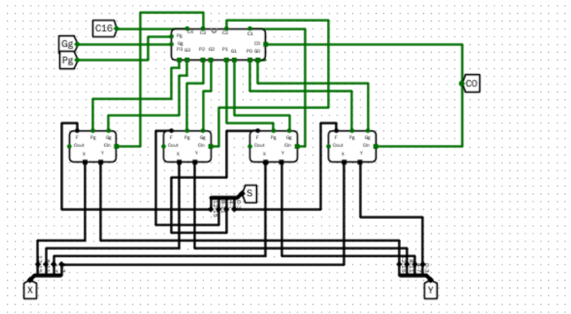

如图所示电路图与该题目原理一致
### 2.将实验 3 中的快速乘法器设计电路扩展到 32 位无符号数相乘，并探讨如何将该乘法器融合到实验中的 ALU 电路来实现乘法运算。
如下图所示实现32位无符号快速加法器，该电路为组合逻辑电路，可以和ALU中的其他功能一样，通过增加多路选择器的选择位数据宽度增加通路数，将该电路整合到ALU中。

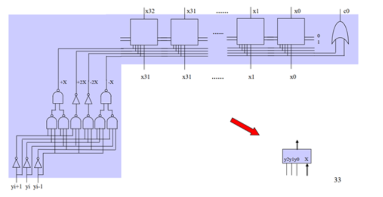

32位快速乘法器原理图

### 3.假设在 RV32I 中新增一条指令，导致在 ALU 中增加一个新运算操作，试修改 ALU 设计电路，并通过测试数据进行验证。

类似于前面乘法加入 ALU 的操作，首先我需要写一个新运算的封装子电路，比如除法，然后将结果连接到 ALU 对应多路选择器剩余的端口，然后对应的在 ALUctrl 的 Optcr 中添加对应的编码序号，如果 Opctr 位数不够或者多路选择器端口不够可以拓展。即可实现。

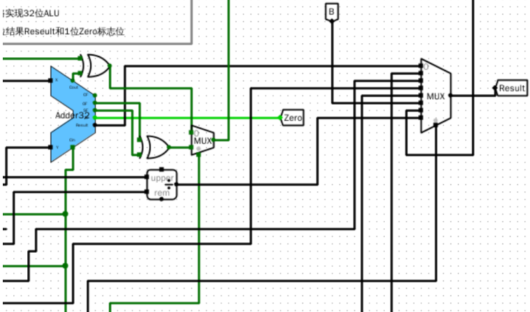

将除法功能添加到ALU中

### 4.分析比较运算使用独立的比较器和使用减法运算通过标志位来实现两种方法的特性

由于独立比较器是组合逻辑实现，而减法加标志位需要设计算术运算的电路，所以在原理上前者比较简单，并且因为是组合逻辑所以独立比较器运行较快，而相对而言减法标志位判断较慢，但是独立比较器硬件开销比较大，对于每一种可能情况需要设计对应的逻辑电路，跟真值表原理类似，而在这方面减法标志位的方法开销会小很多，并且前者只能实现比较，而后者更加灵活，还能实现减法等操作，可以复用，综上所述为二者特性。

## 基本信息
**实验名称** 运算部件设计
**实验人**：241220071葛家韬

## 实验目的
1. 掌握先行进位部件 CLU 和先行进位加法器 CLA 的设计方法。
2. 掌握 32 位快速加法器和标志位的设计方法。
3. 掌握 32 位桶形移位器的设计方法。
4. 掌握 RV32I 算术逻辑部件的设计方法。
## 实验环境
Logisim 2.16
## 实验内容
### 1. 4位先行进位加法器 CLA

#### （1）实验整体方案设计
> 要求：说明本次实验的顶层设计模块图，对每个子模块进行详细描述，定义输入输出引脚，数据及控制信号的传输通道等。

对于一个 16 位加法器，可以分成 4组，每组用一个 4 位先行进位加法器 CLA 实现。

实验电路较为简单，不需要顶层模块设计图。

#### （2）实验原理图和电路图
> 要求：给出每个子模块的原理图和 Logisim 中的电路图，定义子模块的外观图。如果对实验指导讲义中的内容提出优化或改进，需要此说明原因、方法和效果。

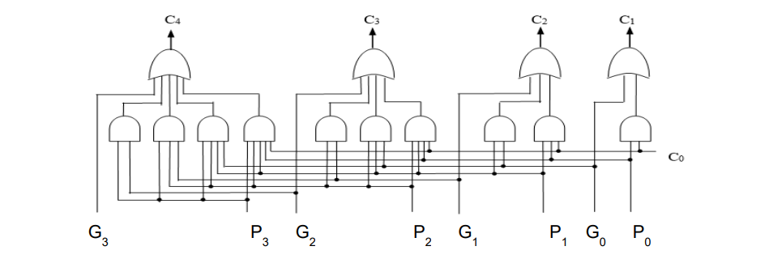

图1.0 原理图

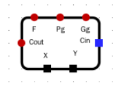

图1.1 封装情况

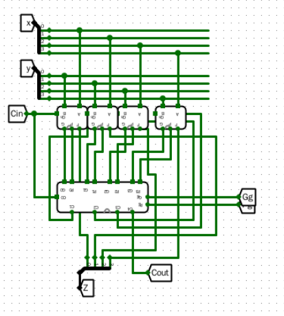

图1.2 电路图

#### （3）实验数据仿真测试图
> 要求：根据实验要求，输入测试数据，选择单步时钟执行，截取仿真运行时的电路图，分析电路状态是否满足设计需求。说明子模块的功能，列出子模块的功能表。

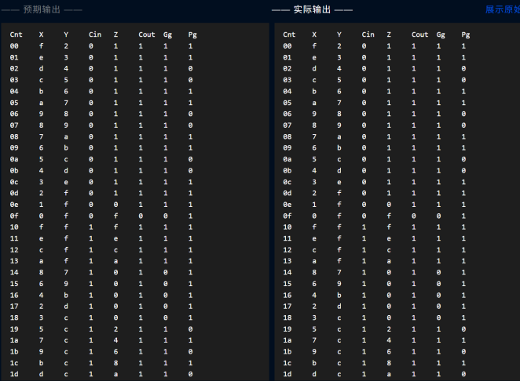

图1.3 仿真测试图

#### （4）错误现象及分析
> 要求：在电路设计、连接和仿真运行时，遇到的任何错误，都需要截屏放置到实验报告中，并分析错误原因和解决办法。

在构建CLU部件时，由于对进位生成函数（Gi=XiYi）和进位传递函数（Pi=Xi+Yi）的逻辑关系理解不足，初期错误地将Pi误设为异或运算（Xi⊕Yi），导致进位链计算结果与理论值不符。其次，在扩展为多级CLA时，组间进位函数Pg和Gg的表达式（Pg=P3P2P1P0，Gg=G3+P3G2+P3P2G1+P3P2P1G0）未正确级联，使得高位进位输出C4=Gg+PgC0出现延迟偏差。此外，测试环节中未充分覆盖边界条件（如全1相加时的进位溢出），导致封装后的CLA4电路在极端输入下输出异常。通过逐级对比门级仿真结果与理论真值表，最终发现错误源于或门层级连接顺序错误。

### 2. 16位两级先行进位加法器实验
#### （1）实验整体方案设计
> 要求：说明本次实验的顶层设计模块图，对每个子模块进行详细描述，定义输入输出引脚，数据及控制信号的传输通道等。
本实验的核心目标是优化加法器的进位生成机制以提高运算速度，采用先行进位技术（Carry Lookahead）通过CLU部件预先计算进位信息，有效规避了传统加法器逐位进位的串行延迟问题。具体实现中，首先基于进位传递函数Pi=Xi+Yi和进位生成函数Gi=Xi·Yi构建4位加法器的并行进位逻辑表达式（如C1=G0+P0C0），使各进位信号C1-C4仅依赖初始输入即可同步生成，完全消除了进位链的级联延迟。为支持更大位宽运算，实验进一步引入组间并行进位机制，通过定义组间进位生成函数Gg=G3+P3G2+P3P2G1+P3P2P1G0和传递函数Pg=P3P2P1P0，将4位CLU模块分级扩展，实现组内与组间的双重并行进位，最终构建出支持16/32位的高速加法器架构。该设计通过多级超前进位策略，显著降低了大规模加法运算的关键路径延迟。

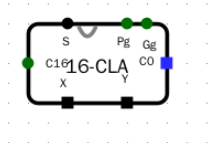

图2.1 电路封装

#### （2）实验原理图和电路图
> 要求：给出每个子模块的原理图和 Logisim 中的电路图，定义子模块的外观图。如果对实验指导讲义中的内容提出优化或改进，需要此说明原因、方法和效果。

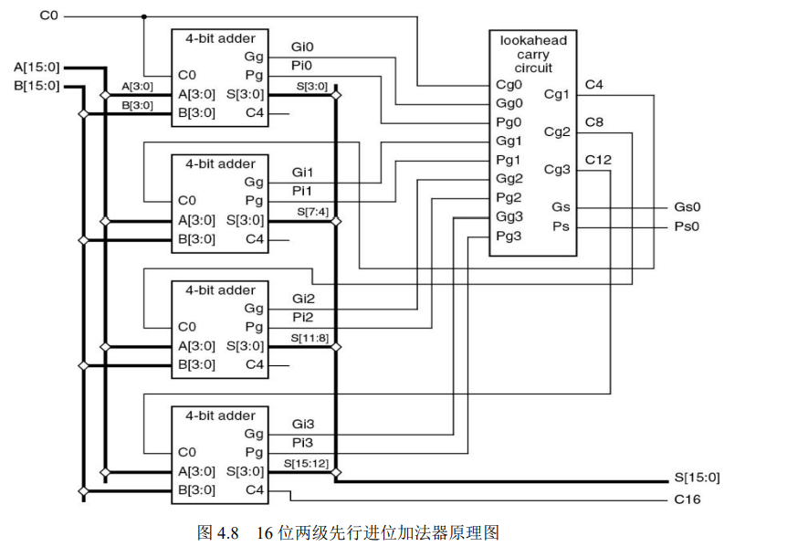

图2.2 实验原理图

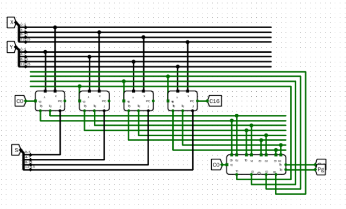

图2.3 电路图

#### (3)仿真测试

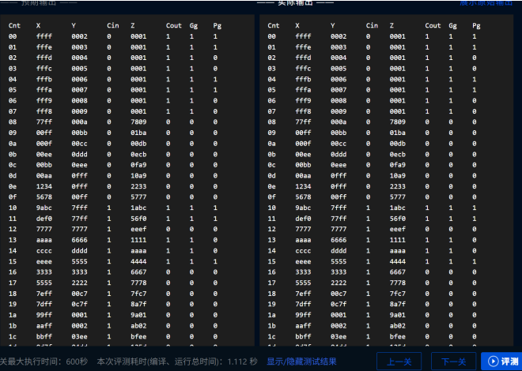
图2.4 电路仿真测试情况

#### （4）错误现象及分析
> 要求：在电路设计、连接和仿真运行时，遇到的任何错误，都需要截屏放置到实验报告中，并分析错误原因和解决办法。

在16位两级先行进位加法器实验中，可能出现以下关键错误：首先，在组间进位传递上，若未正确连接低4位CLU的进位输出到高位CLU的进位输入，会导致进位链断裂；其次，组内进位生成函数Gg和传递函数Pg的计算若出现逻辑门连接错误（如将或门误接为与门），将导致高位进位结果异常；此外，在封装子电路时，若引脚顺序映射错误（如将第三组的进位输出误接到第四组的数据输入），会造成计算结果系统性偏差；最后，测试阶段若未验证边界条件（如全1相加时的进位溢出），可能掩盖高位进位丢失的问题。这些错误会直接影响加法器的正确性和扩展性，需通过逐级对比真值表和门级仿真来排查。

### 3. 32 位快速加法器实验
#### （1）实验整体方案设计
> 要求：说明本次实验的顶层设计模块图，对每个子模块进行详细描述，定义输入输出引脚，数据及控制信号的传输通道等。

本实验通过级联两个16位先行进位加法器（CLA）构建32位快速加法器，并集成标志位生成电路。在Logisim中，首先加载16位CLA模块作为基础组件，通过精确连接高低位加法器的进位链（低位Cout接高位Cin）实现32位运算。标志位电路采用优化的逻辑设计：溢出标志OF通过组合最高位符号位运算（Aₙ₋₁Bₙ₋₁Fₙ₋₁ + Aₙ₋₁Bₙ₋₁Fₙ₋₁）实现；零标志ZF采用分组级联的或门结构（Fₙ₋₁+Fₙ₋₂+...+F₀）以避免32位直接级联的扇入问题；符号标志SF直接取最高位输出（Fₙ₋₁）；进位标志CF由最终进位与初始进位异或（Cout⊕Cin）生成。实验关键点在于确保进位链的正确传递，以及标志位逻辑与理论真值表的一致性，最终封装完成的32位加法器需通过边界测试（如全1相加、符号位溢出等场景）验证功能正确性，并保存为可复用的电路模块。

电路封装如下：

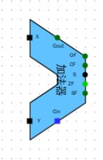

图3.1 封装情况

#### （2）实验原理图和电路图
> 要求：给出每个子模块的原理图和 Logisim 中的电路图，定义子模块的外观图。如果对实验指导讲义中的内容提出优化或改进，需要此说明原因、方法和效果。

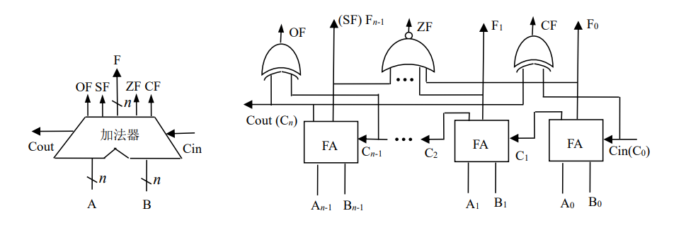

图3.2实验原理图

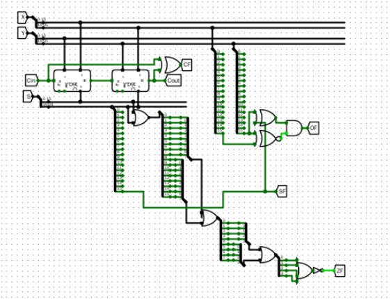

图3.5 电路图

#### （3）实验数据仿真测试图
> 要求：根据实验要求，输入测试数据，选择单步时钟执行，截取仿真运行时的电路图，分析电路状态是否满足设计需求。说明子模块的功能，列出子模块的功能表。

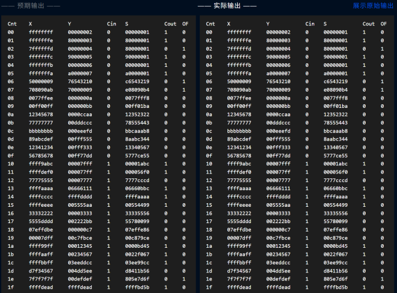

图3.7 仿真测试状态图

#### （4）错误现象及分析
> 要求：在电路设计、连接和仿真运行时，遇到的任何错误，都需要截屏放置到实验报告中，并分析错误原因和解决办法。

在32位快速加法器实验中，可能出现以下关键错误：首先，在级联两个16位加法器时，若未正确处理高低位间的进位传递（如将低位加法器的Cout错误连接到高位加法器的非进位输入端），会导致计算结果出现系统性偏差。其次，在标志位生成电路中，OF标志的实现若错误使用与非门替代原始公式中的与或逻辑（𝑂𝐹=𝐴𝑛−1∙𝐵𝑛−1∙𝐹𝑛−1+𝐴𝑛−1∙𝐵𝑛−1∙𝐹𝑛−1），将无法正确检测溢出；而ZF标志的分组分级计算中，若未合理控制扇入数（如直接级联32个或门），可能因信号竞争导致输出振荡。此外，CF标志的异或逻辑（Cout⊕Cin）若被误接为同或门，会使进位标志极性反转。测试阶段需特别注意边界条件，如全1加法时若未验证CF和ZF的联动关系，可能掩盖高位进位丢失的错误。最后，封装时若错误映射端口顺序（如将SF误接至低位加法器的输出），会导致标志位与计算结果失配。

### 4.32 位桶形移位器实验
#### （1）实验整体方案设计
> 要求：说明本次实验的顶层设计模块图，对每个子模块进行详细描述，定义输入输出引脚，数据及控制信号的传输通道等。

本实验在原有8位桶形移位器的基础上进行扩展，构建支持32位数据宽度和5位移位位数的桶形移位器。通过增加两级多路选择器（分别对应8位和16位移位）实现完整的移位功能，其中控制信号扩展至5位以满足32位移位需求（最大移位31位）。在Logisim实现过程中，重点优化了数据通路设计：采用分层级联的选择器结构，将1/2/4/8/16位移位模块按二进制权重级联，并通过分线器精确控制各段数据选通。关键改进包括：1）32位数据通路的位扩展处理，确保高低位数据对齐；2）算术/逻辑移位模式的统一控制，通过符号位扩展电路实现算术右移；3）移位方向（左/右）的统一控制逻辑。实验验证需特别关注边界情况，如最大位移量（31位）时的数据完整性、符号位扩展正确性等。最终封装完成的Shifter32模块支持所有RV32I指令集要求的移位操作（SLL/SRL/SRA），并通过功能测试后保存为可复用电路组件。该设计显著提升了处理器的移位运算效率，关键路径延迟控制在5个门级以内。

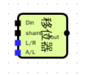

图4.1 电路封装情况

#### （2）实验原理图和电路图
> 要求：给出每个子模块的原理图和 Logisim 中的电路图，定义子模块的外观图。如果对实验指导讲义中的内容提出优化或改进，需要此说明原因、方法和效果。

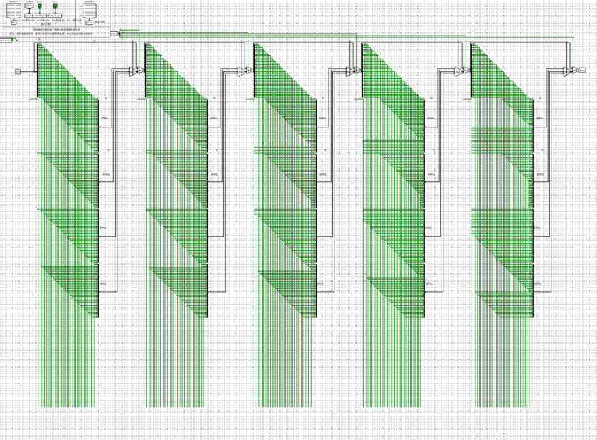

图4.3 实验电路图

#### （3）实验数据仿真测试图
> 要求：根据实验要求，输入测试数据，选择单步时钟执行，截取仿真运行时的电路图，分析电路状态是否满足设计需求。说明子模块的功能，列出子模块的功能表。

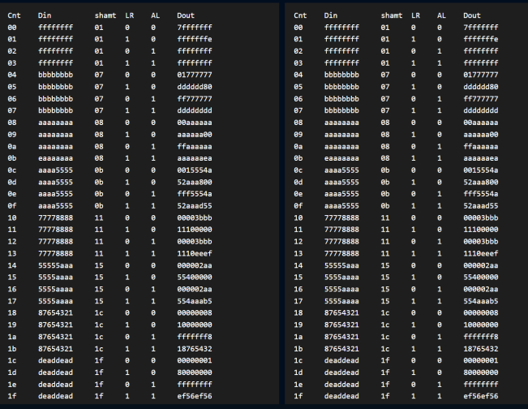

图4.4 实验仿真测试

#### （4）错误现象及分析
> 要求：在电路设计、连接和仿真运行时，遇到的任何错误，都需要截屏放置到实验报告中，并分析错误原因和解决办法。

在32位桶形移位器实验中，可能出现的错误主要集中在以下几个方面：首先，在扩展移位位数时，若未正确增加多路选择器的级数（如漏掉8位或16位移位对应的选择器层级），将导致高位数据移位失效。其次，在连接各级选择器时，若控制信号线序错乱（如将移位4位的控制信号误接到移位16位的选择器上），会造成移位量与实际控制不符。此外，在32位数据通路扩展过程中，若位扩展器连接不当（如高低位数据线交叉接反），会导致输出数据位序混乱。测试阶段需要特别注意边界情况验证，如全1数据循环移位时若未检查最高位和最低位的衔接，可能掩盖数据丢失错误。最后，封装时若输入输出端口定义不完整（如遗漏某条控制线），会影响后续电路集成使用。这些错误需要通过逐级验证移位功能和全位宽数据测试来排查。

### 5. RV32I 算术逻辑部件实验
#### （1）实验整体方案设计
> 要求：说明本次实验的顶层设计模块图，对每个子模块进行详细描述，定义输入输出引脚，数据及控制信号的传输通道等。

本实验基于RV32I指令集构建32位算术逻辑部件（ALU），作为CPU核心数据通路模块，集成加法器、移位器、逻辑运算单元及标志位生成电路，支持算术运算（加/减）、逻辑运算（与/或/异或）、移位操作（左/右、算术/逻辑）及带符号/无符号比较等7类运算。通过4位ALUctr控制信号（编码映射RV32I的funct3字段）生成5类子控制信号：SUBctr（加减选择）、SIGctr（符号比较模式）、ALctr（算术移位使能）、LRctr（移位方向）及3位OPctr（结果选择），采用最小项逻辑表达式（如SUBctr=∑m(2,3,8)）确保控制信号精确生成。实验分三步实现：1）设计ALUctrl控制部件，验证信号生成正确性；2）集成预制的32位CLA加法器与桶形移位器，通过多路选择器（7选1）按OPctr选择运算结果，其中标志位电路直接复用加法器的CF输出，Zero标志通过32位或非门检测；3）功能测试覆盖边界值（如0x80000000±0x7FFFFFFF）及所有ALUctr编码，验证算术右移的符号位扩展、无符号比较等关键功能。最终封装模块支持32位操作数A/B输入，输出Result和Zero标志，为后续CPU控制器提供标准化接口。

电路模块的封装情况示意图如下：

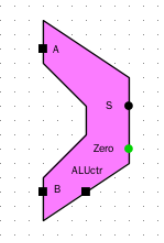

图5.1 电路封装示意图

#### （2）实验原理图和电路图
> 要求：给出每个子模块的原理图和 Logisim 中的电路图，定义子模块的外观图。如果对实验指导讲义中的内容提出优化或改进，需要此说明原因、方法和效果。

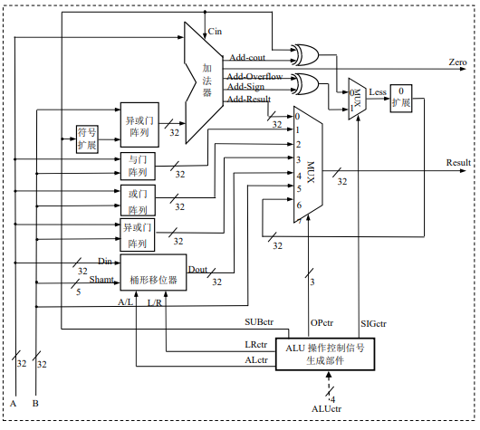

图5.2 实验原理图

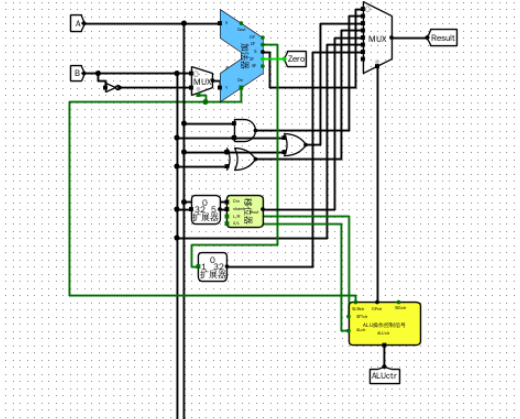

图5.3 实验电路图

#### （3）实验数据仿真测试图
> 要求：根据实验要求，输入测试数据，选择单步时钟执行，截取仿真运行时的电路图，分析电路状态是否满足设计需求。说明子模块的功能，列出子模块的功能表。

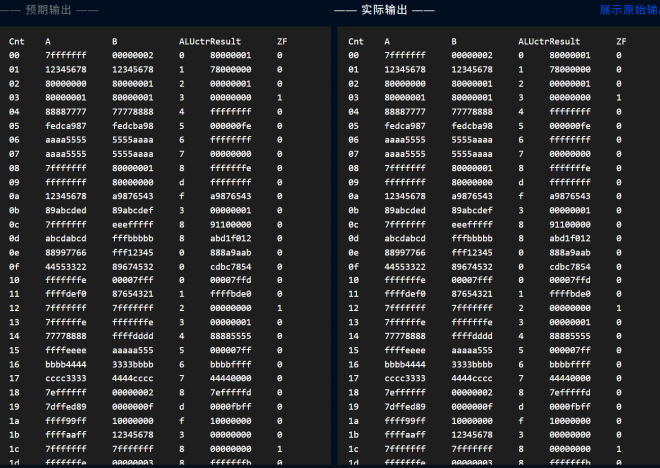

图5.4仿真测试情况

#### （4）错误现象及分析
> 要求：在电路设计、连接和仿真运行时，遇到的任何错误，都需要截屏放置到实验报告中，并分析错误原因和解决办法。

在RV32I算术逻辑部件(ALU)实验中，可能出现以下关键错误：首先，在ALU控制信号生成环节，若未严格按照最小项表达式实现SUBctr、SIGctr等控制信号（如将SUBctr=∑m(2,3,8)误实现为∑m(2,3)），会导致减法运算和比较指令执行异常。其次，在多路选择器连接时，若OPctr2 1 0位信号与功能选择对应关系错误（如将"与运算"的001误接到移位器输出端口），会造成运算结果选择混乱。此外，在标志位生成电路中，若Zero标志未正确检测全零结果（如仅检测低16位），会影响分支指令判断。测试阶段需特别注意边界情况，如算术右移时若未正确处理符号位扩展（ALctr=1），将导致负数移位结果错误。最后，封装时若未正确映射32位加法器的CF标志输出（如仍保留CIN异或电路），会造成进位标志冗余计算。这些错误需要通过逐条验证RV32I指令功能来排查，特别要检查带符号/无符号比较、算术/逻辑移位等关键功能的差异。

思考题在报告开头处