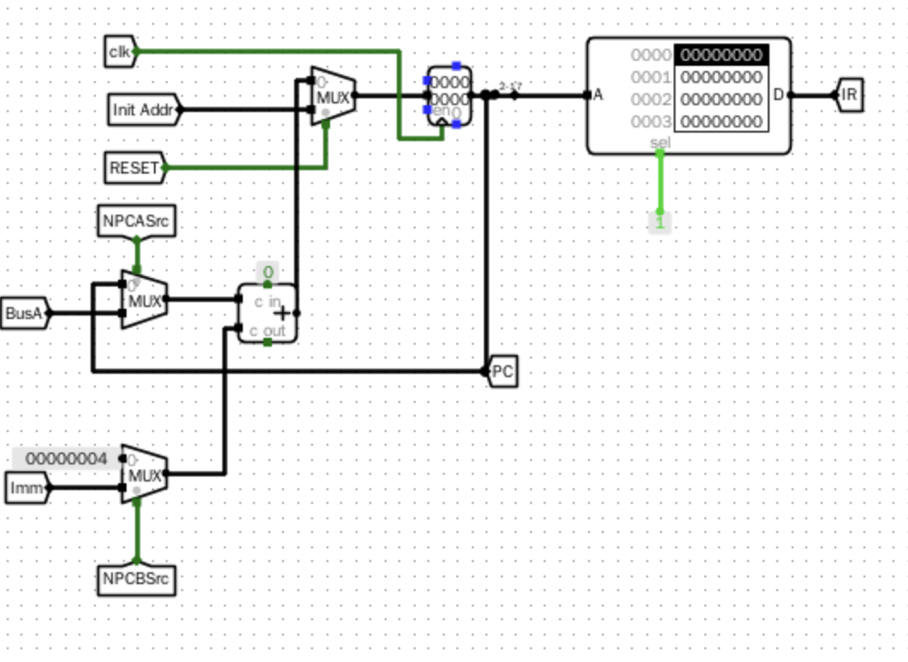
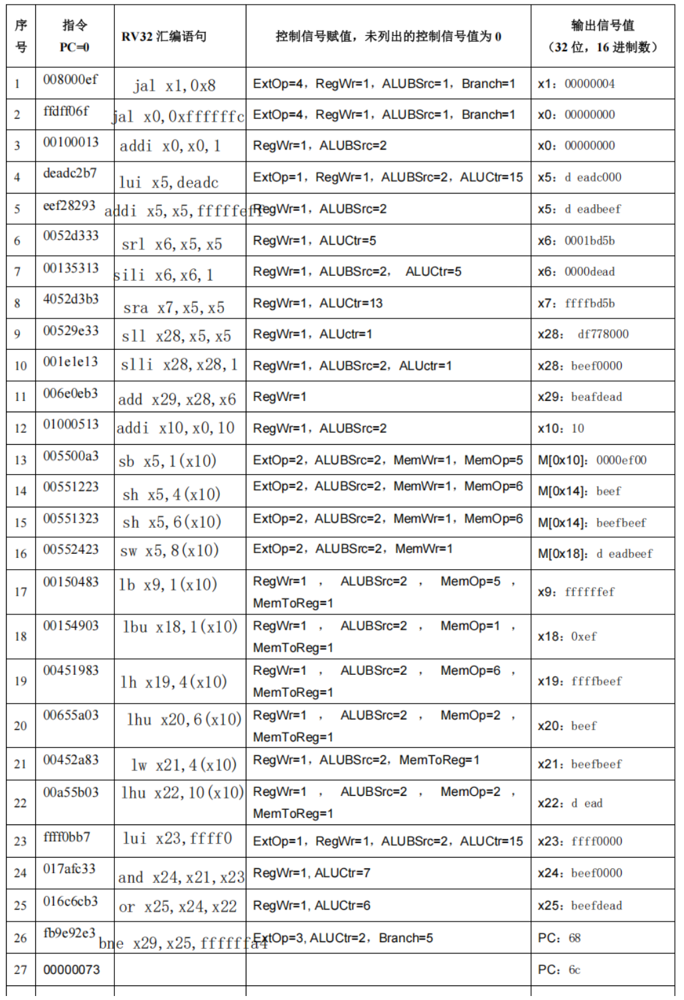

# 实验报告
## 思考题
### 如何利用 ROM 实验实现滚动显示的功能，在 3 个 LED 点阵矩阵中，左右滚动显示 5 个 ASCII 字符，如“NJUCS”。
将code与一个时序逻辑电路相连，在对应的时钟周期输出对应的code信号。得到一个滚动显示的LED矩阵。实现如下：

图 思考题实现

### 2.分析说明如果 PC 寄存器、寄存器堆和数据存储器写入数据的时钟信号触发边沿不一致，则对程序执行结果有什么影响？
如果一条指令包括读和写，可能导致运算结果没有正确生成的时候，寄存器堆和存储器的写入使能端就被激活了，导致写入错误信号，进而读取的信号发生错误。同时，PC寄存器可能跳转到错误的地址，产生程序流错误

### 3. 在 CPU 启动执行后，如何实现停止执行功能
可以设计专门的停止指令，如果执行该指令则将PC的写使能端关闭，PC不会更新，cpu不会继续运行

### 3.利用 4 位移位寄存器设计 8 位二进制伪随机序列电路，写出输出序列值。

## 基本信息
**实验名称** 存储器及数据通路设计
**实验人**：241220071葛家韬

## 实验目的
1. 掌握利用 ROM 组件实现指令存储器的设计方法。
2. 掌握 ASCII 点阵字库的使用方法。
3. 掌握利用 RAM 组件实现按字节存取的数据存储器的设计方法。
4. 掌握实现 RV32I 存取指令的设计方法。
5. 掌握 RV32I 下地址逻辑部件的设计方法
6. 掌握 RV32I 指令译码、反汇编的实现方法
7. 掌握 RV32I 立即数扩展器的设计方式
8. 根据 RV32I 指令执行过程，掌握 RV32I 运算类指令数据通路的设计方法
9. 掌握跳转控制器的设计方法
## 实验环境
Logisim 2.16
## 实验内容
### 1.只读存储器实验

#### （1）实验整体方案设计
> 要求：说明本次实验的顶层设计模块图，对每个子模块进行详细描述，定义输入输出引脚，数据及控制信号的传输通道等。

利用 Logisim 的 ROM 组件加载 ASCII 点阵字库文件 ascii8-16.zk，通过输入 ASCII 码值计算字符点阵起始地址（ASCII 码值减 0x20 后左移 4 位），使用 16 个 ROM 并行读取 16 行点阵数据，同步输出至 8×16 的 LED 点阵显示字符。若输入码值超出可见范围（0x20-0x7F），则输出错误标志 CodeErr。

图 实验电路封装图

#### （2）实验原理图和电路图
> 要求：给出每个子模块的原理图和 Logisim 中的电路图，定义子模块的外观图。如果对实验指导讲义中的内容提出优化或改进，需要此说明原因、方法和效果。
实验电路无模块化设计，不需要原理图。

图 电路图

#### （3）实验数据仿真测试图
> 要求：根据实验要求，输入测试数据，选择单步时钟执行，截取仿真运行时的电路图，分析电路状态是否满足设计需求。说明子模块的功能，列出子模块的功能表。

  

图 仿真测试图

#### （4）错误现象及分析
> 要求：在电路设计、连接和仿真运行时，遇到的任何错误，都需要截屏放置到实验报告中，并分析错误原因和解决办法。

若 LED 点阵无显示，可能是 ROM 地址计算错误（如未正确减去 0x20 或左移位数不足），或片选信号未设置为高电平有效；若显示乱码，可能是字库文件加载错误或 ROM 数据位宽未设为 8 位。

### 2.数据存储器实验
#### （1）实验整体方案设计
> 要求：说明本次实验的顶层设计模块图，对每个子模块进行详细描述，定义输入输出引脚，数据及控制信号的传输通道等。

使用 4 片 8 位 RAM（RAM3-RAM0）级联实现 32 位数据存储，通过 MemOp 信号和地址低两位（Addr [1:0]）控制片选信号 SEL3-SEL0，支持字节、半字、字的存取操作。读取时根据 MemOp 类型进行 0 扩展或符号扩展，地址未对齐或 MemOp 无效时输出 AlignErr 错误。

图 实验电路封装图

#### （2）实验原理图和电路图
> 要求：给出每个子模块的原理图和 Logisim 中的电路图，定义子模块的外观图。如果对实验指导讲义中的内容提出优化或改进，需要此说明原因、方法和效果。

图 实验原理

图 电路图

#### （3）实验数据仿真测试图
> 要求：根据实验要求，输入测试数据，选择单步时钟执行，截取仿真运行时的电路图，分析电路状态是否满足设计需求。说明子模块的功能，列出子模块的功能表。

图 仿真测试图

#### （4）错误现象及分析
> 要求：在电路设计、连接和仿真运行时，遇到的任何错误，都需要截屏放置到实验报告中，并分析错误原因和解决办法。

写入数据后读取异常，可能是片选信号逻辑错误（如 SEL 与 Addr [1:0] 不匹配）或写使能信号 str 未在时钟上升沿有效；扩展结果错误可能是 MemOp 编码与扩展逻辑不匹配，如 lbu 未正确执行零扩展。

### 3.取指令部件实验
#### （1）实验整体方案设计
> 要求：说明本次实验的顶层设计模块图，对每个子模块进行详细描述，定义输入输出引脚，数据及控制信号的传输通道等。

通过程序计数器 PC 加载初始地址，利用加法器和多路选择器计算下一条指令地址（NPC），支持顺序执行（PC+4）、无条件跳转（jal/jalr）和条件分支（beq/bne 等）。PC 寄存器上升沿触发，指令存储器地址需舍弃 PC 最低两位以匹配 Logisim 按字编址规则。

图 实验电路封装图

#### （2）实验原理图和电路图
> 要求：给出每个子模块的原理图和 Logisim 中的电路图，定义子模块的外观图。如果对实验指导讲义中的内容提出优化或改进，需要此说明原因、方法和效果。

图 实验原理

图3 电路图

#### （3）实验数据仿真测试图
> 要求：根据实验要求，输入测试数据，选择单步时钟执行，截取仿真运行时的电路图，分析电路状态是否满足设计需求。说明子模块的功能，列出子模块的功能表。

图 仿真测试图

#### （4）错误现象及分析
> 要求：在电路设计、连接和仿真运行时，遇到的任何错误，都需要截屏放置到实验报告中，并分析错误原因和解决办法。

PC 值未更新可能是时钟触发边沿设置错误（如误设为下降沿）；指令读取错误可能是地址映射错误（未舍弃 PC 低两位）或 ROM 未加载正确的镜像文件 lab5.3.hex。

### 4.取操作数部件 IDU 实验
#### （1）实验整体方案设计
> 要求：说明本次实验的顶层设计模块图，对每个子模块进行详细描述，定义输入输出引脚，数据及控制信号的传输通道等。

通过分线器解析指令字段（opcode、funct3 等），立即数扩展器根据 ExtOp 信号生成 5 种类型（I/U/S/B/J 型）的 32 位立即数，寄存器堆读取 rs1 和 rs2 数据，多路选择器根据 ALUASrc/ALUBSrc 选择操作数输入 ALU。

图 实验电路封装图

#### （2）实验原理图和电路图
> 要求：给出每个子模块的原理图和 Logisim 中的电路图，定义子模块的外观图。如果对实验指导讲义中的内容提出优化或改进，需要此说明原因、方法和效果。

图 原理图

图 电路图

#### （3）实验数据仿真测试图
> 要求：根据实验要求，输入测试数据，选择单步时钟执行，截取仿真运行时的电路图，分析电路状态是否满足设计需求。说明子模块的功能，列出子模块的功能表。

图 仿真测试图

#### （4）错误现象及分析
> 要求：在电路设计、连接和仿真运行时，遇到的任何错误，都需要截屏放置到实验报告中，并分析错误原因和解决办法。

立即数扩展错误可能是 ExtOp 编码与扩展逻辑不对应（如 ExtOp=2 时未生成 immS）；寄存器堆输出为 0 可能是 0 号寄存器硬连接未正确设置，或 rs1/rs2 索引超出范围。

### 5.数据通路实验
#### （1）实验整体方案设计
> 要求：说明本次实验的顶层设计模块图，对每个子模块进行详细描述，定义输入输出引脚，数据及控制信号的传输通道等。

整合 IFU、IDU、ALU、数据存储器和跳转控制器，形成单周期 CPU 数据通路。跳转控制器根据 BandJ 信号和 ALU 结果（Zero/Result [0]）生成 NPC 控制信号，支持 jal、jalr、beq 等指令的地址计算，数据存储器与寄存器堆通过时钟边沿同步写入。

图 实验电路封装图

#### （2）实验原理图和电路图
> 要求：给出每个子模块的原理图和 Logisim 中的电路图，定义子模块的外观图。如果对实验指导讲义中的内容提出优化或改进，需要此说明原因、方法和效果。

图 原理图

图 电路图
#### （3）实验数据仿真测试图
> 要求：根据实验要求，输入测试数据，选择单步时钟执行，截取仿真运行时的电路图，分析电路状态是否满足设计需求。说明子模块的功能，列出子模块的功能表。

图 仿真测试图

图 测评表

#### （4）错误现象及分析
> 要求：在电路设计、连接和仿真运行时，遇到的任何错误，都需要截屏放置到实验报告中，并分析错误原因和解决办法。

程序执行顺序混乱可能是跳转控制器逻辑错误（如 BandJ 编码与 NPCASrc/NPCBSrc 映射错误）；数据写入异常可能是时钟触发边沿不一致（如 PC 用上升沿而存储器用下降沿），导致时序冲突。

思考题在报告开头处