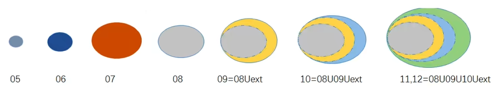

# 序言 笔记
本系列笔记整理了b站视频中所介绍的内容，包含完整的目标检测模型训练流程。

视频链接：https://www.bilibili.com/video/BV1ZL4y1p7Cz

## 教程的定位
目标检测入门实践
- 了解目标检测基本模型
- 了解目标检测的经典网络模型
- 该如何应用到自己的项目中（制作自己的数据集）
- 训练模型的一些技巧方法
## 所需的基础
- python基础
- pytorch基础
- 目标检测、深度学习相关的基础知识（可选）

## 什么是目标检测
检测出**位置** + **类别**

**人脸检测**：以人脸为目标

**文字检测**：以文字为目标

主流目标检测都是以矩阵框的形式进行输出的。（考虑能否满足项目需求）

**语义分割**比**目标检测**能达到更高的精度。

## 目标检测的数据集
### VOC数据集
官网：http://host.robots.ox.ac.uk/pascal/VOC/

VOC 2007、VOC 2012...

### 数据集的下载
VOC 2007：http://host.robots.ox.ac.uk/pascal/VOC/voc2007/VOCtrainval_06-Nov-2007.tar
VOC 2012：http://host.robots.ox.ac.uk/pascal/VOC/voc2012/VOCtrainval_11-May-2012.tar
pytorch官网：https://pytorch.org/vision/stable/generated/torchvision.datasets。VOCDetection.html